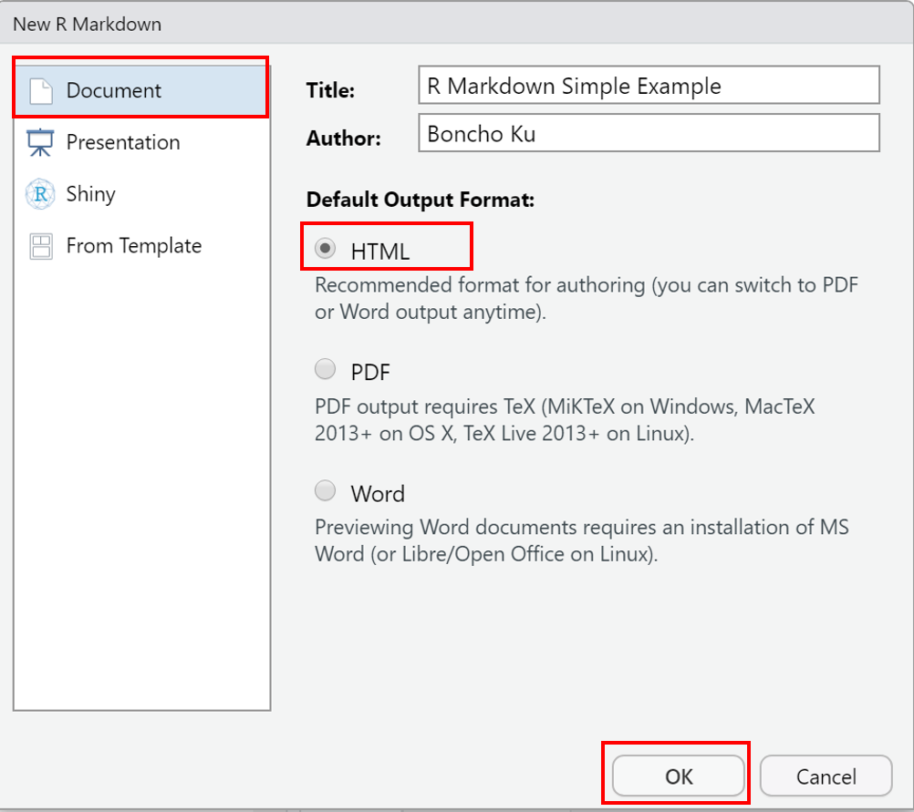
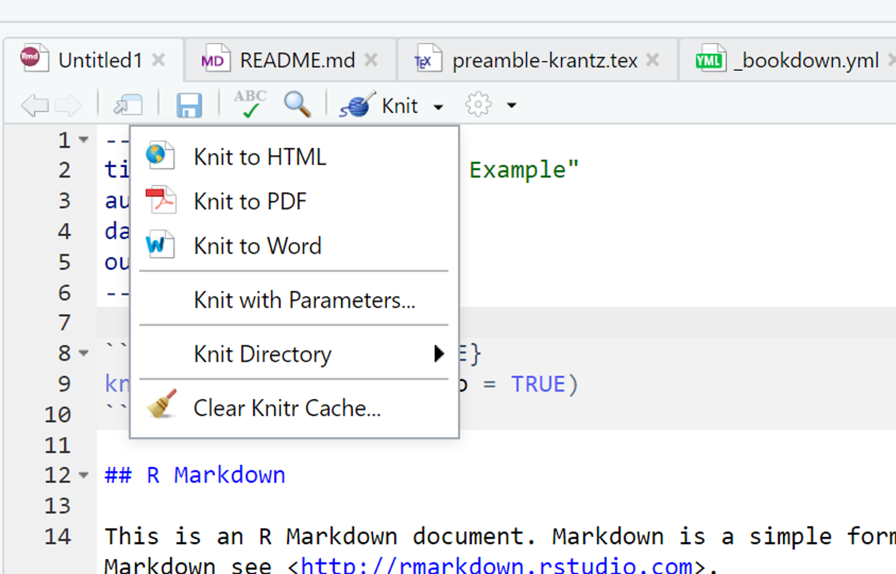
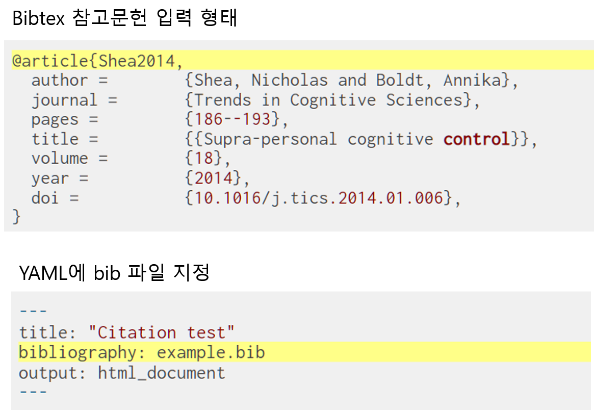
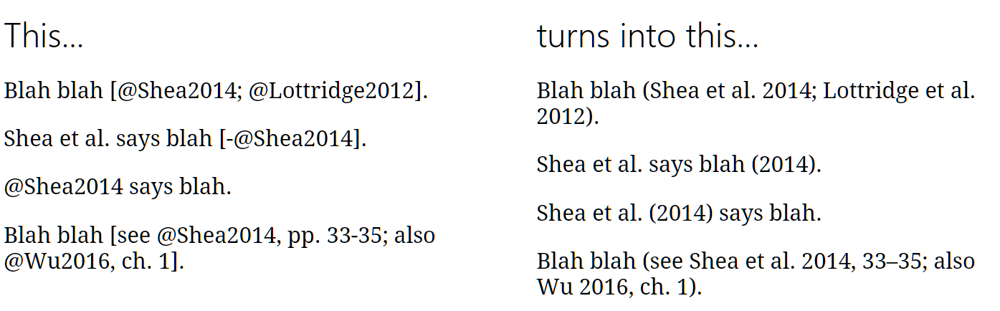

\mainmatter


# R Markdown {#r-markdown}


> **Sketch**
>
> - 동일한 문서에 코드, 결과, 텍스트가 동시에 있을 수 있을까?
> - 만약 결과와 도표가 자동으로 생성된 경우 데이터가 변경 되더라도 자동으로 문서를 업데이트 할 수 있을까?
> - 최종 완료한 문서가 미래에도 열 수 있을까? 
> - 이러한 모든 과정이 매우 쉽다면??


<iframe width="800" height="500" src="https://www.youtube.com/embed/s3JldKoA0zw" frameborder="0" allow="accelerometer; autoplay; encrypted-media; gyroscope; picture-in-picture" allowfullscreen></iframe>

<!-- {width="100%"} -->


\footnotesize

<div class="figure" style="text-align: center">

<p class="caption">(\#fig:unnamed-chunk-1)R markdown 세계(https://ulyngs.github.io/rmarkdown-workshop-2019 에서 발췌)</p>
</div>

 \normalsize


## R Markdown의 구성

\footnotesize

\BeginKnitrBlock{rmdnote}<div class="rmdnote">본 절의 내용 중 일부는 지난 학기 강의노트 1.7절과 중복되거나 재구성한 내용이 포함됨. </div>\EndKnitrBlock{rmdnote}

 \normalsize


1. R Markdown은 R 코드와 분석 결과(표, 그림 등)을 포함한 문서 또는 컨텐츠를 제작하는 도구로 일반적으로 아래 열거한 형태로 활용함
   - 문서 또는 논문(`pdf`, `html`, `docx`)
   - 프리젠테이션(`pdf`, `html`, `pptx`)
   - 웹 또는 블로그

2. 재현가능(reproducible)한 분석 및 연구^[과학적 연구의 결과물을 오픈소스로 내놓고 누구라도 검증 가능] 가능
   - 신뢰성 있는 문서 작성
   - `Copy & paste`를 하지 않고 효율적 작업 가능
   

> **R 마크다운 파일 = `.Rmd` 확장자를 가진 일반 텍스트 파일**

````markdown
---
title: "Untitled.Rmd"
date: "2020-09-11"
output: html_document
---

```{r setup, include=FALSE}
knitr::opts_chunk$set(echo = TRUE)
```

## R Markdown

Markdown은 HTML, PDF 및 MS Word 문서를 작성하 기위한 간단한 형식 지정 구문입니다.
R Markdown 사용에 대한 자세한 내용은 <http://rmarkdown.rstudio.com>을 참조하십시오.


**Knit** 버튼을 클릭하면 두 가지를 모두 포함하는 문서가 생성됩니다.
문서에 포함 된 R 코드 청크의 출력 내용뿐 아니라
다음과 같이 R 코드 청크를 포함 할 수 있습니다.

```{r cars}
summary(cars)
```

## Including Plots

You can also embed plots, for example:

```{r pressure, echo=FALSE}
plot(pressure)
```

`echo = FALSE` 매개 변수가 코드 청크에 추가되었습니다.
플롯을 생성 한 R 코드의 인쇄를 방지합니다.
````

위 R Markdown 문서는 아래 그림과 같이 **YAML**, **Markdown 텍스트**, **Code Chunk** 세 부분으로 구성됨. 

\footnotesize

<div class="figure" style="text-align: center">

<p class="caption">(\#fig:rmarkdown-structure)R markdown structure</p>
</div>

 \normalsize


**YAML (YAML Ain't Markup Language)**


- R Markdown 문서의 metadata로 문서의 맨 처음에 항상 포함(header)되어야 함.
- R Markdown 문서의 최종 출력 형태(`html`, `pdf`, `docx`, `pptx` 등), 제목, 저자, 날짜 등의 정보 등을 포함
<!-- - YAML 언어에 대한 사용 예시는 @xie-2016 의 [Appendix B.2](https://bookdown.org/yihui/bookdown/r-markdown.html) 참고 -->


**최종 문서 생성 과정**

- `Rmd` 파일을 `knitr` 을 통해 `.md` 파일로 변환 후 `pandoc` 이라는 문서 변환기를 통해 원하는 문서 포맷으로 출력

\footnotesize

<div class="figure" style="text-align: center">

<p class="caption">(\#fig:rmarkdown-flow)R Markdown의 최종 결과물 산출과정(http://applied-r.com/project-reporting-template/)</p>
</div>

 \normalsize


## R Markdown 문서 시작하기

- **R Markdown** 문서 생성: `[File] -> [New File] -> [R Markdown..]`을 선택

\footnotesize

\BeginKnitrBlock{rmdcaution}<div class="rmdcaution">RStudio를 처음 설치하고 위와 같이 진행할 경우 아래와 같은 패키지 설치 여부를 묻는 팝업 창이 나타남. 패키지 설치 여부에 `[Yes]`를 클릭하면 R Markdown 문서 생성을 위해 필요한 패키지들이 자동으로 설치</div>\EndKnitrBlock{rmdcaution}

 \normalsize

\footnotesize


 \normalsize

- 설치 완료 후 R Markdown으로 생성할 최종 문서 유형 선택 질의 창이 나타남. 아래 창에서 제목(Title)과 저자(Author) 이름 입력 후 `[OK]` 버튼 클릭(`Document`, `html` 문서 선택)

\footnotesize



 \normalsize

- 아래 그림과 같이 새로운 문서 창이 생성되고 `test.Rmd` 파일로 저장^[[RStudio 프로젝트]에서 생성한 폴더 내에 파일 저장]

\footnotesize


 \normalsize

- 문서 상단에 `Knit` 아이콘을 클릭 후 `Knit to HTML` 클릭 또는 문서 아무 곳에 커서를 위치하고 단축키 `[Ctrl] + [Shift] + [K]` 입력

\footnotesize



 \normalsize

- `knitr` + `R Markdown` + `pandoc` $\rightarrow$ `html` 파일 생성 결과

\footnotesize

<div class="figure" style="text-align: center">

<p class="caption">(\#fig:rmarkdown-new-out)test.html 문서 화면(저장 폴더 내 `test.html`을 크롬 브라우저로 실행)</p>
</div>

 \normalsize


## R Markdown 기본 문법(syntax)

> R Markdown의 기본 문법은 Rstudio 풀다운 메뉴 **`[Help]`** $\rightarrow$ **`[Markdown Quick Reference]`** 에서 확인 가능

### 텍스트 문법

**강조(emphasis)**

- 이텔릭체: \*italic1\*, \_italic2\_  $\rightarrow$ *italic1*, _italic2_
- 볼드(굵은)체: \**bold1\**, \_\_bold2\_\_ $\rightarrow$ **bold1**, __bold2__

**Inline code**

- <span>&#96;</span>inline code&#96; $\rightarrow$ `inline code`

**아래/위 첨자(sub/superscript)**

-  subscript\~2\~ $\rightarrow$ subscript~2~
-  superscript\^2\^ $\rightarrow$ superscript^2^

**삭제표시(strike through)**

- \~\~strikethrough\~\~ $\rightarrow$ ~~strikethrough~~

**생략표시(ellipsis)**

- \.\.\. $\rightarrow$ ...

**긴/짧은 대쉬(en/emd-dash)**

- 짧은 대쉬: \-\- $\rightarrow$ --
- 긴 대쉬: \-\-\- $\rightarrow$ ---

**특수문자 탈출 지정자**

- \\\*,  \\\_, \\\~, \\\\ $\rightarrow$ \*, \_, \~, \\

**하이퍼링크**

-`[text](link)` $\rightarrow$ [통계프로그래밍언어](https://zorba78.github.io/cnu-r-programming-lecture-note)

**외부그림 삽입**

- ``: ``

{width="80%"}


**강제 줄바꿈(line breaks)**

- 하나의 줄에서 공백(space) 두 개 이상 또는 백슬레시(`\`) 입력 후 `[Enter]`

````markdown
End a line with two spaces to start 
a new paragraph
````

End a line with two spaces to start 
a new paragraph


````markdown
End a line with two spaces to start\
a new paragraph
````

End a line with two spaces to start\
a new paragraph


**각주(footnote)**

- `A footnote^[주석내용]` $\rightarrow$ A footnote^[주석내용]

**주석(comment)**

- `<!-- this is a comment that won't be shown -->` $\rightarrow$ <!-- this is a comment that won't be shown -->


\footnotesize

\BeginKnitrBlock{rmdtip}<div class="rmdtip">RStudio에서 단축키 `[Ctrl]` + `[Shift]` + `[C]`를 통해 전체 line 에 대해 주석처리 가능</div>\EndKnitrBlock{rmdtip}

 \normalsize


### Block-level elements


**장/절(header)**

- \# Header 1 (chapter, 장)
- \## Header 2 (section, 절)
- \### Header 3 (subsection, 관)


**목록(list)**

- 비순서(unordered) 목록: `-`, `*`, `+` 중 어느 하나로 입력 가능

````markdown
- one item 
* two item
   + sub-item 1
   + sub-item 2
      - subsub-item 1
      - subsub-item 2
````

- one item 
* two item
   + sub-item 1
   + sub-item 2
      - subsub-item 1
      - subsub-item 2


- 순서(ordered) 목록: 비순서 목록의 기호 대신 숫자로 리스트 생성


````markdown
1. the first item
   - sub-item 1
2. the second item
3. the third item
````

1. the first item
   - sub-item 1
2. the second item
3. the third item


- 같은 숫자로 적어도 순서대로 목록 생성

````markdown
1. the first item
   - sub-item 1
1. the second item
1. the third item
````

1. the first item
   - sub-item 1
1. the second item
1. the third item


**인용구(blockquote)**: `>`로 시작

````markdown
> "There are three kinds of lies: lies, damn lies, and statistics"
>
> --- Benjamin Disraeli
````

> "There are three kinds of lies: lies, damn lies, and statistics"
>
> --- Benjamin Disraeli


### 수식표현(math expression)

- 줄 안에 수식 입력 시 `$수식표현$` 으로 입력
- 수식 display style (보통 교과서에 정리 및 정의에 기술된 수식들) 적용 시 `$$ ~ $$` 안에 수식 입력
- 수식 표현은 LaTeX 의 수식 표현을 동일하게 준용(https://www.latex4technics.com/, https://latex.codecogs.com/legacy/eqneditor/editor.php 에서 수식 입력 명령어 학습 가능)
- LaTeX 수식 입력 코드는 
- 예시

$$
  P(X = x) = f(x; n, p) = {n \choose x} p^x (1-p)^{n-x}
$$

- Inline equation: `$P(X = x) = f(x; n, p) = {n \choose x} p^x (1-p)^{n-x}$` $\rightarrow$ $P(X = x) = f(x; n, p) = {n \choose x} p^x (1-p)^{n-x}$
- Math block: `$$P(X = x) = f(x; n, p) = {n \choose x} p^x (1-p)^{n-x}$$`


$$P(X = x) = f(x; n, p) = {n \choose x} p^x (1-p)^{n-x}$$

- `$ $` 또는 `$$ $$` 안에 LaTeX에서 제공하는 수식 함수 사용 가능

````latex
$$\begin{array}{ccc}
x_{11} & x_{12} & x_{13}\\
x_{21} & x_{22} & x_{23}
\end{array}$$
````

$$\begin{array}{ccc}
x_{11} & x_{12} & x_{13}\\
x_{21} & x_{22} & x_{23}
\end{array}$$


````latex
$$\Theta = \begin{pmatrix}\alpha & \beta\\
\gamma & \delta
\end{pmatrix}$$
````


$$\Theta = \begin{pmatrix}\alpha & \beta\\
\gamma & \delta
\end{pmatrix}$$


````latex
$$\begin{align} 
g(X_{n}) &= g(\theta)+g'({\tilde{\theta}})(X_{n}-\theta) \notag \\
\sqrt{n}[g(X_{n})-g(\theta)] &= g'\left({\tilde{\theta}}\right)
  \sqrt{n}[X_{n}-\theta ]
\end{align}$$
````


$$\begin{aligned} 
g(X_{n}) &= g(\theta)+g'({\tilde{\theta}})(X_{n}-\theta) \notag \\
\sqrt{n}[g(X_{n})-g(\theta)] &= g'\left({\tilde{\theta}}\right)
  \sqrt{n}[X_{n}-\theta ]
\end{aligned}$$


## R Code Chunks

- 실제 R code가 실행되는 부분임
- Code chunk 실행 시 다양한 옵션 존재(본 강의에서는 몇 개의 옵션만 다룰 것이며, 더 자세한 내용은 https://yihui.org/knitr/options/ 또는 [R Markdown 레퍼런스 가이드](https://rstudio.com/wp-content/uploads/2015/03/rmarkdown-reference.pdf) 참조
- Code chunk는  ```` ```{r} ````로 시작되며 `r`은 code 언어 이름을 나타냄.
- Code chunk는 ```` ``` ```` 로 종료
- R Markdown 문서 작성 시 단축키 `[Ctrl] + [Alt] + [I]`를 입력하면 Chunk 입력창이 자동 생성됨
- Code chunk의 옵션 조정을 통해 코드의 출력여부, 코드 출력 시 코드의 출력 형태, 코드의 결과물 출력 조정 가능


\footnotesize

<div class="figure" style="text-align: center">

<p class="caption">(\#fig:r-code-chunk)Chunk anatomy (https://ulyngs.github.io/rmarkdown-workshop-2019 에서 발췌)</p>
</div>

 \normalsize


### 자주 활용하는 chunk 옵션 {#code-chunk .unnumbered}

**코드 실행 관련 청크**

\footnotesize

<table class="table table-condensed table-striped" style="font-size: 11px; width: auto !important; margin-left: auto; margin-right: auto;">
<caption style="font-size: initial !important;">(\#tab:chunk-tab-01)코드 실행 관련 청크</caption>
 <thead>
  <tr>
   <th style="text-align:left;"> Chunk 옵션 </th>
   <th style="text-align:left;"> Default </th>
   <th style="text-align:left;"> 설명 </th>
  </tr>
 </thead>
<tbody>
  <tr>
   <td style="text-align:left;width: 3cm; "> eval </td>
   <td style="text-align:left;width: 3cm; "> TRUE </td>
   <td style="text-align:left;width: 8cm; "> R 실행(코드 실행 결과)에 대응하는 결과 출력 여부 </td>
  </tr>
  <tr>
   <td style="text-align:left;width: 3cm; "> include </td>
   <td style="text-align:left;width: 3cm; "> TRUE </td>
   <td style="text-align:left;width: 8cm; "> 출력 문서에 코드 청크의 내용을 포함할지 여부 </td>
  </tr>
</tbody>
</table>

 \normalsize


````markdown
```{r ex01-1, eval=TRUE}
summary(iris)
hist(iris$Sepal.Length)
```

```{r ex01-2, eval=FALSE}
summary(iris)
hist(iris$Sepal.Length)
```
````


\footnotesize


```r
#청크 옵션 eval=TRUE
summary(iris)
```

```
  Sepal.Length    Sepal.Width     Petal.Length    Petal.Width   
 Min.   :4.300   Min.   :2.000   Min.   :1.000   Min.   :0.100  
 1st Qu.:5.100   1st Qu.:2.800   1st Qu.:1.600   1st Qu.:0.300  
 Median :5.800   Median :3.000   Median :4.350   Median :1.300  
 Mean   :5.843   Mean   :3.057   Mean   :3.758   Mean   :1.199  
 3rd Qu.:6.400   3rd Qu.:3.300   3rd Qu.:5.100   3rd Qu.:1.800  
 Max.   :7.900   Max.   :4.400   Max.   :6.900   Max.   :2.500  
       Species  
 setosa    :50  
 versicolor:50  
 virginica :50  
                
                
                
```

```r
hist(iris$Sepal.Length)
```


 \normalsize


\footnotesize


```r
#청크 옵션 eval=FALSE
summary(iris)
hist(iris$Sepal.Length)
```

 \normalsize


**소스 코드 출력(텍스트) 결과 관련 청크**

\footnotesize

<table class="table table-condensed table-striped" style="font-size: 11px; width: auto !important; margin-left: auto; margin-right: auto;">
<caption style="font-size: initial !important;">(\#tab:chunk-tab-02)소스 코드 출력 결과 관련 청크</caption>
 <thead>
  <tr>
   <th style="text-align:left;"> Chunk 옵션 </th>
   <th style="text-align:left;"> Default </th>
   <th style="text-align:left;"> 설명 </th>
  </tr>
 </thead>
<tbody>
  <tr>
   <td style="text-align:left;width: 3cm; "> echo </td>
   <td style="text-align:left;width: 3cm; "> TRUE </td>
   <td style="text-align:left;width: 8cm; "> R 실행 결과에 대응하는 코드 출력 여부 </td>
  </tr>
  <tr>
   <td style="text-align:left;width: 3cm; "> results </td>
   <td style="text-align:left;width: 3cm; "> markup </td>
   <td style="text-align:left;width: 8cm; "> 출력 결과 포맷 지정을 위한 옵션으로 추가적으로 3 가지 옵션 선택 가능: 'hide', 'asis', 'hold', 'markup' </td>
  </tr>
  <tr>
   <td style="text-align:left;width: 3cm; "> error </td>
   <td style="text-align:left;width: 3cm; "> TRUE </td>
   <td style="text-align:left;width: 8cm; "> 코드 또는 스크립트에 구문오류 메세지 출력 여부 </td>
  </tr>
  <tr>
   <td style="text-align:left;width: 3cm; "> message </td>
   <td style="text-align:left;width: 3cm; "> TRUE </td>
   <td style="text-align:left;width: 8cm; "> 코드로부터 생성된 메세지 출력 여부 </td>
  </tr>
  <tr>
   <td style="text-align:left;width: 3cm; "> warning </td>
   <td style="text-align:left;width: 3cm; "> TRUE </td>
   <td style="text-align:left;width: 8cm; "> 경고 메세지 출력 여부 </td>
  </tr>
</tbody>
</table>

 \normalsize


- `echo`: 코드 청크에 작성한 R-script 출력 여부 결정
   - `echo = FALSE` 이면 소스 코드 출력 없이 그림 결과만 출력


````markdown
```{r ex01-2, echo=TRUE}
require(ggthemes) # ggtheme 패키지 불러오기
require(ggpubr) # ggpubr 패키지 불러오기
iris %>%
   ggplot(aes(x = Sepal.Length, y = Petal.Width, color = Species)) +
   geom_point(size = 5) +
   theme_pubclean() +
   theme(axis.line = element_line(size = 0.8),
         legend.title = element_text(face = "bold", size = 15),
         legend.text = element_text(face = "bold", size = 12))

```


```{r ex01-3, echo=FALSE}
require(ggthemes) # ggtheme 패키지 불러오기
require(ggpubr) # ggpubr 패키지 불러오기
iris %>%
   ggplot(aes(x = Sepal.Length, y = Petal.Width, color = Species)) +
   geom_point(size = 5) +
   theme_pubclean() +
   theme(axis.line = element_line(size = 0.8),
         legend.title = element_text(face = "bold", size = 15),
         legend.text = element_text(face = "bold", size = 12))

```
````


\footnotesize


```r
# echo = TRUE
require(ggthemes) # ggtheme 패키지 불러오기
require(ggpubr) # ggpubr 패키지 불러오기
iris %>%
   ggplot(aes(x = Sepal.Length, y = Petal.Width, color = Species)) +
   geom_point(size = 5) +
   theme_pubclean() +
   theme(axis.line = element_line(size = 0.8),
         legend.title = element_text(face = "bold", size = 15),
         legend.text = element_text(face = "bold", size = 12))
```


 \normalsize

- `results`: 코드의 텍스트 출력 결과 포맷 지정
   - `markup` (default): 코드 청크 내 스크립트의 출력 형태에 따라 텍스트 출력 결과를 mark-up
   - `asis`: 변환하지 않은 원래 R 출력 결과 그대로(as is) 출력
   - `hide`: R 스크립트로 생성된 텍스트 출력을 보여주지 않음(warning, message 출력 예외)
   - `hold`: 코드 청크로 생성된 모든 소스 및 출력을 단일 블록으로 축소

\footnotesize


```r
# results = 'markup'인 경우 아래 텍스트를 mark-up
# (이 경우 아래 텍스트는 ``` ``` 블럭 처리)한 결과를 md 파일로 전송
cat("I'm raw **Markdown** content.\n")
```

```
I'm raw **Markdown** content.
```

 \normalsize


\footnotesize

<div class="figure" style="text-align: center">

<p class="caption">(\#fig:code-chunk-markup)청크 옵션 results = 'markup'인 경우 rmd vs. md 파일 비교</p>
</div>

 \normalsize


\footnotesize


```r
# results = 'asis' 인 경우 텍스트를 그대로 md 파일에 입력
cat("I'm raw **Markdown** content.\n")
```

I'm raw **Markdown** content.

 \normalsize


\footnotesize

<div class="figure" style="text-align: center">

<p class="caption">(\#fig:code-chunk-asis)청크 옵션 results = 'asis'인 경우 rmd vs. md 파일 비교</p>
</div>

 \normalsize


\footnotesize


```r
# results = 'hide'
cat("I'm raw **Markdown** content.\n")

# 텍스트 결과를 출력하지 않음
```

 \normalsize


\footnotesize


```r
# results = 'hold'가 아닌 경우 한 라인 별 출력 결과 생성
x <- rnorm(10)
x
```

```
 [1] -0.7320266 -0.3765900 -0.6315627  0.3514643  0.9194071  0.5942753
 [7] -0.5671516 -0.5589612 -0.5551792 -2.0553561
```

```r
y <- rnorm(10, 1, 2)
y
```

```
 [1] -0.7081745  2.0572642 -2.0232650  2.2064182  2.1381618  3.5902717
 [7]  3.1338554 -2.0209354 -0.2817412 -2.0660737
```

```r
x + y
```

```
 [1] -1.4402011  1.6806742 -2.6548277  2.5578825  3.0575689  4.1845471
 [7]  2.5667038 -2.5798966 -0.8369204 -4.1214298
```

 \normalsize


\footnotesize


```r
# results = 'hold'인 경우 코드 부분과 출력 부분이 따로 블록 처리
x <- rnorm(10)
x
y <- rnorm(10, 1, 2)
y
x + y
```

```
 [1]  1.1683473  1.0069741 -1.5885470  0.2043944 -1.7966616 -0.5415004
 [7] -0.4109462  1.1062956  0.1848271  1.9301193
 [1]  0.9690734  2.4878072  2.6281726  2.7779049 -0.3727006 -0.7669651
 [7]  3.9200363  0.8456648  0.6021145 -0.4479751
 [1]  2.1374207  3.4947814  1.0396256  2.9822993 -2.1693621 -1.3084656
 [7]  3.5090901  1.9519604  0.7869416  1.4821442
```

 \normalsize

- `error`: 코드 청크 내 스크립트에 오류에 대한 보존 여부(`stop()`)
   - 기본적으로 Rmarkdown 컴파일 시 `error`에 대한 옵션이 `FALSE`이기 때문에 스크립트(코드)에 오류가 포함되면 컴파일이 정지됨.
   - `error = TRUE` 이면 오류 메세지를 포함한 텍스트 결과를 출력

\footnotesize


```r
3x <- 3
x <- 25 # 위 행이 구문 오류를 포함하고 있기 때문에
        # 오류 이후의 코드는 실행되지 않음
x
```

```
Error: <text>:1:2: 예상하지 못한 기호(symbol)입니다.
1: 3x
     ^
```

 \normalsize


- `message`/`warning`: 텍스트 출력물 중 경고(warning, `warning()` 함수의 출력 결과) 메세지 출력 여부 결정

\footnotesize


```r
# message = TRUE 인 경우 함수 message 출력
testit <- function() {
  message("testing package startup messages")
  packageStartupMessage("initializing ...", appendLF = FALSE)
  Sys.sleep(1)
  packageStartupMessage(" done")
} # help(message) 예시 중 발췌

testit()
```

```
testing package startup messages
```

```
initializing ... done
```

 \normalsize


\footnotesize


```r
# message=FALSE -> 메세지 출력하지 않음
testit()
```

 \normalsize


\footnotesize


```r
# 경고 메세지 출력
x <- c(1, 2, "new", 4:10)
x <- as.numeric(x)
```

```
Warning: 강제형변환에 의해 생성된 NA 입니다
```

 \normalsize


**코드 서식 관련 청크 옵션**


\footnotesize

<table class="table table-condensed table-striped" style="font-size: 11px; width: auto !important; margin-left: auto; margin-right: auto;">
<caption style="font-size: initial !important;">(\#tab:chunk-tab-03)코드 서식 관련 청크</caption>
 <thead>
  <tr>
   <th style="text-align:left;"> Chunk 옵션 </th>
   <th style="text-align:left;"> Default </th>
   <th style="text-align:left;"> 설명 </th>
  </tr>
 </thead>
<tbody>
  <tr>
   <td style="text-align:left;width: 3cm; "> comment </td>
   <td style="text-align:left;width: 3cm; "> TRUE </td>
   <td style="text-align:left;width: 8cm; "> 소스 코드 실행 출력의 각 줄 앞에 붙는 표시문자 출력 여부: 기본 값은 '\#\#' 임 </td>
  </tr>
  <tr>
   <td style="text-align:left;width: 3cm; "> highlight </td>
   <td style="text-align:left;width: 3cm; "> TRUE </td>
   <td style="text-align:left;width: 8cm; "> 구문 강조 여부 </td>
  </tr>
  <tr>
   <td style="text-align:left;width: 3cm; "> prompt </td>
   <td style="text-align:left;width: 3cm; "> FALSE </td>
   <td style="text-align:left;width: 8cm; "> R 프롬프트 출력 여부 </td>
  </tr>
  <tr>
   <td style="text-align:left;width: 3cm; "> tidy </td>
   <td style="text-align:left;width: 3cm; "> FALSE </td>
   <td style="text-align:left;width: 8cm; "> R 소스 코드 출력 정리 여부 </td>
  </tr>
</tbody>
</table>

 \normalsize


- `comment`: 텍스트 출력물에 주석 표시(default)를 함으로써 소스 코드와 출력 결과를 동시 선택과 복사를 가능(\##는 주석 표시이기 때문에 실행되지 않음)
   - 주석 표시를 제거하고 싶다면 `comment = NA` 또는 `comment = ''`


\footnotesize


```r
# 디폴트 comment 사용
summary(iris)
```

```
##   Sepal.Length    Sepal.Width     Petal.Length    Petal.Width   
##  Min.   :4.300   Min.   :2.000   Min.   :1.000   Min.   :0.100  
##  1st Qu.:5.100   1st Qu.:2.800   1st Qu.:1.600   1st Qu.:0.300  
##  Median :5.800   Median :3.000   Median :4.350   Median :1.300  
##  Mean   :5.843   Mean   :3.057   Mean   :3.758   Mean   :1.199  
##  3rd Qu.:6.400   3rd Qu.:3.300   3rd Qu.:5.100   3rd Qu.:1.800  
##  Max.   :7.900   Max.   :4.400   Max.   :6.900   Max.   :2.500  
##        Species  
##  setosa    :50  
##  versicolor:50  
##  virginica :50  
##                 
##                 
## 
```

 \normalsize

- `highlight`: 구문 강조 표시 여부
   - `highlight=FALSE` 일 때 소스 코드 출력 결과

\footnotesize


```text
# highlight=FALSE

iris %>%
   ggplot(aes(x = Sepal.Length, y = Petal.Width, color = Species)) +
   geom_point(size = 5) +
   theme_pubclean() +
   theme(axis.line = element_line(size = 0.8),
         legend.title = element_text(face = "bold", size = 15),
         legend.text = element_text(face = "bold", size = 12))
```

 \normalsize


- `prompt`: R 콘솔 상 프롬프트 `>`, `+` 출력 여부


\footnotesize


```r
> # prompt = TRUE 인 경우 코드 출력 결과
> require(ggthemes) # ggtheme 패키지 불러오기
> require(ggpubr) # ggpubr 패키지 불러오기
> iris %>%
+    ggplot(aes(x = Sepal.Length, y = Petal.Width, color = Species)) +
+    geom_point(size = 5) +
+    theme_pubclean() +
+    theme(axis.line = element_line(size = 0.8),
+          legend.title = element_text(face = "bold", size = 15),
+          legend.text = element_text(face = "bold", size = 12))
```

 \normalsize

- `tidy`: 코드를 사용자가 지정(혹은 `formatR::tidy_sorce()` 함수에 초기값으로 지정된 코드 정리 값)한 줄 당 문자 길이 등을 반영해 코드를 정리
   - `tidy=TRUE` 인 경우 자동으로 줄 바꿈

\footnotesize


```r
> # tidy = FALSE 인 경우 코드 출력 결과
> require(ggthemes) # ggtheme 패키지 불러오기
> require(ggpubr) # ggpubr 패키지 불러오기
> iris %>% ggplot(aes(x = Sepal.Length, y = Petal.Width, color = Species)) + geom_point(size = 5) + theme_pubclean() + theme(axis.line = element_line(size = 0.8), legend.title = element_text(face = "bold", size = 15), legend.text = element_text(face = "bold", size = 12))
```

 \normalsize


\footnotesize


```r
> # tidy = TRUE 인 경우 코드 출력 결과
> require(ggthemes)  # ggtheme 패키지 불러오기
> require(ggpubr)  # ggpubr 패키지 불러오기
> iris %>% ggplot(aes(x = Sepal.Length, y = Petal.Width, color = Species)) + geom_point(size = 5) + 
+     theme_pubclean() + theme(axis.line = element_line(size = 0.8), legend.title = element_text(face = "bold", 
+     size = 15), legend.text = element_text(face = "bold", size = 12))
```

 \normalsize


**그림(plot) 출력 관련 청크 옵션**

\footnotesize

<table class="table table-condensed table-striped" style="font-size: 11px; width: auto !important; margin-left: auto; margin-right: auto;">
<caption style="font-size: initial !important;">(\#tab:chunk-tab-04)Plot 출력 관련 청크</caption>
 <thead>
  <tr>
   <th style="text-align:left;"> Chunk 옵션 </th>
   <th style="text-align:left;"> Default </th>
   <th style="text-align:left;"> 설명 </th>
  </tr>
 </thead>
<tbody>
  <tr>
   <td style="text-align:left;width: 5cm; "> fig.align </td>
   <td style="text-align:left;width: 5cm; "> default </td>
   <td style="text-align:left;width: 8cm; "> 최종 문서에 plot 정렬 방식 결정(center/left/right) </td>
  </tr>
  <tr>
   <td style="text-align:left;width: 5cm; "> fig.height/fig.width </td>
   <td style="text-align:left;width: 5cm; "> 7 </td>
   <td style="text-align:left;width: 8cm; "> 그림 크기(단위: 인치) </td>
  </tr>
  <tr>
   <td style="text-align:left;width: 5cm; "> fig.cap </td>
   <td style="text-align:left;width: 5cm; "> NULL </td>
   <td style="text-align:left;width: 8cm; "> 그림 캡션(문자열 입력) </td>
  </tr>
  <tr>
   <td style="text-align:left;width: 5cm; "> dpi </td>
   <td style="text-align:left;width: 5cm; "> 72 </td>
   <td style="text-align:left;width: 8cm; "> dot per inche: 출력 그림 해상도 </td>
  </tr>
</tbody>
</table>

 \normalsize


### 알아두면 좋은 청크 형태 {#typical-chunk .unnumbered}

**Setup 청크**

- 일반적으로 Rmarkdown 문서는 YAML 해더 뒤에 전역적 청크 옵션 지정과 R 패키지를 불러오는 것으로 시작
- 청크 옵션은 `knitr::opts_chunk$set(청크 옵션 지정)` 형태로 지정 가능
- 다음은 RStudio 에서 Rmd 문서 생성 시 맨 처음 나오는 코드 청크 예시임

````markdown
```{r ex01-2, include=FALSE}
knitr::opts_chunk$set(echo = TRUE)
```

````

- 일반적 활용 예시

````markdown
```{r option-init, include=FALSE}
knitr::opts_chunk$set(root.dir = '../..', # 프로젝트 폴더 지정
                      eval = TRUE,
                      echo = FALSE,
                      cache = FALSE,
                      include = TRUE,
                      tidy = TRUE,
                      tidy.opts = list(blank=FALSE, width.cutoff=120), # 소스 출력길이 지정
                      message = FALSE,
                      warning = FALSE,
                      engine = "R", # Chunks will always have R code, unless noted
                      error = TRUE,
                      fig.path="Figures/",  # Set the figure options
                      fig.align = "center",
                      fig.width = 7,
                      fig.height = 7,
                      fig.keep='all', fig.retina=2)
```

````

**이미지 불러오기**


````markdown
```{r, fig.cap = "Taj Mahal"}
knitr::include_graphics("figures/taj.JPG", dpi = NA)
```
````

\footnotesize

<div class="figure">

<p class="caption">(\#fig:unnamed-chunk-20)Taj Mahal</p>
</div>

 \normalsize

````markdown
```{r, fig.cap = "Taj Mahal"}
cars %>%
   ggplot(aes(x = speed, y = dist)) +
   geom_point(size = 5) +
   theme_tufte(base_size = 15) # ggtheme::theme_tufte()
```
````


**R 생성 도표 포함**

\footnotesize

<div class="figure">

<p class="caption">(\#fig:plot-example)Scatterplot of the car dataset</p>
</div>

 \normalsize


**테이블 삽입**

- 가장 간단한 테이블은 `knitr::kable()` 함수를 통해 생성 가능
- `kable()` 함수는 가장 단순한 형태의 표만 생성하기 때문에 복잡한 표를 만들기에는 한계가 존재함
- 이를 보완하기 위해 다음과 같은 패키지 활용
   - `kableExtra`: HTML 또는 LaTeX 용 표 생성
      - https://cran.r-project.org/web/packages/kableExtra/vignettes/awesome_table_in_html.html
      - https://cran.r-project.org/web/packages/kableExtra/vignettes/awesome_table_in_pdf.pdf
   - `flextable` + `officer`: HTML, 워드 문서 표 작성
      - https://davidgohel.github.io/flextable/


````markdown
```{r}
knitr::kable(head(iris))
```
````

\footnotesize

<table>
 <thead>
  <tr>
   <th style="text-align:right;"> Sepal.Length </th>
   <th style="text-align:right;"> Sepal.Width </th>
   <th style="text-align:right;"> Petal.Length </th>
   <th style="text-align:right;"> Petal.Width </th>
   <th style="text-align:left;"> Species </th>
  </tr>
 </thead>
<tbody>
  <tr>
   <td style="text-align:right;"> 5.1 </td>
   <td style="text-align:right;"> 3.5 </td>
   <td style="text-align:right;"> 1.4 </td>
   <td style="text-align:right;"> 0.2 </td>
   <td style="text-align:left;"> setosa </td>
  </tr>
  <tr>
   <td style="text-align:right;"> 4.9 </td>
   <td style="text-align:right;"> 3.0 </td>
   <td style="text-align:right;"> 1.4 </td>
   <td style="text-align:right;"> 0.2 </td>
   <td style="text-align:left;"> setosa </td>
  </tr>
  <tr>
   <td style="text-align:right;"> 4.7 </td>
   <td style="text-align:right;"> 3.2 </td>
   <td style="text-align:right;"> 1.3 </td>
   <td style="text-align:right;"> 0.2 </td>
   <td style="text-align:left;"> setosa </td>
  </tr>
  <tr>
   <td style="text-align:right;"> 4.6 </td>
   <td style="text-align:right;"> 3.1 </td>
   <td style="text-align:right;"> 1.5 </td>
   <td style="text-align:right;"> 0.2 </td>
   <td style="text-align:left;"> setosa </td>
  </tr>
  <tr>
   <td style="text-align:right;"> 5.0 </td>
   <td style="text-align:right;"> 3.6 </td>
   <td style="text-align:right;"> 1.4 </td>
   <td style="text-align:right;"> 0.2 </td>
   <td style="text-align:left;"> setosa </td>
  </tr>
  <tr>
   <td style="text-align:right;"> 5.4 </td>
   <td style="text-align:right;"> 3.9 </td>
   <td style="text-align:right;"> 1.7 </td>
   <td style="text-align:right;"> 0.4 </td>
   <td style="text-align:left;"> setosa </td>
  </tr>
</tbody>
</table>

 \normalsize


## 인라인(inline) R 코드 {#inline-code}

- 문서의 모든 숫자를 인라인 R 코드를 통해 재현가능하게 생성 가능
- 인라인 R 코드는 ```` `r ```` 과 ```` ` ```` 사이에 변수 계산 스크립트를 입력해 작성 가능
- 예를 들어 <span>&#96;</span>r 10 + 4&#96; 는 14 출력
- 활용 예시


\footnotesize


```r
head(mtcars, 5)
```

<div data-pagedtable="false">
  <script data-pagedtable-source type="application/json">
{"columns":[{"label":[""],"name":["_rn_"],"type":[""],"align":["left"]},{"label":["mpg"],"name":[1],"type":["dbl"],"align":["right"]},{"label":["cyl"],"name":[2],"type":["dbl"],"align":["right"]},{"label":["disp"],"name":[3],"type":["dbl"],"align":["right"]},{"label":["hp"],"name":[4],"type":["dbl"],"align":["right"]},{"label":["drat"],"name":[5],"type":["dbl"],"align":["right"]},{"label":["wt"],"name":[6],"type":["dbl"],"align":["right"]},{"label":["qsec"],"name":[7],"type":["dbl"],"align":["right"]},{"label":["vs"],"name":[8],"type":["dbl"],"align":["right"]},{"label":["am"],"name":[9],"type":["dbl"],"align":["right"]},{"label":["gear"],"name":[10],"type":["dbl"],"align":["right"]},{"label":["carb"],"name":[11],"type":["dbl"],"align":["right"]}],"data":[{"1":"21.0","2":"6","3":"160","4":"110","5":"3.90","6":"2.620","7":"16.46","8":"0","9":"1","10":"4","11":"4","_rn_":"Mazda RX4"},{"1":"21.0","2":"6","3":"160","4":"110","5":"3.90","6":"2.875","7":"17.02","8":"0","9":"1","10":"4","11":"4","_rn_":"Mazda RX4 Wag"},{"1":"22.8","2":"4","3":"108","4":"93","5":"3.85","6":"2.320","7":"18.61","8":"1","9":"1","10":"4","11":"1","_rn_":"Datsun 710"},{"1":"21.4","2":"6","3":"258","4":"110","5":"3.08","6":"3.215","7":"19.44","8":"1","9":"0","10":"3","11":"1","_rn_":"Hornet 4 Drive"},{"1":"18.7","2":"8","3":"360","4":"175","5":"3.15","6":"3.440","7":"17.02","8":"0","9":"0","10":"3","11":"2","_rn_":"Hornet Sportabout"}],"options":{"columns":{"min":{},"max":[10]},"rows":{"min":[10],"max":[10]},"pages":{}}}
  </script>
</div>

```r
N <- nrow(mtcars)
```

 \normalsize


`mtcars` 데이터셋에 포함된 자동차는 <span>&#96;</span>r N &#96; 개다.


$\rightarrow$


`mtcars` 데이터셋에 포함된 자동차는  32 개다.


## YAML {#yaml}

- R Markdown 문서의 가장 처음에 정의하는 metadata 
- `.Rmd` 파일을 `.md` 파일로 변환 후 최종 출력문서 생성 시 필요한 pandoc의 옵션을 설정하는 것과 같은 의미임
- 일반적으로 문서 형태 및 생성을 위해 사용하는 R package (예: bookdown, officedown, rticles 등)에 따라 YAML 구성요소가 달라짐

### 기본 문법 {#basic-syntax .unnumbered}

- /#: 주석 처리
- YAML 문서의 시작과 끝은 `---` 로 정의함
- 기본적으로 콜론(`:`)으로 구분된 태그(키): 값 쌍으로 구성됨 $\rightarrow$ `key: value`
  - 여기서 콜론 바로 다음에는 반드시 공백문자가 있어야 함
- 한 `key`의 하위 키는 리스트 형태로 표현하고, 하위 키는 두 개 이상의 스페이스로 공백을 주어 표현
  
 ````yaml
 ---
 key : value
    subkey1: value1
    subkey2: value2
       subsubkey1: value3
 ---
 ````

### R Markdown 기본 YAML 구조 {#rmarkdown-yaml-structure .unnumbered}

````
---
title: "문서 제목" # 일반적으로 따옴표 사용
subtitle: "문서 부제목"
author: "문서 작성자"
date: "문서 작성일자" 
output: 
   - "html_document"
   - "word_document"
   - "pdf_document"
   - "md_document"
   - "isoslides_presentation"
   - "slidy_presentation"
   - "beamer_presentation"
bibliography: 참고문헌.bib # bibtex 서식 활용
.
.
.
---

````

- https://bookdown.org/yihui/rmarkdown/documents.html 에 자세한 예시 참고


## 참고문헌 인용 {#rmarkdown-citation}

- 참고문헌 정보가 BibTeX 포맷으로 저장된 `.bib` 파일을 YAML에 선언 후 인용 가능


\footnotesize

<!-- -->

 \normalsize

- 참고문헌 표현: `[@citation-identifier]` 또는 `@citation-identifier`


\footnotesize

<!-- -->

 \normalsize


- BibTeX 포맷은 Google Scholar 에서 쉽게 획득 가능
- Citation 스타일은 YAML 헤더에 `cl: style.csl`로 변경 가능하며 [Zotero](https://www.zotero.org) 에서 `.csl` 파일 다운로드 가능


