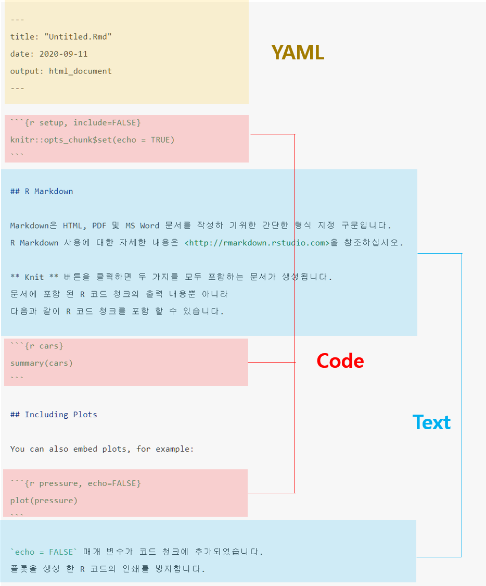

\mainmatter


# R Markdown {#r-markdown}


> **Sketch**
>
> - 동일한 문서에 코드, 결과, 텍스트가 동시에 있을 수 있을까?
> - 만약 결과와 도표가 자동으로 생성된 경우 데이터가 변경 되더라도 자동으로 문서를 업데이트 할 수 있을까?
> - 최종 완료한 문서가 미래에도 열 수 있을까? 
> - 이러한 모든 과정이 매우 쉽다면??


<iframe width="800" height="500" src="https://www.youtube.com/embed/s3JldKoA0zw" frameborder="0" allow="accelerometer; autoplay; encrypted-media; gyroscope; picture-in-picture" allowfullscreen></iframe>

<!-- {width="100%"} -->


\footnotesize

<div class="figure" style="text-align: center">

<p class="caption">(\#fig:unnamed-chunk-1)R markdown 세계(https://ulyngs.github.io/rmarkdown-workshop-2019 에서 발췌)</p>
</div>

 \normalsize


## R Markdown의 구성

\footnotesize

\BeginKnitrBlock{rmdnote}<div class="rmdnote">본 절의 내용 중 일부는 지난 학기 강의노트 1.7절과 중복되거나 재구성한 내용이 포함됨. </div>\EndKnitrBlock{rmdnote}

 \normalsize


1. R Markdown은 R 코드와 분석 결과(표, 그림 등)을 포함한 문서 또는 컨텐츠를 제작하는 도구로 일반적으로 아래 열거한 형태로 활용함
   - 문서 또는 논문(`pdf`, `html`, `docx`)
   - 프리젠테이션(`pdf`, `html`, `pptx`)
   - 웹 또는 블로그

2. 재현가능(reproducible)한 분석 및 연구^[과학적 연구의 결과물을 오픈소스로 내놓고 누구라도 검증 가능] 가능
   - 신뢰성 있는 문서 작성
   - `Copy & paste`를 하지 않고 효율적 작업 가능
   

> **R 마크다운 파일 = `.Rmd` 확장자를 가진 일반 텍스트 파일**

````markdown
---
title: "Untitled.Rmd"
date: "2020-09-11"
output: html_document
---

```{r setup, include=FALSE}
knitr::opts_chunk$set(echo = TRUE)
```

## R Markdown

Markdown은 HTML, PDF 및 MS Word 문서를 작성하 기위한 간단한 형식 지정 구문입니다.
R Markdown 사용에 대한 자세한 내용은 <http://rmarkdown.rstudio.com>을 참조하십시오.


**Knit** 버튼을 클릭하면 두 가지를 모두 포함하는 문서가 생성됩니다.
문서에 포함 된 R 코드 청크의 출력 내용뿐 아니라
다음과 같이 R 코드 청크를 포함 할 수 있습니다.

```{r cars}
summary(cars)
```

## Including Plots

You can also embed plots, for example:

```{r pressure, echo=FALSE}
plot(pressure)
```

`echo = FALSE` 매개 변수가 코드 청크에 추가되었습니다.
플롯을 생성 한 R 코드의 인쇄를 방지합니다.
````

위 R Markdown 문서는 아래 그림과 같이 **YAML**, **Markdown 텍스트**, **Code Chunk** 세 부분으로 구성됨. 

\footnotesize

<div class="figure" style="text-align: center">

<p class="caption">(\#fig:rmarkdown-structure)R markdown structure</p>
</div>

 \normalsize


**YAML (YAML Ain't Markup Language)**


- R Markdown 문서의 metadata로 문서의 맨 처음에 항상 포함(header)되어야 함.
- R Markdown 문서의 최종 출력 형태(`html`, `pdf`, `docx`, `pptx` 등), 제목, 저자, 날짜 등의 정보 등을 포함
<!-- - YAML 언어에 대한 사용 예시는 @xie-2016 의 [Appendix B.2](https://bookdown.org/yihui/bookdown/r-markdown.html) 참고 -->


**최종 문서 생성 과정**

- `Rmd` 파일을 `knitr` 을 통해 `.md` 파일로 변환 후 `pandoc` 이라는 문서 변환기를 통해 원하는 문서 포맷으로 출력

\footnotesize

<div class="figure" style="text-align: center">

<p class="caption">(\#fig:rmarkdown-flow)R Markdown의 최종 결과물 산출과정(http://applied-r.com/project-reporting-template/)</p>
</div>

 \normalsize


## R Markdown 문서 시작하기

- **R Markdown** 문서 생성: `[File] -> [New File] -> [R Markdown..]`을 선택

\footnotesize

\BeginKnitrBlock{rmdcaution}<div class="rmdcaution">RStudio를 처음 설치하고 위와 같이 진행할 경우 아래와 같은 패키지 설치 여부를 묻는 팝업 창이 나타남. 패키지 설치 여부에 `[Yes]`를 클릭하면 R Markdown 문서 생성을 위해 필요한 패키지들이 자동으로 설치</div>\EndKnitrBlock{rmdcaution}

 \normalsize

\footnotesize


 \normalsize

- 설치 완료 후 R Markdown으로 생성할 최종 문서 유형 선택 질의 창이 나타남. 아래 창에서 제목(Title)과 저자(Author) 이름 입력 후 `[OK]` 버튼 클릭(`Document`, `html` 문서 선택)

\footnotesize


 \normalsize

- 아래 그림과 같이 새로운 문서 창이 생성되고 `test.Rmd` 파일로 저장^[[RStudio 프로젝트]에서 생성한 폴더 내에 파일 저장]

\footnotesize


 \normalsize

- 문서 상단에 `Knit` 아이콘을 클릭 후 `Knit to HTML` 클릭 또는 문서 아무 곳에 커서를 위치하고 단축키 `[Ctrl] + [Shift] + [K]` 입력

\footnotesize


 \normalsize

- `knitr` + `R Markdown` + `pandoc` $\rightarrow$ `html` 파일 생성 결과

\footnotesize

<div class="figure" style="text-align: center">

<p class="caption">(\#fig:rmarkdown-new-out)test.html 문서 화면(저장 폴더 내 `test.html`을 크롬 브라우저로 실행)</p>
</div>

 \normalsize


## R Markdown 기본 문법(syntax)

> R Markdown의 기본 문법은 Rstudio 풀다운 메뉴 **`[Help]`** $\rightarrow$ **`[Markdown Quick Reference]`** 에서 확인 가능

### 텍스트 문법

**강조(emphasis)**

- 이텔릭체: \*italic1\*, \_italic2\_  $\rightarrow$ *italic1*, _italic2_
- 볼드(굵은)체: \**bold1\**, \_\_bold2\_\_ $\rightarrow$ **bold1**, __bold2__

**Inline code**

- <span>&#96;</span>inline code&#96; $\rightarrow$ `inline code`

**아래/위 첨자(sub/superscript)**

-  subscript\~2\~ $\rightarrow$ subscript~2~
-  superscript\^2\^ $\rightarrow$ superscript^2^

**삭제표시(strike through)**

- \~\~strikethrough\~\~ $\rightarrow$ ~~strikethrough~~

**생략표시(ellipsis)**

- \.\.\. $\rightarrow$ ...

**긴/짧은 대쉬(en/emd-dash)**

- 짧은 대쉬: \-\- $\rightarrow$ --
- 긴 대쉬: \-\-\- $\rightarrow$ ---

**특수문자 탈출 지정자**

- \\\*,  \\\_, \\\~, \\\\ $\rightarrow$ \*, \_, \~, \\

**하이퍼링크**

-`[text](link)` $\rightarrow$ [통계프로그래밍언어](https://zorba78.github.io/cnu-r-programming-lecture-note)

**외부그림 삽입**

- ``: ``

{width="80%"}


**강제 줄바꿈(line breaks)**

- 하나의 줄에서 공백(space) 두 개 이상 또는 백슬레시(`\`) 입력 후 `[Enter]`

````markdown
End a line with two spaces to start 
a new paragraph
````

End a line with two spaces to start 
a new paragraph


````markdown
End a line with two spaces to start\
a new paragraph
````

End a line with two spaces to start\
a new paragraph


**각주(footnote)**

- `A footnote^[주석내용]` $\rightarrow$ A footnote^[주석내용]

**주석(comment)**

- `<!-- this is a comment that won't be shown -->` $\rightarrow$ <!-- this is a comment that won't be shown -->


\footnotesize

\BeginKnitrBlock{rmdtip}<div class="rmdtip">RStudio에서 단축키 `[Ctrl]` + `[Shift]` + `[C]`를 통해 전체 line 에 대해 주석처리 가능</div>\EndKnitrBlock{rmdtip}

 \normalsize


### Block-level elements


**장/절(header)**

- \# Header 1 (chapter, 장)
- \## Header 2 (section, 절)
- \### Header 3 (subsection, 관)


**목록(list)**

- 비순서(unordered) 목록: `-`, `*`, `+` 중 어느 하나로 입력 가능

````markdown
- one item 
* two item
   + sub-item 1
   + sub-item 2
      - subsub-item 1
      - subsub-item 2
````

- one item 
* two item
   + sub-item 1
   + sub-item 2
      - subsub-item 1
      - subsub-item 2


- 순서(ordered) 목록: 비순서 목록의 기호 대신 숫자로 리스트 생성


````markdown
1. the first item
   - sub-item 1
2. the second item
3. the third item
````

1. the first item
   - sub-item 1
2. the second item
3. the third item


- 같은 숫자로 적어도 순서대로 목록 생성

````markdown
1. the first item
   - sub-item 1
1. the second item
1. the third item
````

1. the first item
   - sub-item 1
1. the second item
1. the third item


**인용구(blockquote)**: `>`로 시작

````markdown
> "There are three kinds of lies: lies, damn lies, and statistics"
>
> --- Benjamin Disraeli
````

> "There are three kinds of lies: lies, damn lies, and statistics"
>
> --- Benjamin Disraeli


### 수식표현(math expression)

- 줄 안에 수식 입력 시 `$수식표현$` 으로 입력
- 수식 display style (보통 교과서에 정리 및 정의에 기술된 수식들) 적용 시 `$$ ~ $$` 안에 수식 입력
- 수식 표현은 LaTeX 의 수식 표현을 동일하게 준용(https://www.latex4technics.com/, https://latex.codecogs.com/legacy/eqneditor/editor.php 에서 수식 입력 명령어 학습 가능)
- LaTeX 수식 입력 코드는 
- 예시

$$
  P(X = x) = f(x; n, p) = {n \choose x} p^x (1-p)^{n-x}
$$

- Inline equation: `$P(X = x) = f(x; n, p) = {n \choose x} p^x (1-p)^{n-x}$` $\rightarrow$ $P(X = x) = f(x; n, p) = {n \choose x} p^x (1-p)^{n-x}$
- Math block: `$$P(X = x) = f(x; n, p) = {n \choose x} p^x (1-p)^{n-x}$$`


$$P(X = x) = f(x; n, p) = {n \choose x} p^x (1-p)^{n-x}$$

- `$ $` 또는 `$$ $$` 안에 LaTeX에서 제공하는 수식 함수 사용 가능

````latex
$$\begin{array}{ccc}
x_{11} & x_{12} & x_{13}\\
x_{21} & x_{22} & x_{23}
\end{array}$$
````

$$\begin{array}{ccc}
x_{11} & x_{12} & x_{13}\\
x_{21} & x_{22} & x_{23}
\end{array}$$


````latex
$$\Theta = \begin{pmatrix}\alpha & \beta\\
\gamma & \delta
\end{pmatrix}$$
````


$$\Theta = \begin{pmatrix}\alpha & \beta\\
\gamma & \delta
\end{pmatrix}$$


````latex
$$\begin{align} 
g(X_{n}) &= g(\theta)+g'({\tilde{\theta}})(X_{n}-\theta) \notag \\
\sqrt{n}[g(X_{n})-g(\theta)] &= g'\left({\tilde{\theta}}\right)
  \sqrt{n}[X_{n}-\theta ]
\end{align}$$
````


$$\begin{aligned} 
g(X_{n}) &= g(\theta)+g'({\tilde{\theta}})(X_{n}-\theta) \notag \\
\sqrt{n}[g(X_{n})-g(\theta)] &= g'\left({\tilde{\theta}}\right)
  \sqrt{n}[X_{n}-\theta ]
\end{aligned}$$


## R Code Chunks

- 실제 R code가 실행되는 부분임
- Code chunk 실행 시 다양한 옵션 존재(본 강의에서는 몇 개의 옵션만 다룰 것이며, 더 자세한 내용은 https://yihui.org/knitr/options/ 또는 [R Markdown 레퍼런스 가이드](https://rstudio.com/wp-content/uploads/2015/03/rmarkdown-reference.pdf) 참조
- Code chunk는  ```` ```{r} ````로 시작되며 `r`은 code 언어 이름을 나타냄.
- Code chunk는 ```` ``` ```` 로 종료
- R Markdown 문서 작성 시 단축키 `[Ctrl] + [Alt] + [I]`를 입력하면 Chunk 입력창이 자동 생성됨


\footnotesize

<div class="figure" style="text-align: center">

<p class="caption">(\#fig:r-code-chunk)Chunk anatomy</p>
</div>

 \normalsize


