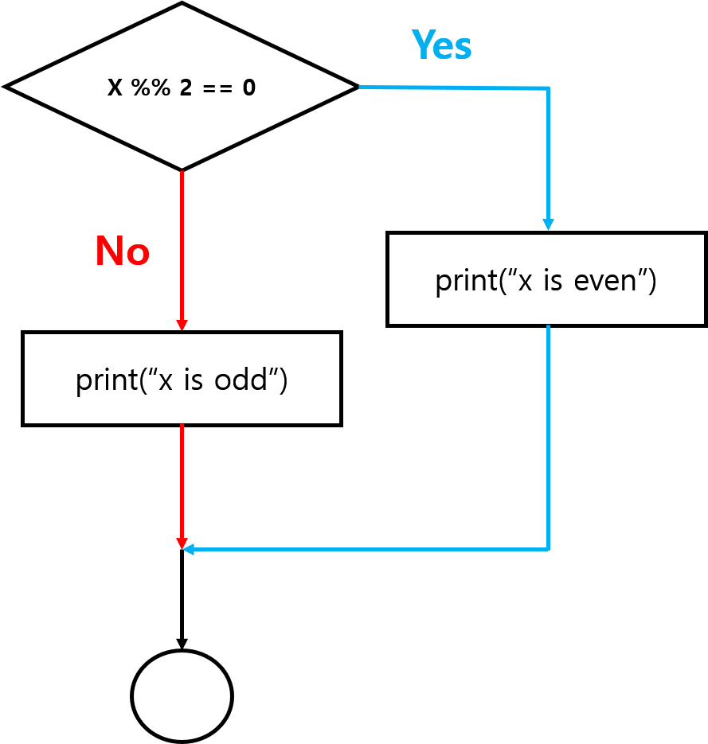
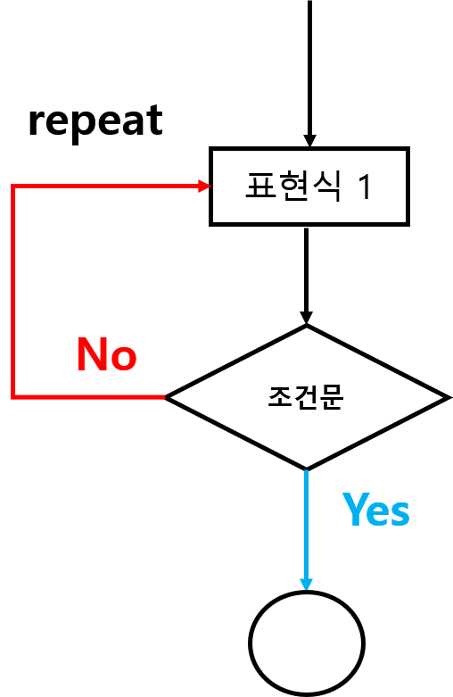
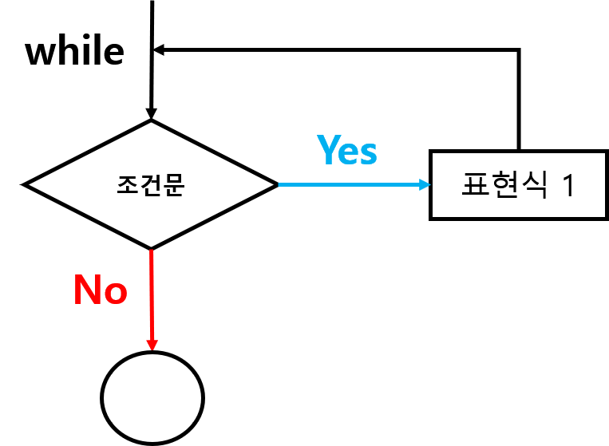

# 제어문(Control Structure) {#control-structure}


> **Sketch**
>
> - 프로그램이 무엇이고 이를 만들기 위해 어떤 것들이 필요할까?
> - 프로그램 안의 특정 구문을 주어진 조건에 맞게 실행 여부를 제어하거나 동일한 작업을 반복할 수 있을까?
> - 프로그램을 통해 특정 목적을 위한 나만의 함수를 만들 수 있을까?


\footnotesize

<div class="figure" style="text-align: center">

<p class="caption">(\#fig:unnamed-chunk-2)Flow-control example (https://homerhanumat.github.io/r-notes/flow.html)</p>
</div>

 \normalsize


\footnotesize

\BeginKnitrBlock{rmdnote}<div class="rmdnote">**참고**: 본 장의 내용은 [데이터과학 민주화](https://statkclee.github.io/r4inf/)와 [Beginning Computer Programming with R](https://homerhanumat.github.io/r-notes/prompting-the-user.html)의 내용을 기반으로 재구성함</div>\EndKnitrBlock{rmdnote}

 \normalsize


## Prerequisite {#control-prerequisite}

- 예약어(researved words): R에서 의미(sementic)를 미리 정해 놓은 단어
   - [통계프로그래밍언어 강의노트](https://zorba78.github.io/cnu-r-programming-lecture-note/scalar.html) 참고


\footnotesize

<table class="table table-condensed table-striped" style="font-size: 12px; margin-left: auto; margin-right: auto;">
<caption style="font-size: initial !important;">(\#tab:unnamed-chunk-4)R 예약어 종류 및 설명</caption>
 <thead>
  <tr>
   <th style="text-align:left;"> R 예약어 </th>
   <th style="text-align:left;"> 설명 </th>
  </tr>
 </thead>
<tbody>
  <tr>
   <td style="text-align:left;width: 7cm; font-family: monospace;"> if, else, while, function, in, next, break </td>
   <td style="text-align:left;width: 7cm; font-family: monospace;"> 조건, 함수, 반복문에 사용 </td>
  </tr>
  <tr>
   <td style="text-align:left;width: 7cm; font-family: monospace;"> TRUE/FALSE </td>
   <td style="text-align:left;width: 7cm; font-family: monospace;"> 논리 상수(logical constants) </td>
  </tr>
  <tr>
   <td style="text-align:left;width: 7cm; font-family: monospace;"> NULL </td>
   <td style="text-align:left;width: 7cm; font-family: monospace;"> 정의되지 않은 값 혹은 값이 없음 표현 </td>
  </tr>
  <tr>
   <td style="text-align:left;width: 7cm; font-family: monospace;"> Inf </td>
   <td style="text-align:left;width: 7cm; font-family: monospace;"> 무한(infinity) </td>
  </tr>
  <tr>
   <td style="text-align:left;width: 7cm; font-family: monospace;"> NaN </td>
   <td style="text-align:left;width: 7cm; font-family: monospace;"> 숫자가 아님(not a number) </td>
  </tr>
  <tr>
   <td style="text-align:left;width: 7cm; font-family: monospace;"> NA </td>
   <td style="text-align:left;width: 7cm; font-family: monospace;"> 결측값(not available) </td>
  </tr>
  <tr>
   <td style="text-align:left;width: 7cm; font-family: monospace;"> NA_integer_, NA_real_, NA_complex_, NA_character_ </td>
   <td style="text-align:left;width: 7cm; font-family: monospace;"> 결측값을 처리하는 상수 </td>
  </tr>
  <tr>
   <td style="text-align:left;width: 7cm; font-family: monospace;"> ... </td>
   <td style="text-align:left;width: 7cm; font-family: monospace;"> 함수가 다른 함수에 인자를 전달하도록 지원 </td>
  </tr>
</tbody>
</table>

 \normalsize


- **변수(variable)**: 사용자가 프로그램 처리를 위해 지정한 단어
   - 적당한 값을 저장하고 나중에 필요시 해당 값을 호출해 사용하기 위한 목적으로 사용되는 표식(label)
   - 예약어를 변수명으로 사용할 수 없음
   - [통계프로그래밍언어 강의노트: R 기초문법](https://zorba78.github.io/cnu-r-programming-lecture-note/r-basic.html) 참고
   
- **고수준 언어(high-level language)**: 사람이 읽고 쓰기 쉬운 형태의 명령어를 컴퓨터가 읽고 처리할 수 있도록 고안된 프로그래밍 언어
   - 컴퓨터가 이해할 수 있는 언어 $\rightarrow$ 중앙처리장치(central processing unit, CPU)가 이해하는 언어 $\rightarrow$ 기계어(machine language)
   - 기계어는 0과 1로 구성된 이진수(binary number)임(예: `0100101001001001001110110101101010110`)
   - 고수준 언어의 종류: C, C++, JAVA, 베이직, Perl, Python, R, ...
   
- **번역기(translator)**: 사람이 이해할 수 있는 표현(언어)를 기계(컴퓨터)가 이해할 수 있는 언어(기계어)로 변환
   - 인터프리터(interpreter)
   - 컴파일러(compiler)

- **인터프리터*: 코드(스크립트) 한 줄을 즉석에서 읽고, 파싱(프로그램을 검사하고 구문론적 구조를 분석)하고, 해석
   - R, Python, MATLAB 등은 인터프리터를 번역기로 사용
   - 인터엑티브 모드 $\rightarrow$ R 프롬프트(`>`) 뒤에 한 줄의 명령어를 작성하면 측석해서 처리 후 다음 입력에 대해 준비(prompt)함. 

\footnotesize


```r
안녕하세요!!
통계패키지활용 수업에서 R을 배우고 있습니다. 
처음이라 실수가 많습니다.
앞으로 잘 부탁해요!!
```

```
Error: <text>:1:6: 예기치 않은 '!'입니다
1: 안녕하세요!
         ^
```

 \normalsize

\footnotesize


```r
print("안녕하세요!!")
print("통계패키지활용 수업을 위해 R을 배우고 있습니다.")
print("처음이라 실수가 많습니다.")
print("앞으로 잘 부탁해요!!")
```

```
[1] "안녕하세요!!"
[1] "통계패키지활용 수업을 위해 R을 배우고 있습니다."
[1] "처음이라 실수가 많습니다."
[1] "앞으로 잘 부탁해요!!"
```

 \normalsize


- **컴파일러**: 완전한 프로그램을 하나의 파일에 담고 파일 안에 저장되어 있는 소스코드를 기계어로 번역 후 다음 실행할 수 있도록 변환한 기계어를 파일에 담음. 
   - 보통은 `.exe`, `.dll` 파일 형태로 저장됨 
      


## 프로그램 {#control-program}

- **프로그램(program)**: 특정 작업(목적)을 수행할 수 있도록 작성한 일련의 R 문장(명령어)의 집합
   - 일련의 문장(명령어)들은 텍스트 편집기를 통해 작성하며, **스크립트(script)**로 명칭되는 파일로 저장 $\rightarrow$ R 스크립트 `.R` 확장자를 가짐

\footnotesize


```r
# Hello.R 
print("안녕 R!!") #한국어
print("Hi R!!") # 영어
print("こんにちはR!!") # 일본어
print("Γεια R!!") #그리스어
```

 \normalsize

\footnotesize


```r
source("hello.R", encoding = "UTF-8")
```

```
[1] "안녕 R!!"
[1] "Hi R!!"
[1] "こんにちはR!!"
[1] "Γεια R!!"
```

 \normalsize


- 예시: 텍스트 파일에서 가장 자주 나오는 단어 찾기 프로그램
   - https://statkclee.github.io/r4inf/r-intro.html#r-intro-what-is-a-program 참고

\footnotesize


```r
require(tidyverse)
require(stringr)
require(ggpubr)
require(ggthemes)

text_dat <- readLines("data/text-example-01.txt")
# 공백 또는 구둣점 문자를 기준으로 텍스트 나누기

# 공백 또는 구둣점 문자 기준으로 텍스트 토큰화
split_wd <- str_split(text_dat, pattern = "\\b|[[:punct:]]") 
split_wd <- do.call(c, split_wd)
id <- grepl("[a-zA-Z]+", split_wd) #알파벳을 포함한 단어 인덱스
split_wd <- split_wd[id]
unique_wd <- unique(split_wd) # 중복을 제외한 총 사용 단어
res_v <- vector("integer", length(unique_wd)) # 저장 벡터 생성

for (i in seq_along(unique_wd)) {
  for (j in seq_along(split_wd)) {
    if (unique_wd[i] == split_wd[j]) {
      res_v[i] <- res_v[i] + 1 
    }
  }
}

bind_cols("word" = unique_wd, "freq" = res_v) %>% 
  arrange(desc(freq)) 
```

<div data-pagedtable="false">
  <script data-pagedtable-source type="application/json">
{"columns":[{"label":["word"],"name":[1],"type":["chr"],"align":["left"]},{"label":["freq"],"name":[2],"type":["dbl"],"align":["right"]}],"data":[{"1":"the","2":"57"},{"1":"in","2":"24"},{"1":"of","2":"23"},{"1":"to","2":"20"},{"1":"South","2":"17"},{"1":"a","2":"15"},{"1":"and","2":"14"},{"1":"Korea","2":"13"},{"1":"was","2":"9"},{"1":"which","2":"9"},{"1":"on","2":"8"},{"1":"for","2":"8"},{"1":"that","2":"8"},{"1":"United","2":"7"},{"1":"States","2":"7"},{"1":"economic","2":"7"},{"1":"year","2":"7"},{"1":"is","2":"7"},{"1":"consumption","2":"7"},{"1":"at","2":"6"},{"1":"The","2":"6"},{"1":"s","2":"6"},{"1":"as","2":"6"},{"1":"fiscal","2":"6"},{"1":"stimulus","2":"6"},{"1":"with","2":"5"},{"1":"pandemic","2":"5"},{"1":"it","2":"5"},{"1":"OECD","2":"5"},{"1":"percent","2":"5"},{"1":"said","2":"5"},{"1":"That","2":"5"},{"1":"has","2":"5"},{"1":"more","2":"5"},{"1":"be","2":"5"},{"1":"cases","2":"4"},{"1":"In","2":"4"},{"1":"by","2":"4"},{"1":"GDP","2":"4"},{"1":"could","2":"4"},{"1":"success","2":"4"},{"1":"hand","2":"4"},{"1":"first","2":"4"},{"1":"Korean","2":"4"},{"1":"cash","2":"4"},{"1":"new","2":"3"},{"1":"contrast","2":"3"},{"1":"around","2":"3"},{"1":"most","2":"3"},{"1":"since","2":"3"},{"1":"down","2":"3"},{"1":"its","2":"3"},{"1":"their","2":"3"},{"1":"than","2":"3"},{"1":"André","2":"3"},{"1":"quickly","2":"3"},{"1":"countries","2":"3"},{"1":"response","2":"3"},{"1":"billion","2":"3"},{"1":"about","2":"3"},{"1":"but","2":"3"},{"1":"support","2":"3"},{"1":"also","2":"3"},{"1":"spent","2":"3"},{"1":"stubbornly","2":"2"},{"1":"have","2":"2"},{"1":"both","2":"2"},{"1":"can","2":"2"},{"1":"late","2":"2"},{"1":"coronavirus","2":"2"},{"1":"contraction","2":"2"},{"1":"economies","2":"2"},{"1":"only","2":"2"},{"1":"Second","2":"2"},{"1":"economist","2":"2"},{"1":"went","2":"2"},{"1":"tamping","2":"2"},{"1":"reason","2":"2"},{"1":"relatively","2":"2"},{"1":"recorded","2":"2"},{"1":"day","2":"2"},{"1":"single","2":"2"},{"1":"deaths","2":"2"},{"1":"per","2":"2"},{"1":"million","2":"2"},{"1":"seen","2":"2"},{"1":"U","2":"2"},{"1":"S","2":"2"},{"1":"outbreak","2":"2"},{"1":"end","2":"2"},{"1":"less","2":"2"},{"1":"like","2":"2"},{"1":"been","2":"2"},{"1":"much","2":"2"},{"1":"changed","2":"2"},{"1":"after","2":"2"},{"1":"were","2":"2"},{"1":"hard","2":"2"},{"1":"hit","2":"2"},{"1":"wasn","2":"2"},{"1":"t","2":"2"},{"1":"other","2":"2"},{"1":"country","2":"2"},{"1":"into","2":"2"},{"1":"businesses","2":"2"},{"1":"big","2":"2"},{"1":"package","2":"2"},{"1":"helped","2":"2"},{"1":"up","2":"2"},{"1":"form","2":"2"},{"1":"open","2":"2"},{"1":"bang","2":"2"},{"1":"this","2":"2"},{"1":"month","2":"2"},{"1":"sought","2":"2"},{"1":"domestic","2":"2"},{"1":"So","2":"2"},{"1":"there","2":"2"},{"1":"payouts","2":"2"},{"1":"consumers","2":"2"},{"1":"three","2":"2"},{"1":"region","2":"2"},{"1":"As","2":"1"},{"1":"struggles","2":"1"},{"1":"persistent","2":"1"},{"1":"slow","2":"1"},{"1":"return","2":"1"},{"1":"growth","2":"1"},{"1":"seems","2":"1"},{"1":"found","2":"1"},{"1":"recipe","2":"1"},{"1":"succeed","2":"1"},{"1":"fronts","2":"1"},{"1":"if","2":"1"},{"1":"survive","2":"1"},{"1":"uptick","2":"1"},{"1":"latest","2":"1"},{"1":"projections","2":"1"},{"1":"looking","2":"1"},{"1":"mere","2":"1"},{"1":"second","2":"1"},{"1":"best","2":"1"},{"1":"performer","2":"1"},{"1":"among","2":"1"},{"1":"major","2":"1"},{"1":"behind","2":"1"},{"1":"China","2":"1"},{"1":"euro","2":"1"},{"1":"area","2":"1"},{"1":"expected","2":"1"},{"1":"shrink","2":"1"},{"1":"see","2":"1"},{"1":"full","2":"1"},{"1":"order","2":"1"},{"1":"almost","2":"1"},{"1":"world","2":"1"},{"1":"facing","2":"1"},{"1":"dramatic","2":"1"},{"1":"slowdown","2":"1"},{"1":"World","2":"1"},{"1":"War","2":"1"},{"1":"Laurence","2":"1"},{"1":"Boone","2":"1"},{"1":"chief","2":"1"},{"1":"introducing","2":"1"},{"1":"newest","2":"1"},{"1":"outlook","2":"1"},{"1":"presentation","2":"1"},{"1":"underscored","2":"1"},{"1":"part","2":"1"},{"1":"escaping","2":"1"},{"1":"unscathed","2":"1"},{"1":"economically","2":"1"},{"1":"starting","2":"1"},{"1":"highly","2":"1"},{"1":"effective","2":"1"},{"1":"management","2":"1"},{"1":"place","2":"1"},{"1":"case","2":"1"},{"1":"same","2":"1"},{"1":"then","2":"1"},{"1":"peaked","2":"1"},{"1":"daily","2":"1"},{"1":"March","2":"1"},{"1":"before","2":"1"},{"1":"flattening","2":"1"},{"1":"digits","2":"1"},{"1":"never","2":"1"},{"1":"really","2":"1"},{"1":"plateaued","2":"1"},{"1":"until","2":"1"},{"1":"mid","2":"1"},{"1":"July","2":"1"},{"1":"where","2":"1"},{"1":"peak","2":"1"},{"1":"confirmed","2":"1"},{"1":"infections","2":"1"},{"1":"seven","2":"1"},{"1":"people","2":"1"},{"1":"nearly","2":"1"},{"1":"according","2":"1"},{"1":"Centers","2":"1"},{"1":"Disease","2":"1"},{"1":"Control","2":"1"},{"1":"Prevention","2":"1"},{"1":"Johns","2":"1"},{"1":"Hopkins","2":"1"},{"1":"University","2":"1"},{"1":"Economic","2":"1"},{"1":"efficacious","2":"1"},{"1":"handling","2":"1"},{"1":"made","2":"1"},{"1":"strict","2":"1"},{"1":"national","2":"1"},{"1":"lockdown","2":"1"},{"1":"sort","2":"1"},{"1":"paralyzed","2":"1"},{"1":"entire","2":"1"},{"1":"European","2":"1"},{"1":"months","2":"1"},{"1":"largely","2":"1"},{"1":"unnecessary","2":"1"},{"1":"turn","2":"1"},{"1":"meant","2":"1"},{"1":"dislocation","2":"1"},{"1":"from","2":"1"},{"1":"shuttered","2":"1"},{"1":"factories","2":"1"},{"1":"closed","2":"1"},{"1":"restaurants","2":"1"},{"1":"main","2":"1"},{"1":"they","2":"1"},{"1":"ve","2":"1"},{"1":"able","2":"1"},{"1":"contain","2":"1"},{"1":"epidemic","2":"1"},{"1":"better","2":"1"},{"1":"others","2":"1"},{"1":"so","2":"1"},{"1":"disruptions","2":"1"},{"1":"activity","2":"1"},{"1":"limited","2":"1"},{"1":"Christophe","2":"1"},{"1":"senior","2":"1"},{"1":"Google","2":"1"},{"1":"mobility","2":"1"},{"1":"data","2":"1"},{"1":"shows","2":"1"},{"1":"barely","2":"1"},{"1":"normal","2":"1"},{"1":"routines","2":"1"},{"1":"February","2":"1"},{"1":"what","2":"1"},{"1":"little","2":"1"},{"1":"recovered","2":"1"},{"1":"April","2":"1"},{"1":"biggest","2":"1"},{"1":"factors","2":"1"},{"1":"change","2":"1"},{"1":"weather","2":"1"},{"1":"public","2":"1"},{"1":"holidays","2":"1"},{"1":"not","2":"1"},{"1":"virus","2":"1"},{"1":"Italy","2":"1"},{"1":"saw","2":"1"},{"1":"shop","2":"1"},{"1":"visits","2":"1"},{"1":"plummet","2":"1"},{"1":"Further","2":"1"},{"1":"even","2":"1"},{"1":"though","2":"1"},{"1":"launched","2":"1"},{"1":"fairly","2":"1"},{"1":"aggressive","2":"1"},{"1":"pouring","2":"1"},{"1":"or","2":"1"},{"1":"pockets","2":"1"},{"1":"citizens","2":"1"},{"1":"early","2":"1"},{"1":"spring","2":"1"},{"1":"such","2":"1"},{"1":"Germany","2":"1"},{"1":"launching","2":"1"},{"1":"worth","2":"1"},{"1":"because","2":"1"},{"1":"Seoul","2":"1"},{"1":"provided","2":"1"},{"1":"keep","2":"1"},{"1":"continuing","2":"1"},{"1":"provide","2":"1"},{"1":"loans","2":"1"},{"1":"guarantees","2":"1"},{"1":"totaling","2":"1"},{"1":"More","2":"1"},{"1":"point","2":"1"},{"1":"kept","2":"1"},{"1":"taps","2":"1"},{"1":"Last","2":"1"},{"1":"week","2":"1"},{"1":"announced","2":"1"},{"1":"fourth","2":"1"},{"1":"round","2":"1"},{"1":"adding","2":"1"},{"1":"an","2":"1"},{"1":"additional","2":"1"},{"1":"policymakers","2":"1"},{"1":"say","2":"1"},{"1":"expansionary","2":"1"},{"1":"approach","2":"1"},{"1":"will","2":"1"},{"1":"likely","2":"1"},{"1":"continue","2":"1"},{"1":"through","2":"1"},{"1":"next","2":"1"},{"1":"combat","2":"1"},{"1":"lingering","2":"1"},{"1":"impacts","2":"1"},{"1":"too","2":"1"},{"1":"stands","2":"1"},{"1":"started","2":"1"},{"1":"monetary","2":"1"},{"1":"slowed","2":"1"},{"1":"efforts","2":"1"},{"1":"throw","2":"1"},{"1":"continued","2":"1"},{"1":"weakness","2":"1"},{"1":"Earlier","2":"1"},{"1":"Congress","2":"1"},{"1":"failed","2":"1"},{"1":"agree","2":"1"},{"1":"fresh","2":"1"},{"1":"Republican","2":"1"},{"1":"lawmakers","2":"1"},{"1":"trim","2":"1"},{"1":"already","2":"1"},{"1":"paltry","2":"1"},{"1":"benefits","2":"1"},{"1":"while","2":"1"},{"1":"Democrats","2":"1"},{"1":"aid","2":"1"},{"1":"huge","2":"1"},{"1":"numbers","2":"1"},{"1":"unemployed","2":"1"},{"1":"Americans","2":"1"},{"1":"one","2":"1"},{"1":"key","2":"1"},{"1":"getting","2":"1"},{"1":"back","2":"1"},{"1":"track","2":"1"},{"1":"demand","2":"1"},{"1":"remained","2":"1"},{"1":"solid","2":"1"},{"1":"fall","2":"1"},{"1":"half","2":"1"},{"1":"rebound","2":"1"},{"1":"he","2":"1"},{"1":"And","2":"1"},{"1":"carried","2":"1"},{"1":"buck","2":"1"},{"1":"places","2":"1"},{"1":"First","2":"1"},{"1":"spend","2":"1"},{"1":"those","2":"1"},{"1":"translated","2":"1"},{"1":"spending","2":"1"},{"1":"saving","2":"1"},{"1":"bailout","2":"1"},{"1":"checks","2":"1"},{"1":"A","2":"1"},{"1":"significant","2":"1"},{"1":"portion","2":"1"},{"1":"money","2":"1"},{"1":"distributed","2":"1"},{"1":"tranches","2":"1"},{"1":"many","2":"1"},{"1":"households","2":"1"},{"1":"simply","2":"1"},{"1":"banked","2":"1"},{"1":"famous","2":"1"},{"1":"check","2":"1"},{"1":"There","2":"1"},{"1":"impact","2":"1"},{"1":"rebounded","2":"1"},{"1":"actually","2":"1"},{"1":"June","2":"1"},{"1":"quite","2":"1"},{"1":"spectacular","2":"1"},{"1":"very","2":"1"},{"1":"important","2":"1"},{"1":"some","2":"1"},{"1":"provinces","2":"1"},{"1":"used","2":"1"},{"1":"creative","2":"1"},{"1":"solutions","2":"1"},{"1":"ensure","2":"1"},{"1":"government","2":"1"},{"1":"would","2":"1"},{"1":"recycled","2":"1"},{"1":"economy","2":"1"},{"1":"help","2":"1"},{"1":"boost","2":"1"},{"1":"Lee","2":"1"},{"1":"Jae","2":"1"},{"1":"myung","2":"1"},{"1":"governor","2":"1"},{"1":"Gyeonggi","2":"1"},{"1":"province","2":"1"},{"1":"populous","2":"1"},{"1":"decided","2":"1"},{"1":"test","2":"1"},{"1":"out","2":"1"},{"1":"non","2":"1"},{"1":"payments","2":"1"},{"1":"Each","2":"1"},{"1":"resident","2":"1"},{"1":"received","2":"1"},{"1":"won","2":"1"},{"1":"over","2":"1"},{"1":"period","2":"1"},{"1":"But","2":"1"},{"1":"came","2":"1"},{"1":"local","2":"1"},{"1":"currency","2":"1"},{"1":"shops","2":"1"},{"1":"inside","2":"1"},{"1":"rather","2":"1"},{"1":"hoarded","2":"1"}],"options":{"columns":{"min":{},"max":[10]},"rows":{"min":[10],"max":[10]},"pages":{}}}
  </script>
</div>

 \normalsize

- 프로그램 작성을 위한 개념적 요소
   - **입력(input)**: 외부로부터 가져온 데이터, 값 등 
   - **출력(output)**: 입력에 대한 반응(결과 출력, 파일 저장, 음악 재생, ...)
   - **순차실행(sequential execution)**: 스크립트 또는 코드 작성 순서에 따라 한줄씩 실행
   - **조건실행(conditional execution)**: 특정 조건에 따라 문장(명령)을 실행하거나 건너뜀
   - **번복실행(iterative execution)**: 특정 명령을 반복적으로 실행 
   - **재사용(resuse)**: 스크립트의 집합(다수 줄로 구성된 코드 또는 스크립트)에 이름을 부여하고 저장 $\rightarrow$ 사용자 지정 함수(function)
   
- 프로그램 오류의 종류
   - **구문오류(syntax error)**: R 언어가 이해할 수 없는 문장 또는 문법으로 실행했을 때 나타나는 오류 $\rightarrow$ 가장 고치기 쉽고 즉각적으로 알려줌
   - **논리 또는 run-time 오류(logic or run-time error)**: 구문은 완벽하지만 실행 순서 또는 논리적으로 연관방식에 문제가 있어서 명령어를 수행할 수 없는 경우
   - **의미론적 오류(sementic error)**: 프로그램은 구문적으로 오류가 없고 실행되지만 올바른 결과를 출력하지 않는 경우 $\rightarrow$ **제일 고치기 어려움**


- 가장 간단한 프로그래밍은 순차적으로 명령을 실행하되 입력 시 흐름을 잠시 중단하고 대기하는 방법 $\rightarrow$ 프롬프트 상 명령어 한 줄씩 입력

\footnotesize


```r
# 아주 간단한 프로그래밍 예제
# readline() 함수 이용해 R한테 인사 받기
name <- readline("What's your name?: ")
cat("Hello, ", name, "!\n", sep = "")
```

 \normalsize


\footnotesize


```r
# readline() 함수를 이용해 알바비 계산

x <- as.numeric(readline(prompt = "하루 아르바이트 시간을 입력하시오: "))
y <- as.numeric(readline(prompt = "시급을 입력하시오 (단위=원): "))
z <- as.numeric(readline(prompt = "한달 동안 총 몇 일 동안 일을 하셨나요? "))
cat("월 급여는 ", x * y * z, " 원 입니다.\n", sep = "")
```

 \normalsize


## 조건문(Conditionals) {#condition}

- `if` 구문을 통해 조건문 생성
- **불린 표현식(boolean expression)**: 참(`TRUE`) 또는 거짓(`FALSE`) 두 값 중 하나로 값이 도출되는 표현식^[비교 및 논리 연산자([통계프로그래밍언어 2.1.4절 참고](https://zorba78.github.io/cnu-r-programming-lecture-note/scalar.html#character))]
   - **비교 연산자(comparison operators)**
      - 같다, 같지 않다, 크다 등을 표현하기 위한 연산자
      - `==`, `!=`, `>`, `<`, `>=`, `<=`
   - **논리 연산자(logical operator)**
      - AND (`&`, `&&`), OR (`|`, `||`), NOT (`!`)


\footnotesize


```r
x <- 10; y <- 13

# x가 2의 배수이고 y가 3의 배수
# 두 조건이 모두 참이여야 참
x %% 2 == 0 & y %% 3 == 0 

# x가 2의 배수이거나 y가 3의 배수 
# 두 개 조건 중 하나만 참을 만족하면 참임
x %% 2 == 0 | y %% 3 == 0 

# NOT (x > y)
!(x > y) # 부정에 부정은 참
```

```
[1] FALSE
[1] TRUE
[1] TRUE
```

 \normalsize

   
### **기본 구문** {#if-basic}

\footnotesize


```r
if (조건) 표현식
 └ 괄호 안 조건을 만족하면 표현식을 실행하고 조건을 만족하지 않으면 실행하지 않음
```

 \normalsize


\footnotesize


```r
x <- 10
if (x > 0) {
  print("x is positive")
}

x <- -5
if (x > 0) {
  print("x is positive")
}
```

```
[1] "x is positive"
```

 \normalsize


\footnotesize

<div class="figure" style="text-align: center">

<p class="caption">(\#fig:unnamed-chunk-15)if 구문 기본 flow-chart</p>
</div>

 \normalsize


- **`if` 구문의 사용 규칙**
   - `if` 문은 조건을 정의하는 헤더 부분(`(`, `)`)과 표현식이 위치하는 몸통 블록(body block, `{표현식}`) 으로  구성됨
   - `(`, `)`에 표현되는 조건은 벡터가 아닌 단일 값으로 나타내야 함. 
   - `{`, `}` 의 표현 또는 문장이 한 줄인 경우 블록 지정이 필요하지 않지만, 두 줄 이상인 경우 `if` 문의 범위를 지정해줘야 하기 때문에 꼭 중괄호(curly bracket, `{}`)가 사용되야 함. 
   

\footnotesize


```r
# 조건문 사용 예시
x <- c(TRUE, FALSE, FALSE)
y <- c(TRUE, TRUE, FALSE)
z <- "Both TRUE!!"

if (x[1] & y[1]) print(z) # x, y 첫 번째 원소만 사용
if (x && y) print(z) # 강제로 첫 번째 원소만 사용
if (x & y) print(z) # 경고 표시
```

```
Warning in if (x & y) print(z): length > 1 이라는 조건이 있고, 첫번째 요소만이
사용될 것입니다
```

```
[1] "Both TRUE!!"
[1] "Both TRUE!!"
[1] "Both TRUE!!"
```

 \normalsize


   
### **대안 실행(alternative execution)** {#if-else .unnumbered}

- 두 가지 경우가 존재하고 조건에 따라 어떤 명령을 실행할지를 결정
- **`if`**와 **`else`**로 표현 가능
- 조건에 따라 실행이 분기(branch) 되기 때문에 `if`-`else` 구문을 분기문이라고도 함
- `else` 는 `if` 조건을 배제(exclusive)한 나머지 경우이기 때문에 조건을 따로 지정하지 않으며, `if`와 동일하게 중괄호 내에 표현되어야 함

\footnotesize


```r
x <- 9
if (x %% 2 == 0) {
  print("x is even")
} else {
  print("x is odd")
}
```

```
[1] "x is odd"
```

 \normalsize

\footnotesize

<div class="figure" style="text-align: center">

<p class="caption">(\#fig:unnamed-chunk-18)대안실행(if-else 구문) flow-chart</p>
</div>

 \normalsize


### **연쇄 조건문(chained condition)** {#chain-cond}


- 두 가지 이상의 분기가 존재하는 경우 조건 표현식
- 연쇄 조건문의 표현은 아래와 같음

\footnotesize


```r
if (조건1) {
  표현식1 
  ...
} else if (조건2) {
  표현식2
  ...
} else {
  표현식3 
  ...
}
```

 \normalsize

\footnotesize


```r
x <- 5; y <- 10
if (x < y) {
  print("x is less than y")
} else if (x > y) {
  print("x is greater than y")
} else {
  print("x is equal to y")
}
```

```
[1] "x is less than y"
```

 \normalsize


\footnotesize

<div class="figure" style="text-align: center">

<p class="caption">(\#fig:unnamed-chunk-21)연쇄조건(if-else if-else 구문) flow-chart</p>
</div>

 \normalsize


### **중첩 조건문(nested contition)** {#nest-cond}

- 하나의 조건문 내부에 하위 조건식이 존재하는 형태

   
\footnotesize


```r
if (조건1) {
  표현식1 
  ...
} else {
  if (조건2) {
    표현식2
    ...
  } else {
    표현식3
    ...
  }
}
```

 \normalsize


\footnotesize


```r
x <- 10; y <- 10
if (x == y) {
  print("x is equal to y")
} else {
  if (x > y) {
    print("x is greater than y")
  } else {
    print("x is less than y")
  }
}
```

```
[1] "x is equal to y"
```

 \normalsize


\footnotesize

<div class="figure" style="text-align: center">

<p class="caption">(\#fig:unnamed-chunk-24)중첩 조건문 flow-chart</p>
</div>

 \normalsize


\footnotesize

\BeginKnitrBlock{rmdnote}<div class="rmdnote">
- 중첩 조건문은 코드의 가독성을 떨어뜨리기 때문에 피하는 것을 권장
- 중첩 조건문을 피하기 위한 한 가지 방법은 논리 연산자를 활용
</div>\EndKnitrBlock{rmdnote}

 \normalsize


\footnotesize


```r
# 중첩조건
x <- 58
if (x > 0) {
  if (x < 10) {
    print("x는 한 자리 양수")
  } else {
    if (x < 100) {  
      print("x는 두 자리 양수")
    } else {
      print("x는 세 자리 이상 양수")
    }
  }
}
```

```
[1] "x는 두 자리 양수"
```

```r
# 연쇄 조건
x <- 2020
if (x > 0 & x < 10) {
  print("x는 한 자리 양수")
} else if (x >=10 & x < 100) {
  print("x는 두 자리 양수")
} else {
  print("x는 세 자리 이상 양수")
}
```

```
[1] "x는 세 자리 이상 양수"
```

 \normalsize


### **`ifelse()` 함수** {#ifelse-fun}

- `if-else` 구문을 사용하기 쉽게 구현된 R 내장 **함수**
- `if-else` 구문과 다르게 조건 부분에 한 값(스칼라)이 아닌 논리형 벡터를 입력값으로 받아 조건에 따른 값(벡터)을 반환


\footnotesize


```r
# ifelse() 함수 인수
# help(ifelse) 참고
ifelse(
  test, 조건에 따른 논리형 벡터
  yes,  test에 정의한 조건이 참인 경우 새로운 벡터에 대입할 값
  no,   test 조건이 거짓인 경우 대입할 값
)
```

 \normalsize

- 사용 예시

\footnotesize


```r
# 평균이 23이고 표준편차가 5인 정규분포로부터 30개의 난수 추출
set.seed(12345)
bmi <- rnorm(30, 23, 5) 
bmi_cat <- ifelse(bmi < 25, "normal", "overweight")
bmi_cat
```

```
 [1] "overweight" "overweight" "normal"     "normal"     "overweight"
 [6] "normal"     "overweight" "normal"     "normal"     "normal"    
[11] "normal"     "overweight" "normal"     "overweight" "normal"    
[16] "overweight" "normal"     "normal"     "overweight" "normal"    
[21] "overweight" "overweight" "normal"     "normal"     "normal"    
[26] "overweight" "normal"     "overweight" "overweight" "normal"    
```

```r
# ifelse() 함수를 연쇄조건문 처럼 사용할 수 있다
bmi_cat2 <- ifelse(bmi < 18.5, "underweight", 
            ifelse(bmi < 24.9, "normal", 
            ifelse(bmi < 29.9, "overweight", "obesity")))
bmi_cat2
```

```
 [1] "overweight"  "overweight"  "normal"      "normal"      "overweight" 
 [6] "underweight" "overweight"  "normal"      "normal"      "underweight"
[11] "normal"      "obesity"     "normal"      "overweight"  "normal"     
[16] "overweight"  "normal"      "normal"      "overweight"  "normal"     
[21] "overweight"  "obesity"     "normal"      "underweight" "underweight"
[26] "obesity"     "normal"      "overweight"  "overweight"  "normal"     
```

 \normalsize


## 반복문(Looping) {#looping}

### Prerequisite {#loop-pre .unnumbered}


- 프로그램 또는 알고리즘 구현 시 특정 문장 또는 표현을 반복해야만 하는 상황이 발생
- 특히 시뮬레이션 시 반복문은 거의 필수적임
- 반복문을 통해 코딩의 효율을 극대화 할 수 있음
- 반복문은 특정 변수의 값을 갱신(update) 하기 위해 주로 사용


\footnotesize


```r
x <- x + 1 # 현재 값에 1을 더해서 x를 새로운 값으로 update
```

 \normalsize

- 통상적으로 특정 변수의 값을 갱신하기 위해 변수 값을 초기화(initialize)

\footnotesize


```r
x <- 0 # x 변수 초기화
x <- x + 1
```

 \normalsize


- 몇 번 반복이라는 정의가 없는 상태에서 특정 조건이 거짓(FALSE)이 될 때 까지 계속 반복

### **`repeat` 구문** {#repeat}

\footnotesize


```r
repeat 표현식
```

 \normalsize

- `repeat` 다음에 오는 표현식을 무한 반복(infinite loop)

\footnotesize


```r
repeat print("무한 루프에 걸림...ESC 키 누르시오!!")
```

 \normalsize

```
[1] "무한 루프에 걸림...ESC 키 누르시오!!"
[1] "무한 루프에 걸림...ESC 키 누르시오!!"
[1] "무한 루프에 걸림...ESC 키 누르시오!!"
[1] "무한 루프에 걸림...ESC 키 누르시오!!"
[1] "무한 루프에 걸림...ESC 키 누르시오!!"
...
...
```


- 특정 작업에 대해 블록을 지정(중괄호)하고 블록 안에 표현 가능
- 일반적으로 특정 조건(`if (조건) break`)을 두어 무한루프에서 탈출
- `if` 문의 조건은 언제 반복이 끝날 지를 제어하는 변수로 반복변수(iteration variable) 이라고도 함
- 언제까지(until) 반복(repeat) $\rightarrow$ REPEAT-UNTIL 구문으로 표현


\footnotesize


```r
repeat {
  표현식 1
  if (조건) break
  반복변수 update
}
```

 \normalsize


\footnotesize

<div class="figure" style="text-align: center">

<p class="caption">(\#fig:unnamed-chunk-34)REPEAT 구문 flow-chart</p>
</div>

 \normalsize


\footnotesize


```r
# REPEAT-UNTIL 예시 1
# 1:100 까지 합 계산 함수
tot <- 0; i <- 1 # 사용 변수 초기화 (update 변수)
repeat {
  tot <- tot + i
  if (i >= 100) break # i는 반복 변수
  i <- i + 1
}
tot
# check
sum(1:100)
```

```
[1] 5050
[1] 5050
```

 \normalsize

> 1. `tot`에 `i`를 더한 후 `i` 가 조건을 만족하는지 확인
> 2. 조건에 *부합하지 않으면* 다음 문장 실행(`i`에 1을 증가 후 업데이트) 1. 의 작업을 반복(loop)
> 3. `i`가 조건에 부합하면 반복 종료


\footnotesize


```r
# REPEAT 예시 2
# 1에서 20 사이 숫자 알아맞추기 게임
n <- 20
number <- sample(1:n, size = 1)
cat("1에서 ", n, "까지 숫자 알아 맞추기", sep = "")
repeat {
  guess <- readline("어떤 숫자를 생각하시나요? (종료: q 입력) ")
  if (guess == "q") {
    cat("재미가 없나봐요.\n")
    break
  } else if (as.numeric(guess) == number) {
    cat("천재인데요?ㅋㅋㅋ")
    break
  }
  # 틀리면 계속 반복
}
```

 \normalsize

> 1. `guess`에 `readline()` 으로부터 값 입력
> 2. `guess` 값이 `q` 이면 종료
> 3. `guess` 값이 `number` 와 일치하면 종료
> 4. 2.와 3. 조건에 부합하지 않으면 `guess` 값을 반복적으로 입력


```
어떤 숫자를 생각하시나요? (종료: q 입력) 1
어떤 숫자를 생각하시나요? (종료: q 입력) 2
어떤 숫자를 생각하시나요? (종료: q 입력) 3
천재인데요?ㅋㅋㅋ
```

### **`while` 구문** {#while}

\footnotesize


```r
while (조건) 표현식 ...
```

 \normalsize

- `while`에 지정된 조건이 참이면 계속해서 반복
- `repeat`는 반복이 처음부터 시작되는 반면, `while` 문은 조건을 먼저 평가한 후 반복이 시작됨. 
- `while (FALSE)`인 경우 루프 본문 코드가 실행되지 않음 
- `while (TRUE)`는 `repeat` 구문과 동일
- `while`문 의 일반적 형태

\footnotesize


```r
while (조건) {
  표현식 1
  반복변수 update
}
```

 \normalsize


\footnotesize

<div class="figure" style="text-align: center">

<p class="caption">(\#fig:unnamed-chunk-39)WHILE 구문 flow-chart</p>
</div>

 \normalsize


\footnotesize


```r
# WHILE 구문 예시 1
# 1:100 까지 합 계산 함수
tot <- 0; i <- 1 # 사용 변수 초기화 (update 변수)
while (i <= 100) {
  tot <- tot + i
  i <- i + 1
}
tot
```

```
[1] 5050
```

 \normalsize


> 1. 초기값 `i`가 조건 `i <= 100` 인지 확인
> 2. 참인 경우 `tot + i`를 통해 `tot`을 업데이트 한 다음 `i`를 1만큼 증가
> 3. 만약 `i`에 대한 조건 평가 결과가 거짓이면 `while` 구문을 빠져나감


\footnotesize


```r
# while 문 조건이 TRUE 인 경우
tot <- 0; i <- 1 # 사용 변수 초기화 (update 변수)
while (TRUE) {
  tot <- tot + i
  if (i >= 100) break
  i <- i + 1
}
tot
```

```
[1] 5050
```

 \normalsize

> 1. `while` 의 조건이 참이기 때문에 무한 반복
> 2. 단 `i`가 100과 같거나 클 경우 구문 탈출
> 3. 그 전 까지는 `tot`와 `i`를 갱신


\footnotesize


```r
# WHILE 구문 예시 2
# 문자열 벡터에서 특정 문자열의 인덱스를 반환
txtvec <- c("R", "package", "flow-control", "while", "if", "for", "repeat")
found <- FALSE
i <- 1

word <- readline("검색할 텍스트: ")
while (!found & i <= length(txtvec)) {
  if (txtvec[i] == word) {
    found <- TRUE
    break
  }
  cat(i, " 번째 위치에 해당 단어가 존재하지 않습니다.\n", sep="")
  i <- i + 1
}

if (found) {
  cat(i, " 번째 위치에 ", word, "를 찾았습니다.", sep = "")
} else {
  cat(word, " 단어는 해당 문자열 벡터에 존재하지 않습니다.\n", sep = "")
}
```

 \normalsize

> 1. `found = FALSE`, `i = 1`을 초기값으로 입력
> 2. `readline()`으로 입력한 텍스트를 `word`에 저장
> 3. `found` 가 참이고 `i`가 텍스트 벡터의 길이 값과 같을 때 까지 다음 구문 반복
> 4. `txtvec` 각 원소와 `word` 값이 같은지 확인 


```
while 입력 결과
1 번째 위치에 해당 단어가 존재하지 않습니다.
2 번째 위치에 해당 단어가 존재하지 않습니다.
3 번째 위치에 해당 단어가 존재하지 않습니다.
4 번째 위치에  while 를 찾았습니다.

temp 입력 결과
1 번째 위치에 해당 단어가 존재하지 않습니다.
2 번째 위치에 해당 단어가 존재하지 않습니다.
3 번째 위치에 해당 단어가 존재하지 않습니다.
4 번째 위치에 해당 단어가 존재하지 않습니다.
5 번째 위치에 해당 단어가 존재하지 않습니다.
6 번째 위치에 해당 단어가 존재하지 않습니다.
7 번째 위치에 해당 단어가 존재하지 않습니다.
temp 단어는 해당 문자열 벡터에 존재하지 않습니다.
```


\footnotesize

\BeginKnitrBlock{rmdnote}<div class="rmdnote">
- `repeat`, `while`과 같이 반복의 횟수가 지정되지 않는 반목구문을 불확정 반복문(indefinite loop)이라고 함. 
- 다음에 배울 `for` 구문은 위 두 반복문과는 다르게 반복의 범위를 명확히 지정하기 때문에 확정 반복문(definite loop)라고 함.
</div>\EndKnitrBlock{rmdnote}

 \normalsize


### **`for` 구문**

- 가장 많이 사용되는 반복구문으로 일반적인 형태는 아래와 같음


\footnotesize


```r
for (반복변수 in sequence) {
  표현식 1
  ...
}
```

 \normalsize

- R에서 `sequence`은 특정 유형의 벡터이며, 반복변수에 `sequence`의 원소를 순차적으로 할당함
- 반복변수는 `for` 반복문 안의 `표현식 1`에서 사용됨


\footnotesize

<div class="figure" style="text-align: center">

<p class="caption">(\#fig:unnamed-chunk-45)FOR 구문 flow-chart</p>
</div>

 \normalsize

\footnotesize


```r
#for 문 예시 1
student <- readxl::read_excel("data/stat-students.xlsx")
student_name <- student$이름
for (s in student_name) {
  cat(s, "학생!! 즐거운 명절 보내세요^^\n")
}
```

```
김세민 학생!! 즐거운 명절 보내세요^^
김기랑 학생!! 즐거운 명절 보내세요^^
이종영 학생!! 즐거운 명절 보내세요^^
이원규 학생!! 즐거운 명절 보내세요^^
황보영 학생!! 즐거운 명절 보내세요^^
구나현 학생!! 즐거운 명절 보내세요^^
엄용현 학생!! 즐거운 명절 보내세요^^
오동원 학생!! 즐거운 명절 보내세요^^
윤지우 학생!! 즐거운 명절 보내세요^^
이근범 학생!! 즐거운 명절 보내세요^^
이승호 학생!! 즐거운 명절 보내세요^^
이희도 학생!! 즐거운 명절 보내세요^^
정보경 학생!! 즐거운 명절 보내세요^^
채시진 학생!! 즐거운 명절 보내세요^^
최호진 학생!! 즐거운 명절 보내세요^^
박인혜 학생!! 즐거운 명절 보내세요^^
박준기 학생!! 즐거운 명절 보내세요^^
최소미 학생!! 즐거운 명절 보내세요^^
백승완 학생!! 즐거운 명절 보내세요^^
김지원 학생!! 즐거운 명절 보내세요^^
신형원 학생!! 즐거운 명절 보내세요^^
임현정 학생!! 즐거운 명절 보내세요^^
정수빈 학생!! 즐거운 명절 보내세요^^
최예린 학생!! 즐거운 명절 보내세요^^
황정인 학생!! 즐거운 명절 보내세요^^
```

 \normalsize

> 1. student_name의 첫 번째 원소를 s에 할당
> 2. for 구문 안에 표현 실행
> 3. student_name의 마지막 원소까지 반복


\footnotesize


```r
# 위 예시와 동일한 표현
## 인덱싱을 사용
for (i in 1:length(student_name)) {
  cat(student_name[i], "학생!! 즐거운 명절 보내세요^^\n")
}

## sequence를 만드는 함수 seq_along() 사용

for (i in seq_along(student_name)) {
  cat(student_name[i], "학생!! 즐거운 명절 보내세요^^\n")
}
```

 \normalsize


- `for` 구문 안에 `for` 문을 1개 이상 중첩 가능 

\footnotesize


```r
## 2중 for 문 예시
set.seed(12345)
id <- sample(1:length(student_name), 5)
sel_student <- student_name[id]

for (i in seq_along(student_name)) {
  for (j in seq_along(sel_student)) {
    if (student_name[i] == sel_student[j]) {
      cat(sel_student[j], "님!! 당첨 축하 드립니다!!\n")
    }
  }
}
```

```
김기랑 님!! 당첨 축하 드립니다!!
이승호 님!! 당첨 축하 드립니다!!
채시진 님!! 당첨 축하 드립니다!!
박인혜 님!! 당첨 축하 드립니다!!
백승완 님!! 당첨 축하 드립니다!!
```

 \normalsize


\footnotesize

\BeginKnitrBlock{rmdnote}<div class="rmdnote">- 불확정 반복문 학습 시 무한루프로부터 `break`를 통해 루프에서 탈출
- 루프를 완전히 탈출하지 않고 현재 반복을 중지하고 그 다음 반복을 진행하고 싶을 경우 `next` 예약어를 사용
  </div>\EndKnitrBlock{rmdnote}

 \normalsize


\footnotesize


```r
# 알파벳 e와 일치하는 경우에만 텍스트 메세지 출력
vec <- c("a","e", "e", "i", "o", "u", "e", "z")
word <- "e"
for (i in 1:length(vec)) {
  if (vec[i] != word) next
  cat(word, "가", i, "번 째 인덱스에 있네요!!\n")
}
```

```
e 가 2 번 째 인덱스에 있네요!!
e 가 3 번 째 인덱스에 있네요!!
e 가 7 번 째 인덱스에 있네요!!
```

 \normalsize


## 2.5. 함수 (function) {#function}


- **함수**: 특정한 목적을 위한 연산을 수행하기 위해 명명된 일련의 문장 
   - 예: `sum(x)` $\rightarrow$ 


## 2.6. 제어 구문 이해를 위한 몇 가지 알고리즘


