\footnotesize


 \normalsize


# 시뮬레이션 {#Simulation}

> **Sketch**
>
> - 시뮬레이션이 뭐지?
> - 통계학에서 시뮬레이션이 왜 필요할까? 
> - 중요한 기초통계 이론을 눈으로 확인할 수 있을까?


\footnotesize


 \normalsize


## 시뮬레이션(모의실험)의 의미


**알반적 의미**


현실세계에서는 시간 및 비용 등의 문제로 실현하기 어렵거나 불가능한 시스템을 모형을 통해 실제 시스템을 모사함으로써 현상에 대한 문제를 이해하고자 하는 목적으로 고안한 일련의 방법


**시뮬레이션의 활용 사례**

- 군사 모의실험
- 비행 모의실험
- 선거 모의실험
- 민방위 훈련
- ...


**통계적 모의실험(statistical or stochastic simulation)**


통계학의 표본이론과 확률론에 근간을 두고 난수(random number)와 임의표본(random sample)을 이용해 어떤 결과나 문제의 해를 근사해 실제 이론으로 도출한 해와 비교함. 이러한 형태의 모의실험 방법을 몬테칼로 시뮬레이션(Monte Carlo simulation)이라고 함. 


> 통계적 모의실험에 Monte carlo 라는 명칭이 붙게된 계기는 2차 세계대전 당시 미국의 원자폭탄 개발계획인 Manhattan 프로젝트에서 중성자의 특성을 연구하기 위한 모의실험의 명칭에 모나코의 유명한 도박 도시 Monte Carlo 이름을 붙힌 것에서 유래함. 

- 통계적 모형은 결국 수학적으로 데이터가 어떻게 생성되었는가를 의미함. 
- "모형을 시뮬레이션 한다" = 단계적으로 "데이터 처럼 보이는 것"을 생성하기 위해 모형을 적용
- 통계적 시뮬레이션 결과는 동일한 초기값에서 시작하더라도 동일한 결과를 보장하지 않음
- 예시: $X_1 \sim \mathcal{N}(3, 2^2)$, $X_2 \sim \mathcal{N}(5, 3^2)$ 이고, $X \perp \!\!\! \perp Y$ 일때 $X_3 = X_1 + 2X_2$ 의 분포는? 
   - $X3 \sim \mathcal{N}(3 + 2\times5, 2^2 + 4\times 3^2) = \mathcal{N}(13, 40)$

\footnotesize


```r
set.seed(10000)
x1 <- rnorm(10000, 3, 2)
x2 <- rnorm(10000, 5, 3)
x3 <- x1 + 2*x2
mean(x3); var(x3)
```

```
[1] 13.0817
```

```
[1] 39.87758
```

 \normalsize


**통계적 모의실험의 특징**

- 특정 분포를 따르는 확률변수의 관찰값이 필요
- 반복적으로 수많은 난수를 생성해야 하기 때문에 컴퓨터의 사용이 필수적
- 기본적으로 통계학의 가장 기본적 개념인 **대수의 법칙(law of the large number)**을 활용


**통계적 모의실험을 하는 방법**

- 통계적(확률) 모형은 보통 한 변수($X$)가 주어졌을 때 다른 변수($Y$)에 대한 조건부 분포임. 
- 대표적인 예: 단순선형회귀모형(simple linear regression model)

$$
\begin{eqnarray}
X   & \sim & \mathcal{N}(\mu_x, \sigma_1^2) \\
Y|X & \sim & \mathcal{N}(\beta_0 + \beta_1X, \sigma_2^2)
\end{eqnarray}
$$
- 위 식에서 우변에 주어진 확률변수를 생성하는 방법을 알고 있다면 위 회귀모형에 대한 시뮬레이션 가능 $\rightarrow$ 모든 종류의 확률 모형에 대한 시뮬레이션의 일반적 전략임(통계 프로그래밍 언어 기말고사 마지막 문제 상기!!)


\footnotesize

\BeginKnitrBlock{rmdimportant}<div class="rmdimportant">**통계적 모의실험(시뮬레이션) = 확률변수의 생성문제**</div>\EndKnitrBlock{rmdimportant}

 \normalsize


## 통계 시뮬레이션에 활용되는 수학 함수 및 분포 함수

### 수학함수

R은 광범위한 수학 함수를 내장하고 있고 다음 열거한 함수 목록은 그 일부임

- `exp()`: 지수(`e`)를 밑으로 하는 지수 함수
- `log()`: 자연 로그 함수
- `log10()`: 10을 밑으로 하는 로그
- `sqrt()`: 제곱근
- `abs()`: 절대값
- `sin()`, `cos()`, `tan()` ... : 삼각함수
- `min()`, `max()`: 벡터 내 최솟값과 최댓값 반환
- `which.min()`, `which.max()`: 벡터 내 최댓값과 최솟값에 대한 인덱스 반환
- `sum()`, `prod()`: 벡터 원소들의 합과 곱 결과 반환
- `cumsum()`, `cumprod()`: 백터 원소들의 누적합과 누적곱
- `round()`, `floor()`, `ceiling()`: 수치형 값의 반올림, 내림, 올림
- `factorial()`: 팩토리얼 함수 $n!$
- `choose()`: 조합 함수 ($_n C_r = \frac{n!}{r!(n-r)!}$)

**확장예제1: 확률계산**

- $P_i$: $n$ 개의 독립적인 사건이 있고 $i$ 번째 사건이 발생할 확률
- $n = 3$ 일 때, 각 사건의 이름을 각각 A, B, C 라고 할 때 이 중 사건 하나가 발생할 확률

\footnotesize


```r
P(사건 하나가 발생할 확률) = 
P(A가 일어나고 B와 C가 일어나지 않을 확률) + 
  P(A가 일어나지 않고 B가 일어나고 C가 일어나지 않을 확률) + 
  P(A, B가 일어나지 않고 C만 일어날 확률)
```

 \normalsize

- 여기서 P(A가 일어나고 B와 C가 일어나지 않을 확률) = $P_A(1-P_B)(1-P_C)$ $\rightarrow$ 나머지도 마찬가지임
- 일반화 하면

$$
\sum_{i=1}^{n} P_i(1-P_1)(1-P_2)\cdots (1-P_{i-1})(1-P_{i+1})\cdots (1-P_{n})
$$

- 구현 함수


\footnotesize


```r
# 벡터 p에서 p_i 계산 함수

probability_i <- function(p) {
  notp <- 1 - p
  tot <- 0
  for (i in 1:length(p)) 
    tot <- tot + p[i] * prod(notp[-i])
  return(tot)
}

# test
set.seed(3)
p <- runif(3, 0, 1) # 0-1 사이 값 3개를 균일분포로부터 추출
probability_i(p)
```

```
[1] 0.4947463
```

 \normalsize


**확장예제2: 누적합, 누적곱**

\footnotesize


```r
# cumsum, cumprod 함수 사용 예시
x <- c(2, 4, 1, 3, 7, 8)
cumsum(x); cumprod(x)
```

```
[1]  2  6  7 10 17 25
```

```
[1]    2    8    8   24  168 1344
```

 \normalsize


**확장예제3: 최솟값, 최댓값**

\footnotesize


```r
# which.min, which.max 사용 예시
set.seed(100)
x <- sample(1:100, 100)
idx_min <- which.min(x)
x[idx_min]
```

```
[1] 1
```

```r
idx_max <- which.max(x)
x[idx_max]
```

```
[1] 100
```

```r
# min(), max(), pmin(), pmax() 비교
set.seed(5)
x <- runif(5, 2, 4)
y <- runif(5, 2, 4)
z <- cbind(x, y)

min(z); max(z) # z의 전체 값 중 최솟값과 최댓값 반환
```

```
[1] 2.2093
```

```
[1] 3.913
```

```r
pmin(z); pmax(z) # 아무 값을 반환하지 않음
```

```
            x        y
[1,] 2.400429 3.402115
[2,] 3.370437 3.055920
[3,] 3.833752 3.615870
[4,] 2.568799 3.913000
[5,] 2.209300 2.220906
```

```
            x        y
[1,] 2.400429 3.402115
[2,] 3.370437 3.055920
[3,] 3.833752 3.615870
[4,] 2.568799 3.913000
[5,] 2.209300 2.220906
```

```r
# 두 열을 비교해 각 행에서 최솟값, 최댓값을 반환
pmin(z[, 1], z[, 2]) 
```

```
[1] 2.400429 3.055920 3.615870 2.568799 2.209300
```

```r
pmax(z[, 1], z[, 2])
```

```
[1] 3.402115 3.370437 3.833752 3.913000 2.220906
```

 \normalsize


**확장예제4: 미분/적분**

- 문자의 미분 및 수치 적분 가능

\footnotesize


```r
# 도함수 구하기
## D() 함수 사용
dx <- D(expression(exp(x^2)), "x") # exp(x^2)을 x에 대해서 1차 미분한 도함수
set.seed(3)
x <- runif(3, 1, 2)
eval(dx) # 위 입력한 x에 대한 도함수 값 출력
```

```
[1]  9.141245 94.842390 18.856751
```

```r
## deriv() 함수 사용
grad <- D(expression(x*sin(x)), "x")
# 도함수를 R의 function으로 바로 반환 가능
dx2 <- deriv(expression(x*sin(x)), "x", function.arg = TRUE) 
dx2(x)
```

```
[1] 1.074580 1.757109 1.361092
attr(,"gradient")
             x
[1,] 1.3778035
[2,] 0.5482219
[3,] 1.2386966
```

```r
# 수치 적분
## integrate() 함수 사용
## 주어진 함수의 적분식을 구한 후, 입력 구간에 대한 적분값 계산
integrate(f = function(x) x^2, lower = 0, upper = 1)
```

```
0.3333333 with absolute error < 3.7e-15
```

 \normalsize


**확장예제 응용: Newton-Raphson method**

임의의 함수 $f(x)$가 주어졌을 때 $f(x) = 0$ ($f(x)$의 해)를 만족하는 $x$를 반복적인 수치계산을 통해 찾는 방법

- Newton-Raphson (N-R) 방법 적용 시 $f(x)$의 만족 조건
  - $x$의 특정 범위 내에서 $f(x) = 0$를 만족하는 유일한 실수값 존재
  - $f(x)$는 미분 가능한 함수
  


{width="100%"}


**N-R 알고리즘(스케치)**

- step 1: 초기치 $x_{old}$를 설정

- step 2: $x_{old}$에서 $f(x_{old})$ 값 계산

- step 3: $x_{old}$에서 접선의 기울기(미분계수) $f'(x_{old})$ 계산

- step 4: $f'(x_{old})$의 접선이 $x$축과 만나는 점을 새로운 값 $x_{new}$로 업데이트
   

$$
 x_{new} = x_{old} - \frac{f(x_{old})}{f'(x_{old})}
$$


- step 5: 일정 조건을 만족할 때 까지 step 1 ~ step 4 반복
   

- **step 4**에서 초기값 $x_0$이 주어졌을 때 $f(x_0)$의 접선은 $f'(x_0)$ 이고 $(x_0, f(x_0))$를 통과하므로 접선의 식은 아래와 같음

$$
f(x) = f'(x_0)(x - x_0) + f(x_0)
$$

- $f(x) = 0$ 일때 $x$의 값은 

$$
 x = x_0 -\frac{f(x_0)}{f'(x_0)}
$$
- 따라서 다음 단계에서 해의 근사치 $x_{1} = x_0 - f(x_0)/f'(x_0)$ 이고, 이를 조금 더 일반화 하면, 

$$
 x_{n+1} = x_n - \frac{f(x_n)}{f'(x_n)}
$$

- 위 식은 **테일러 전개(Taylor expansion)**를 통해 도출 가능(한 번 생각해 볼 것!!)


**N-R 알고리즘의 특징**

1. 현재 $x_{old}$ 또는 $x_{n}$이 0을 만족할 경우, 더 이상 다음 단계로 가지 않음. 
2. 현재 함수값이 0에서 멀리 떨어져 있을수록 다음 스텝이 커지고, 미분계수의 절대값이 클수록 다음 스텝이 작아짐
   - 미분계수의 절대값이 크다 $\rightarrow$ $x_n$을 조금만 움직여도 함수값이 크게 변한다는 의미 
   - 따라서 미분계수의 값을 다음 스텝에 반영해야 함. 
3. 다음 $x_{new}$의 방향은 $f(x_{old})/f'(x_{old})$ 부호와 반대방향으로 결정
4. 수렴속도가 빠르지만 초기값에 따라 알고리즘의 성능이 달라짐
5. $f'(x)$를 반복적으로 계산해야 하고, 경우에 따라 $f'(x) = 0$이면 반복식 계산이 불가


**반복 종료 조건**

- 처음 설정한 최대 반복 횟수를 넘었을 때
- 더 이상 $x$의 값이 움직이지 않는다고 판단되었을 경우
- 함수의 값이 충분히 0에 가까워 졌을 경우


**N-R 알고리즘 구현**

\footnotesize

\BeginKnitrBlock{rmdnote}<div class="rmdnote">- 알고리즘에 입력되어야 할 변수
  - 초기값과 해를 찾을 범위 지정 $\rightarrow$ 만약 초기값이 해당 범위를 벗어난 값이 입력되었다면 함수 종료
  - 함수
  - 반복횟수
  - 0과 충분히 가까운 상수(종료 시 필요) $\rightarrow$ `tol`
- 함수 내부 또는 함수 외부에서 1차 미분 함수가 요구
  - 함수 인수로 입력 vs. 함수 내부에서 도함수 계산?
  - 도함수 계산 시 위 예제에서 사용한 R 내장 함수 사용 vs. 미분식 사용? 
  
$$
\lim_{d \rightarrow 0} \frac{f(x + d) - f(x)}{d}
$$

- 반복 종료조건에 도달할 때 까지 반복이 필요 $\rightarrow$ `while` 문 사용
- 반복 조건: 반복이 최대 반복수보다 작고 $|f(x_{new})|$ 값이 `tol` 값보다 클 때 까지
</div>\EndKnitrBlock{rmdnote}

 \normalsize


\footnotesize


```r
newton_raphson <- function(FUN, # 함수
                           x0 = 1, # 초기값
                           max_iters = 5000, # 최대 반복 횟수
                           tol = 1.0e-9, 
                           range = c(-Inf, Inf), 
                           ...) 
{
 iters <- 1;
 grads <- deriv(as.expression(body(FUN)), "x", function.arg = TRUE)
 # grads 반환값 중 "gradient" 값 = f'(x0)
 gap <- x0 - FUN(x0)/attr(grads(x0), "gradient") 
 
 while(iters < max_iters & abs(gap) > tol) {
   # x_new 계산 
   x_new <- x0 - FUN(x0)/attr(grads(x0), "gradient")
   gap <- FUN(x_new) 
   # x_new 가 범위를 벗어난 경우 처리
   if (x_new <= range[1]) x_new <- range[1] 
   if (x_new >= range[2]) x_new <- range[2]
   iters <- iters + 1
   x0 <- x_new # 초기값 업데이트
 }
 
 if (x_new == range[1] | x_new == range[2]) 
   warning("마지막 점이 x 범위의 경계선 상에 있습니다.")
 if (iters > max_iters) 
   warning("최대 반복 때 까지 해를 찾지 못했습니다.")
 cat("x 가", x_new, "일 때 함수값:", FUN(x_new), "\n")
 return(list(solution = x_new, iteration = iters))
 
}

## test: 위 동영상과 동일한 해를 갖는지 확인
f <- function(x) 5 * x^3 - 7 * x^2 - 40 * x + 100 
newton_raphson(FUN = f, 
               x0 = 1,
               range = c(-10, 10)) -> sols
```

```
x 가 -3.151719 일 때 함수값: -3.547029e-11 
```

 \normalsize


\footnotesize

\BeginKnitrBlock{rmdcaution}<div class="rmdcaution">**Quiz**: `newton_raphson()` 함수에서 1차 미분 도함수를 구하는 스크립트를 아래 일반 미분공식으로 변환한 함수 `newton_raphson_gen()`를 작성하고, 해당 함수가 정상적으로 작동하는지 확인하시오. 

$$
\lim_{d \rightarrow 0} \frac{f(x + d) - f(x)}{d}
$$


- 문제 제출이 필수는 아니지만 제출 시 가산점이 있음. 
- 제출기간: 2020년 11월 6일 금요일
- 제출방법: 작성 스크립트를 `학번-이름.R`로 저장 후 E-mail로 제출
</div>\EndKnitrBlock{rmdcaution}

 \normalsize


### 통계 분포 함수

R은 현존하는 대부분의 통계 확률 분포 함수를 제공하고 `접두사 + 분포이름` 형태의 함수명을 갖고 있으며, 보통 다음과 같은 접두사를 통해 분포 함수 생성

- `d`: 밀도(density)의 약어로 확률 밀도함수(probability density function, pdf) 또는 이산형 분포의 확률 질량 함수(probability mass function, pmf)
- `q`: 분위수(quantile)의 약어로 상위 %에 해당하는 $x$ 값을 반환
- `p`: 누적분포함수(cumulative density function, cdf)
- `r`: 특정 분포로부터 난수(확률변수) 생성


> 예: `dnorm()`, `qnorm()`, `pnorm()`, `rnorm()` 은 정규분포 관련 함수임


\footnotesize

<table class=" lightable-paper lightable-striped" style='font-size: 12px; font-family: "Arial Narrow", arial, helvetica, sans-serif; margin-left: auto; margin-right: auto;'>
<caption style="font-size: initial !important;">(\#tab:unnamed-chunk-15)일반적인 R 통계 분포함수(일부 제시)</caption>
 <thead>
  <tr>
   <th style="text-align:left;"> Distribution </th>
   <th style="text-align:left;"> Density/Mass function </th>
   <th style="text-align:left;"> R pdf </th>
   <th style="text-align:left;"> R cdf </th>
   <th style="text-align:left;"> R quantile </th>
   <th style="text-align:left;"> RV generation </th>
   <th style="text-align:left;"> Parameter </th>
  </tr>
 </thead>
<tbody>
  <tr>
   <td style="text-align:left;"> 균일분포 </td>
   <td style="text-align:left;"> $\frac{1}{b -a},~\mathrm{for}~x \in [a, b]$ </td>
   <td style="text-align:left;"> dunif </td>
   <td style="text-align:left;"> punif </td>
   <td style="text-align:left;"> qunif </td>
   <td style="text-align:left;"> runif </td>
   <td style="text-align:left;"> min (a), max (b) </td>
  </tr>
  <tr>
   <td style="text-align:left;"> 지수분포 </td>
   <td style="text-align:left;"> $\lambda \exp{(-\lambda x)}$ </td>
   <td style="text-align:left;"> dexp </td>
   <td style="text-align:left;"> pexp </td>
   <td style="text-align:left;"> qexp </td>
   <td style="text-align:left;"> rexp </td>
   <td style="text-align:left;"> rate ($\lambda$) </td>
  </tr>
  <tr>
   <td style="text-align:left;"> 정규분포 </td>
   <td style="text-align:left;"> $\frac{1}{\sqrt{2\pi}\sigma}\exp \left\{-\frac{(x - \mu)^2}{2\sigma^2} \right \}$ </td>
   <td style="text-align:left;"> dnorm </td>
   <td style="text-align:left;"> pnorm </td>
   <td style="text-align:left;"> qnorm </td>
   <td style="text-align:left;"> rnorm </td>
   <td style="text-align:left;"> mean ($\mu$), sd ($\sigma$) </td>
  </tr>
  <tr>
   <td style="text-align:left;"> $\chi^2$ 분포 </td>
   <td style="text-align:left;"> $\frac{1}{\Gamma(\nu/2)2^{\nu/2}}x^{(\nu/2) - 1}e^{(-x/2)}$ </td>
   <td style="text-align:left;"> dchisq </td>
   <td style="text-align:left;"> pchisq </td>
   <td style="text-align:left;"> qchisq </td>
   <td style="text-align:left;"> rchisq </td>
   <td style="text-align:left;"> df ($\nu$) </td>
  </tr>
  <tr>
   <td style="text-align:left;"> $t$ 분포 </td>
   <td style="text-align:left;"> $\frac{\Gamma(\frac{\nu + 1}{2})}{\Gamma{(\frac{\nu}{2}})}\frac{1}{\sqrt{\nu\pi}}\frac{1}{(1 + x^2/\nu)^{(\nu + 1)/2}}$ </td>
   <td style="text-align:left;"> dt </td>
   <td style="text-align:left;"> pt </td>
   <td style="text-align:left;"> qt </td>
   <td style="text-align:left;"> rt </td>
   <td style="text-align:left;"> df ($\nu$) </td>
  </tr>
  <tr>
   <td style="text-align:left;"> 이항분포 </td>
   <td style="text-align:left;"> ${n \choose x} p^x (1 - p)^{n - x}$ </td>
   <td style="text-align:left;"> dbinom </td>
   <td style="text-align:left;"> pbinom </td>
   <td style="text-align:left;"> qbinom </td>
   <td style="text-align:left;"> rbinom </td>
   <td style="text-align:left;"> size ($n$), prob ($p$) </td>
  </tr>
  <tr>
   <td style="text-align:left;"> 포아송 분포 </td>
   <td style="text-align:left;"> $\frac{e^{-\lambda}\lambda^x}{x!}$ </td>
   <td style="text-align:left;"> dpois </td>
   <td style="text-align:left;"> ppois </td>
   <td style="text-align:left;"> qpois </td>
   <td style="text-align:left;"> rpois </td>
   <td style="text-align:left;"> lambda ($\lambda$) </td>
  </tr>
</tbody>
</table>

 \normalsize


**예제: 확률 분포 함수**


\footnotesize


```r
## 카이제곱분포 
x <- seq(0, 30, by = 0.1)
y <- dchisq(x, df = 3) # 자유도가 3인 카이제곱분포 밀도 함수
plot(x, y, type = "l",
     bty = "n", 
     xlab = "", ylab = "", 
     main = expression(paste("PDF of ", ~chi^2, " distribution")), 
     lwd = 2, 
     cex.main = 2)

# P(5 < V < 10)
pchisq(10, df = 3) - pchisq(5, df = 3)
```

```
[1] 0.153231
```

```r
## 그림에 표현
idx <- x >= 5 & x <= 10
polygon(c(5, x[idx], 10), 
        c(0, y[idx], 0), 
        col = "blue", 
        border = "blue")
abline(h = 0, col = "darkgray")
text(x = 10, y = 0.05, cex = 2, 
     bquote(P({5 <= V} <= 10 ) ==
              .(sprintf("%.3f", pchisq(10, df = 3) - pchisq(5, df = 3)))),
     adj = 0)
```

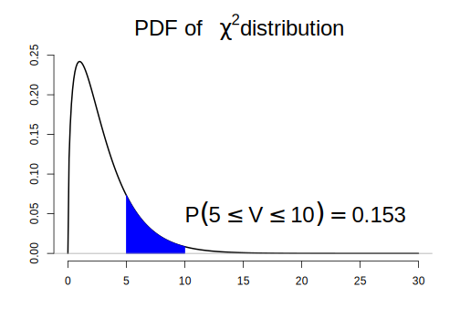

```r
# 분위수
qchisq(pchisq(10, df = 3), df = 3) 
```

```
[1] 10
```

```r
# 난수 생성
v <- rchisq(1000, df = 3)
mean(v) # 카이제곱분포의 평균은 이론적으로 자유도 값과 같음 
```

```
[1] 2.994
```

 \normalsize


<!-- $$\frac{1}{\sqrt{2\pi}\sigma}\exp \left\{-\frac{(x - \mu)^2}{2\sigma^2} \right \}$$ -->


**난수 생성의 방법**

- 난수(random number): 어떤 방법으로도 예측될 수 없는 일련의 수열(숫자)
- 통계적 의미로 난수는 특정 범위(보통 0에서 1 사이)의 균일분포(uniform distribution)에서 추출된 표본들의 관찰값으로, 임의의 확률분포(예: 정규분포, 지수분포 등)를 따르는 확률변수와는 구별됨.
   - 보통 확률 변수는 균일분포를 따르는 확률변수로부터 적절한 변환을 통해 얻을 수 있음. 
- 난수를 발생하려면 어떤 알고리즘이 필요하고 알고리즘은 일정한 규칙에 의해 구현되기 때문에 컴퓨터로 발생한 난수는 엄밀한 의미에서 난수가 아님. 
- 이를 구별하기 위해 보통 컴퓨터로 생성한 난수를 유사난수(pseudo-random number)라 칭함
- 난수 생성을 위한 알고리즘으로 합동법(congruential method), 역변환법(inversion method) 등이 널리 사용됨
- 통계 시뮬레이션에서는 특히 변수변환방법(transformation)을 통해 확률변수 생성
   - $Z \sim \mathcal{N}(0, 1)$일 때 $\sigma Z + \mu \sim \mathcal{N}(\mu, \sigma^2)$
   - $Z^2 \sim \chi^2(1)$


\footnotesize

<div class="figure" style="text-align: center">

<p class="caption">(\#fig:unnamed-chunk-17)확률분포의 관계도(http://www.math.wm.edu/~leemis/chart/UDR/UDR.html)</p>
</div>

 \normalsize


<!-- ```{r} -->
<!-- newton_raphson_test <- function(FUN, # 함수 -->
<!--                            x0 = 1, # 초기값 -->
<!--                            max_iters = 5000, # 최대 반복 횟수 -->
<!--                            tol = 1.0e-7,  -->
<!--                            range = c(-Inf, Inf),  -->
<!--                            ...)  -->
<!-- { -->
<!--  iters <- 1; d <- tol; -->
<!--  grads <- (FUN(x0 + d) - FUN(x0))/d -->
<!--  x <- c(x0, x0 - FUN(x0)/grads) -->
<!--  gap <- x[2] -->

<!--  while(iters < max_iters & abs(gap) > tol) { -->
<!--    # browser() -->
<!--    grads <- (FUN(x0 + d) - FUN(x0))/d -->
<!--    x_new <- x0 - FUN(x0)/grads -->
<!--    gap <- FUN(x_new) -->
<!--    # x_new 가 범위를 벗어난 경우 처리 -->
<!--    if (x_new <= range[1]) x_new <- range[1]  -->
<!--    if (x_new >= range[2]) x_new <- range[2] -->
<!--    iters <- iters + 1 -->
<!--    x0 <- x_new -->
<!--  } -->

<!--  if (x_new == range[1] | x_new == range[2])  -->
<!--    warning("마지막 점이 x 범위의 경계선 상에 있습니다.") -->
<!--  if (iters > max_iters)  -->
<!--    warning("최대 반복 때 까지 해를 찾지 못했습니다.") -->
<!--  cat("x 가", x_new, "일 때 함수값:", FUN(x_new), "\n") -->
<!--  return(list(solution = x_new, iteration = iters)) -->

<!-- } -->


<!-- f <- function(x) x^2 - 3 -->
<!-- newton_raphson_test(FUN = f,  -->
<!--                x0 = 1, -->
<!--                range = c(-10, 10)) -->

<!-- ``` -->


## 확률과 확률변수

\footnotesize

\BeginKnitrBlock{rmdimportant}<div class="rmdimportant">**필수 개념**

1. 확률(probability)
2. 확률변수(random variable)
3. 기댓값(expectation)
</div>\EndKnitrBlock{rmdimportant}

 \normalsize


- 확률(probability): 어떤 사건을 $E$ 라고 명명할 때, $E$가 발생할 확률은 만약 무작위적 과정을 매우 많이 반복 했을 때 사건 $E$가 발생한 비율을 의미함
   - 예1: 한화 이글스가 플레이오프에서 승리 후 리그 1위 팀과 한국 시리즈에서 경기를 할 확률?
   - 예2: 동전/주사위 던지기

- 확률변수(random variable): 우연한 사건의 결과에 값을 핟당
   - 예: 카지노 게임의 배당금
   
- 기댓값(expectation):  사건이 벌어졌을 때의 이득과 그 사건이 벌어질 확률을 곱한 것을 전체 사건에 대해 합한 값
   - 확률변수의 기댓값은 평균으로 수렴
   - 확률변수의 기댓값은 무작위 과정을 여러 번 반복했을 때 장기적인 측면에서 평균적으로 얻어질 것으로 기대되는 값


## 몬테칼로 시뮬레이션

\footnotesize

\BeginKnitrBlock{rmdnote}<div class="rmdnote">본 절에서 사용한 동영상 및 모의실험 코드는 Yihui Xie와 Lijia Yu가 배포한 animation 패키지의 내용을 기반으로 재구성함. </div>\EndKnitrBlock{rmdnote}

 \normalsize


- 우리가 알고 있는 확률과 기댓값의 정의는 모두 반복 횟수에 제한없이 무한대로 확률실험(무작위 과정)을 반복 했을 때의 상황을 설정한 것임
- 즉 컴퓨터를 통해 수학적 확률 또는 기댓값을 정확히 계산할 수 없어도 무작위 실험을 매우 많이 반복해 특정 사건이 일어날 확률이나 기댓값 추정이 가능 $\rightarrow$ 몬테칼로 시뮬레이션의 기본 idea


### 동전 던지기 

> 실제 정상적인 동전을 던졌을 때 앞/뒷면이 나올 확률이 1/2 일까? 


\footnotesize


 \normalsize


{width="80%"}


**구현**

- `sample()` 함수를 통해 매우 간단히 구현 가능
- 함수 적용 시 가장 중요한 부분은 **복원 추출**을 한다는 점임
   - 매번 시행이 독립시행이고 매회 시행 시 앞면과 뒷면이 나올 확률이 같도록 유지해야 함


\footnotesize


```r
# 동전 실험
coin_flip <- function(faces, ntry = 100) {
  record <- sample(faces, size = ntry, replace = TRUE)
  prob1 <- sum(record == faces[1])/ntry
  prob2 <- 1 - prob1
  p <- list(prob1, prob2)
  for (i in 1:length(faces)) 
    cat(paste0("Proprotion ", faces[i], ":"), p[[i]], "\n")

  
}

coin <- c("H", "T")
set.seed(1000)
coin_flip(coin, ntry = 10) # 10회
```

```
Proprotion H: 0.5 
Proprotion T: 0.5 
```

```r
coin_flip(coin, ntry = 20) # 20회 
```

```
Proprotion H: 0.4 
Proprotion T: 0.6 
```

```r
coin_flip(coin, ntry = 100) # 100회 
```

```
Proprotion H: 0.53 
Proprotion T: 0.47 
```

```r
coin_flip(coin, ntry = 1000) # 1000회 
```

```
Proprotion H: 0.516 
Proprotion T: 0.484 
```

```r
coin_flip(coin, ntry = 10000) # 10000회 
```

```
Proprotion H: 0.4988 
Proprotion T: 0.5012 
```

```r
coin_flip(coin, ntry = 100000) # 100000회 
```

```
Proprotion H: 0.49925 
Proprotion T: 0.50075 
```

 \normalsize


### 기댓값 추정

정상적인 동전 두 번을 던졌을 때, 

- 모두 뒷면이 나온 경우 1000 원을 잃음
- 둘 중 하나가 앞면이 나온 경우 비김
- 모두 앞면이 나온 경우 2000 원을 가짐

동전을 던져서 내가 딴 돈의 금액을 $X$ 라고 하면 $X$는 -1000, 0, 2000 의 값을 갖는 확률변수이고 다음과 같은 표본공간을 가짐

$$
S = \{HH,~HT,~TH,~TT \}
$$

위의 사건들은 다음과 같이 처음 정한 금액에 대응됨.

- HH $\rightarrow$ $X = 2000$
- HT $\rightarrow$ $X = 0$
- TH $\rightarrow$ $X = 0$
- TT $\rightarrow$ $X = -1000$

따라서, 각 금액에 대응한 확률은

\footnotesize

<table class=" lightable-paper lightable-striped" style='font-family: "Arial Narrow", arial, helvetica, sans-serif; width: auto !important; margin-left: auto; margin-right: auto;'>
<tbody>
  <tr>
   <td style="text-align:left;"> x </td>
   <td style="text-align:left;"> -1000 </td>
   <td style="text-align:left;"> 0 </td>
   <td style="text-align:left;"> 2000 </td>
  </tr>
  <tr>
   <td style="text-align:left;"> p </td>
   <td style="text-align:left;"> 1/4 </td>
   <td style="text-align:left;"> 2/4 </td>
   <td style="text-align:left;"> 1/4 </td>
  </tr>
</tbody>
</table>

 \normalsize

게임에서 내가 얻을 금액에 대한 기댓값

$$
E(X) = -0.25 \times 1000 + 0 \times 0.5 + 2000 \times 0.25 = 250
$$

**구현**

- 동전 던지기 시뮬레이션 코드에서 사용한 `sample()` 함수 사용
- 금액과 각 금액에 대응하는 확률값, 시행 횟수를 함수의 인수로 입력


\footnotesize


```r
simple_game <- function(x, p, ntry = 10) {
  record <- sample(x, size = ntry, replace = TRUE, prob = p)
  expect <- mean(record)
  cat("당신이 이 게임을 무한히 반복한다면 평균적으로 ", expect, 
      "원을 가져갈 것입니다.", "\n")
}

x <- c(-1000, 0, 2000)
p <- c(1/4, 2/4, 1/4)

set.seed(2371)
simple_game(x = x, p = p, ntry = 10) # 10회 실행
```

```
당신이 이 게임을 무한히 반복한다면 평균적으로  900 원을 가져갈 것입니다. 
```

```r
simple_game(x = x, p = p, ntry = 50) # 50회 실행  
```

```
당신이 이 게임을 무한히 반복한다면 평균적으로  40 원을 가져갈 것입니다. 
```

```r
simple_game(x = x, p = p, ntry = 100) # 100회 실행  
```

```
당신이 이 게임을 무한히 반복한다면 평균적으로  170 원을 가져갈 것입니다. 
```

```r
simple_game(x = x, p = p, ntry = 1000) # 1000회 실행  
```

```
당신이 이 게임을 무한히 반복한다면 평균적으로  234 원을 가져갈 것입니다. 
```

```r
simple_game(x = x, p = p, ntry = 10000) # 10000회 실행  
```

```
당신이 이 게임을 무한히 반복한다면 평균적으로  241.2 원을 가져갈 것입니다. 
```

```r
simple_game(x = x, p = p, ntry = 100000) # 100000회 실행  
```

```
당신이 이 게임을 무한히 반복한다면 평균적으로  247.64 원을 가져갈 것입니다. 
```

```r
sum(x*p) # 실제값
```

```
[1] 250
```

 \normalsize


\footnotesize

\BeginKnitrBlock{rmdimportant}<div class="rmdimportant">확률 및 기대값 추정 모두 시행횟수가 증가할 수록 실제 이론적 값에 근사하는 것을 눈으로 확인 가능함. 즉, 통계학의 근간이 되는 **대수의 법칙(law of large number)**
에 따른 자연스러운 결과임. 
</div>\EndKnitrBlock{rmdimportant}

 \normalsize


### 몬테칼로 적분법(sample-mean Monte-carlo integration)

컴퓨터를 이용해 적분값 계산 시, 적분하고자 하는 적절한 차수의 도함수가 존재하는 경우 일반적으로 수치적분법(직사각형, 사다리꼴, simpson 적분법 등)을 사용할 수 있으나, 
도함수가 존재하지 않을 경우 또는 다중 적분을 해야하는 경우 수치적분법 적용이 어려움. 몬테칼로 적분법은 복잡한 적분식에 대한 해를 구하기(추정하기) 위해 고안되었으며 
매우 간단하게 적분식의 해를 찾을 수 있는 장점이 있음. 대략적 원리는 다음과 같음. 

- 함수의 적분값을 하나의 모수로 보고 임의표본추출을 통해 해당 모수를 추정

$$
E[f(x)] = \int f(x) p(x) dx \approx \frac{1}{N}\sum_{i=1}^{N}f(x_i)
$$


**적중법(Hit or miss)**

- $f(x) = 2 + \cos(x + \sin(\arctan(x) + 3)$ 일 때, $a = 1$ 에서 $b = 3$ 아래 면적은 다음과 같음

$$
 I = \int_{a = 1}^{b = 3} f(x)~dx
$$


\footnotesize


```r
x <- seq(0, pi, length = 500)
y <- 2 + cos(x + sin(atan(x)) + 3)
plot(x, y, type = "n", 
     ylim = c(0, 4), xlim = c(0, 3.5))
idx <- x >= 1 & x <= 3
polygon(c(1, x[idx], 3), 
        c(0, y[idx], 0), 
        col = "darkgray", 
        border = "darkgray")
lines(x, y, lwd = 1.5)
rect(1, 0, 3, 4, lty = 1)
abline(h = 4, lty = 2)
text(3, 0.1, "Hit", cex = 2.5, adj = 1, pos = 2)
text(1, 3.9, "Miss", cex = 2.5, adj = 0)
text(2.2, 2.8, "f(x)", cex = 2.5)
```

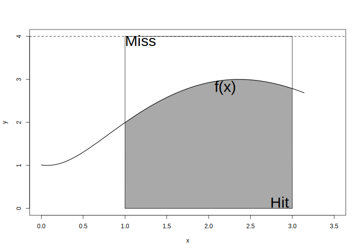

 \normalsize


- 위 그림에서 $x$ 축과 평행한 $y = c$의 선을 그었을 때 $a$, $b$ 구간 상에 사각형 면적은 $c(b-a)$ 임. 
- 사각형에서 $I$가 차지하는 비율을 $p$ 라고 할 때, $I = c(b - a)p$ 임. 
- 위 사각형 안에 랜덤하게 N개의 점을 x-y 좌표 상에 찍었을 때, $f(x)$ 아래 놓인 점의 개수를 $X$라고 하면 $X$은 모수가 $N$, $p$인 이앙분포를 따름. 
- 따라서 $\hat{p} = X/N$이고 $f(x)$ 아래 면적 $I$의 추정값은 아래와 같음. 

$$
\hat{I} = c(b - a)\frac{X}{N}
$$

**구현: $\pi$ 값 계산**

- Idea: 원의 면적은 $\pi r^2$이므로 반지름이 1인 경우 $\pi$랑 동일 $\rightarrow$ $x^2 + y^2 = 1$인 원을 고려
- 1사분면에 해당하는 영역에서 랜덤하게 점을 찍은 후 4분원의 면적을 추정한 다음 4를 곱하면 $\pi$ 값 추정 가능

\footnotesize


```r
hit_pi <- function(ntry) {
  X <- 0
  for (i in 1:ntry) {
    xy <- runif(2, 0, 1)^2  
    if (sum(xy) < 1) X <- X + 1
  }
  cat("Estimated pi: ", sprintf("%.6f", 4 * X/ntry, "\n"))
  
}

set.seed(314)
hit_pi(100) # 100
```

```
Estimated pi:  3.000000
```

```r
hit_pi(1000) # 1,000
```

```
Estimated pi:  3.184000
```

```r
hit_pi(10000) # 10,000
```

```
Estimated pi:  3.148000
```

```r
hit_pi(100000) # 100,000
```

```
Estimated pi:  3.140080
```

```r
hit_pi(1000000) # 1,000,000
```

```
Estimated pi:  3.137764
```

```r
system.time(hit_pi(5000000)) # 5,000,000
```

```
Estimated pi:  3.141950
```

```
 사용자  시스템 elapsed 
 10.310   0.000  10.318 
```

```r
pi
```

```
[1] 3.141593
```

 \normalsize


**표본평균을 활용한 몬테칼로 적분**

- 적중법의 비효율성 개선
- 적분을 어떤 확률변수의 기댓값으로 표현하여 적분값을 추정
- 확률변수 $X \sim \mathrm{Uniform(a, b)}$ 일 때, 

$$
E[f(x)] = \int_a^{b} f(x)p(x)~dx = \frac{1}{b - a}\int_a^b f(x)~dx
$$
- 적분값은

$$
\begin{aligned}
I &= \int_a^b f(x)~d(x) = (b-a)E[f(x)] \\
E[f(x)] &= \frac{1}{N}\sum_{i = 1}^N f(x_i),~~ x_i \stackrel{iid}{\sim} \mathrm{Uniform}(a, b)
\end{aligned}
$$

**구현: $\pi$ 계산시간 비교**

\footnotesize


```r
mean_pi <- function(ntry) {
  x <- runif(ntry, -1, 1)
  I = 4*mean(sqrt(1 - x^2))
  cat("Estimated pi: ", sprintf("%.6f", I), "\n")
}


set.seed(314)
mean_pi(100) # 100
```

```
Estimated pi:  3.251687 
```

```r
mean_pi(1000) # 1,000
```

```
Estimated pi:  3.155947 
```

```r
mean_pi(10000) # 10,000
```

```
Estimated pi:  3.140608 
```

```r
mean_pi(100000) # 100,000
```

```
Estimated pi:  3.143188 
```

```r
mean_pi(1000000) # 1,000,000
```

```
Estimated pi:  3.140865 
```

```r
system.time(mean_pi(5000000)) # 5,000,000
```

```
Estimated pi:  3.141221 
```

```
 사용자  시스템 elapsed 
  0.203   0.015   0.218 
```

 \normalsize


### Buffon의 바늘 실험

간격이 $d$인 평행선들이 그려져 있는 책상 위에 길이가 $l$ 인 바늘을 던졌을 때, 이 바늘이 책상 위에 그려진 선에 걸쳐질 확률

> 원문: 떨어진 거리가 같은 평행선들이 그어진 마룻바닥에 바늘을 떨어뜨렸다. 바늘이 금에 닿을 확률은 얼마인가?
>
> Georges-Louis Leclerc, Comte de Buffon (1777)


**조건**

- 바늘의 길이는 선 사이 간격보다 작다($l < d$)


\footnotesize

<div class="figure" style="text-align: center">

<p class="caption">(\#fig:unnamed-chunk-28)Buffon의 바늘실험: 바늘이 선에 걸쳐진 경우</p>
</div>

 \normalsize


\footnotesize

<div class="figure" style="text-align: center">

<p class="caption">(\#fig:unnamed-chunk-29)Buffon의 바늘실험: 바늘이 선에 걸쳐지지 않은 경우</p>
</div>

 \normalsize


- $m$: 바늘의 중앙점
- $a$: 두 평행선 중 $m$과 가까운 평행선에서 $m$ 까지의 직선거리
- $\theta$: 바늘과 평행선이 이루는 각도


**Fact**

$d > l$ 조건 하에서

- $a$는 가장 가까운 선과의 직선거리이기 때문에 $d/2$보다 클 수 없음 $\rightarrow$ $0 \leq a \leq d/2$ $\rightarrow$ $a \sim \mathrm{Uniform}(0, d/2)$
- 선을 벗어난 바늘 끝을 지나는 가상의 평행선과 $m$ 사이의 수직 거리는 $l/2\sin \theta$
- 바늘이 선에 걸치는 경우는 $l/2\sin \theta$ 가 $a$ 보다 긴 경우임 $\rightarrow$ $0 \leq a \leq l/2\sin \theta$ $\rightarrow$ $\theta \sim \mathrm{Uniform}(0, \pi)$
- $\therefore$ 바늘이 선에 걸쳐질 확률은

$$
 P(바늘이~걸쳐질 ~확률) = P\left (0 \leq a \leq \frac{l}{2} \sin \theta \right )
$$


\footnotesize

\BeginKnitrBlock{rmdnote}<div class="rmdnote">두 확률변수의 결합분포를 구한 후 결합밀도함수에 대한 적분값(확률)을 구하는 문제!!
</div>\EndKnitrBlock{rmdnote}

 \normalsize


**수학적 표현**

$a$ 에 대한 확률분포

$$
a \sim \mathrm{Uniform}(0, d/2) = \begin{cases}
\frac{2}{d}, & 0 \leq a \leq d/2 \\
0, & \mathrm{otherwise}
\end{cases}
$$


$\theta$ 에 대한 확률분포


$$
\theta \sim \mathrm{Uniform}(0, \pi) = \begin{cases}
\frac{1}{\pi}, & 0 \leq \theta \leq \pi \\
0, & \mathrm{otherwise}
\end{cases}
$$

두 확률변수가 독립이기 때문에 $a$와 $\theta$의 결합분포는 아래와 같음

$$
f(a, \theta) = \begin{cases}
 \frac{2}{d\pi}, & 0 \leq a \leq d/2;~ 0 \leq \theta \leq \pi \\
 0, & \mathrm{otherwise}
\end{cases}
$$


따라서 바늘이 평행선에 걸쳐질 확률은


$$
\begin{align} P\left (0 \leq a \leq \frac{l}{2} \sin \theta \right ) &=  \int_{\theta = 0}^{\pi}\int_{a = 0}^{(l/2)\sin \theta} \frac{2}{d\pi} \,da\,d\theta\\
&= \int_{\theta = 0}^\pi \frac{l\sin\theta}{d\pi}\,d\theta \\
&= \frac{l\cos\theta}{d\pi} \Big|_{0}^\pi = \frac{2l}{d\pi}
\end{align}
$$


\footnotesize

\BeginKnitrBlock{rmdnote}<div class="rmdnote">위 식을 이용해 모의실험을 통해 $\pi$ 값 추정이 가능.

$$
  \hat{\pi} = \frac{2l}{d\hat{P}}
$$
</div>\EndKnitrBlock{rmdnote}

 \normalsize

**실제 모의실험 시 확률 계산 방법**

- 바늘의 중점에서 가장 가까운 평행선 까지 수평 거리는 $d/2$ 안에 있기 때문에 표본공간($S$)은 다음과 같이 정의할 수 있음. 

$$
S = \{(a, \theta)|0 \leq a \leq \frac{d}{2}, ~ 0 \leq \theta \leq \pi \}
$$


- 표본공간 $S$에서 $\frac{l}{2} \sin \theta$의 함수 아래 면적($A$)이 결국 바늘이 평행선 상에 걸칠 확률임. 따라서


$$
P\left (0 \leq a \leq \frac{l}{2} \sin \theta \right ) = \frac{\mathrm{A}의~넓이}{\mathrm{S}의~넓이} = \frac{\int_0^{\pi} 0.5l\sin{\theta}~d\theta}{0.5d\pi} = \frac{2l}{d\pi}
$$


- 기하학적 표현


\footnotesize


```r
# l = 1, d = 2
l <- 1; d <- 2
x <- seq(0, pi, by = 0.01)
y <- 0.5 * l * sin(x)

plot(1, xlim = c(0, pi), 
     ylim = c(0, d/2), 
     type = "n", 
     xlab = expression(theta),
     ylab = "d/2", 
     cex.lab = 1.5)
polygon(x, y, col = "yellow", border = "yellow")
lines(x = x, y = y, lty = 1, lwd = 2)
rect(0, 0, pi, 1, lty = 2, lwd = 1.5)
text(x = 1.5, y = 0.6, 
     expression(paste(f, "(", theta, ")" == frac(l, 2) * sin * theta)), 
     adj = 0, 
     cex = 2)
text(x = 0.05, y = 0.95, "S", adj = c(0,1), cex = 2)
text(x = pi/2, y = 0.2, "A", adj = 0, cex = 2)
```

<div class="figure" style="text-align: center">

<p class="caption">(\#fig:unnamed-chunk-32)Buffon 바늘 실험의 표본 공간과 확률 영역</p>
</div>

 \normalsize


**Implementation**

1. 실제 바늘이 던져지는 상황 시각화

\footnotesize


 \normalsize


{width="80%"}


\footnotesize


```r
buffon_needle_draw <- function(nmax = 20, 
                               l = 0.8, # 바늘의 길이
                               d = 1,   # 두 평생선 간 간격
                               col = c("lightgray", "red"), 
                               plot = TRUE, 
                               return.value = FALSE) {
  # 반복 초기화
  j <- 1; n <- 0
  # x <- y <- x0 <- y0 <- theta <- a <- rep(NA, ani.options("nmax"))
  x <- y <- x0 <- y0 <- theta <- a <- rep(NA, nmax)

  while (j <= length(x)) {
    theta[j] <- runif(1, 0, pi)
    a[j] <- runif(1, 0, d/2)
    y[j] <- sample(c(0.5 * d + a[j], 1.5 * d - a[j]), 1)
    x[j] <- runif(1, 0, l)
    # 바늘이 떨어졌을 때 수평선과 이루는 각도 반영
    x0[j] <- 0.5 * l * cos(theta[j])
    y0[j] <- 0.5 * l * sin(theta[j])
    j <- j + 1
    
    if (plot) {
    dev.hold()
    plot(1, xlim = c(-0.5*l, 1.5*l), 
         ylim = c(0, 2*d), 
         type = "n", 
         xlab = "", ylab = "", axes = FALSE)
    axis(1, c(0, l), c("", ""), tcl = -1)
    axis(1, 0.5 * l, "L", font = 3, tcl = 0, cex.axis = 1.5, 
         mgp = c(0, 0.5, 0))
    axis(2, c(0.5, 1.5) * d, c("", ""), tcl = -1)
    axis(2, d, "D", font = 3, tcl = 0, cex.axis = 1.5, mgp = c(0, 0.5, 0))
    box()
    bd <- par("usr") # 실제 device plot 영역 상 x-y 좌표 시작 끝 점 정보 반환
    rect(bd[1], 0.5 * d, bd[2], 1.5 * d, col = col[1])
    abline(h = c(0.5 * d, 1.5 * d), lwd = 2)
    
    # 그림 1: 부폰의 바늘 실험: 바늘과 평행선
    # 실제 바늘이 평행선 안에 떨어지는 모습 모사
    segments(x - x0, y - y0, 
             x + x0, y + y0, 
             col = col[2])
    dev.flush() # 
    Sys.sleep(1)
    }
  }
  if(return.value) {
    result <- list(nmax =nmax, l = l, d = d, a = a, theta = theta)
    return(result)
  }
}

# buffon_needle_draw(nmax = 20, l = 0.8, d = 1, plot = TRUE, return.value = FALSE)
set.seed(5000)
# 바늘의 길이가 15이고 평행선 간격이 20일 때 바늘이 평행선에 걸칠 확률
param <- buffon_needle_draw(nmax = 5000, 
                            l = 15, 
                            d = 20, 
                            plot = FALSE, 
                            return.value = TRUE)
```

 \normalsize


2. $P(A)$ 계산: 표본공간 및 바늘을 던졌을 때 표본공간 안에 바늘이 들어와 있는지 확인 $\rightarrow$ 바늘이 금에 걸쳐질 확률 계산

- **step 0**: 바늘의 길이($l$)과 수평선 사이 거리($d$) 설정
- **step 1**: $a ~ \mathrm{Uniform}(0, d/2)$에서 난수 한개 발생
- **step 2**: $\theta ~ \mathrm{Uniform}(0, \pi)$에서 난수 한개 발생
- **step 3**: 바늘이 선에 걸치는 경우($a \leq 0.5l\sin{\theta}$) 카운트한 후 확률 계산
   

\footnotesize


```r
buffon_prob <- function(param, 
                        plot = TRUE, 
                        ndraw = 20) {
  # browser()
  l <- param$l
  d <- param$d
  a <- param$a
  theta <- param$theta
  ntry <- length(a)
  A <- a <= 0.5 * l * sin(theta)
  phati <- cumsum(A)/(1:ntry)
  phat <- sum(A)/ntry # 시뮬레이션 추정 확률
  ptrue <- 2*l/(pi*d) # 이론적 확률
  idx <- NULL
  
  if (plot) {
    for (i in 1:ndraw) {
      dev.hold()
      x = seq(0, pi, by = 0.01)
      plot(x, 0.5 * l * sin(x), type = "l", ylim = c(0, 0.5 * d), 
      bty = "l", xlab = "", ylab = "", col = "black")
      # rect(0, 0, pi, d/2, lty = 2, lwd = 1.5)
      text(pi/2, 0.4 * l, expression(y == frac(L, 2) * sin(theta)), cex = 1.5)
      idx = c(idx, as.numeric(a[i] > 0.5 * l * sin(theta[i])) + 1)
      points(theta[1:i], a[1:i], col = c("red", "blue")[idx])
      phatii <- format(phati[i], nsmall = 6, digits = 6)
      legend("topright", legend = substitute(hat(P) == phatii, 
              list(phatii = phatii)), bty = "n", cex = 1.3)
      dev.flush() #
      Sys.sleep(0.05)
    }
  }    
  
  cat("True Probability:", sprintf("%.3f", ptrue), "\n")
  cat("Estimated Probability:", sprintf("%.3f (total %d dropping)", phat, ndraw), "\n")

}

buffon_prob(param, plot = FALSE, ndraw = 5000)
```

```
True Probability: 0.477 
Estimated Probability: 0.478 (total 5000 dropping) 
```

 \normalsize


\footnotesize


 \normalsize


{width="80%"}


3. 추정한 $\hat{\pi}$ 값이 횟수가 증가할수록 실제 $\pi$ 값에 수렴하는지 확인 `buffon_pi_estimate()`


\footnotesize


```r
buffon_pi_estimate <- function(param, plot = TRUE, ndraw = 20) {
  # browser()
  l <- param$l
  d <- param$d
  a <- param$a
  theta <- param$theta
  ntry <- length(a)
  A <- a <= 0.5 * l * sin(theta)
  csum_A <- cumsum(A)
  phat <- csum_A/(1:ntry) # i 번째 시행 때 까지 바늘이 선에 걸쳐질 확률
  pihat <- (2 * l)/(d * phat) # pi 계산
  
  if (plot) {
    for (i in 1:ndraw) {
      dev.hold()
      plot(pihat[1:i], ylim = c((1 - 0.5) * pi, (1 + 0.5) * pi), 
           xlim = c(0, ndraw), 
           xlab = paste("바늘 던진 횟수:", i), ylab = expression(hat(pi)), 
           type = "l", col = "black", 
           cex.lab = 1.5)
      abline(h = pi, lty = 2, col = "red")
      # phati <- sprintf("%.6f", pihat[i])
      pihati <- format(pihat[i], nsmall = 7, digits = 7)
      legend("topright", legend = substitute(hat(pi) == pihati, 
              list(pihati = pihati)), bty = "n", cex = 1.3)
      dev.flush() #
      Sys.sleep(0.05)
    }
  }
  
  cat("Estimated pi: ", sprintf("%.6f (%d dropping)", pihat[ndraw], ndraw))
  
}

buffon_pi_estimate(param, plot = FALSE, ndraw = 5000)
```

```
Estimated pi:  3.139389 (5000 dropping)
```

 \normalsize


\footnotesize


 \normalsize


{width="80%"}


## 시뮬레이션과 통계학

\footnotesize

\BeginKnitrBlock{rmdimportant}<div class="rmdimportant">통계학에서 다루는 많은 이론들은 모의실험을 통해 그 이론의 의미를 더욱 명확하게 확인 가능하다. 특히 본 절에서는 데이터 분석 실무에서 꼭 알아두어야 할 중요 개념에 대해 간단히 review를 하고, 중심극한정리(central limit theorem, CLT), 신뢰구간(confidence interval), p-value 등에 대한 모의실험을 통해 이해를 증진</div>\EndKnitrBlock{rmdimportant}

 \normalsize


<!-- ### 기초 통계학(review) -->


#### **혈압강하제 임상시험** {#stat-review-ex .unnumbered}


\footnotesize

\BeginKnitrBlock{rmdnote}<div class="rmdnote">**DBP.txt**: 통계패키지활용 [Github 저장소](https://github.com/zorba78/stat-package-lecture/blob/master/data/DBP.txt)에서 데이터 확인 가능

  
- 1960년대 중반 미국에서 실시한 고혈압 치료제 유효성 확인을 위한 임상시험 결과 데이터
- 총 40명의 고혈압 환자를 대상으로 임상시험을 실시했으며, 랜덤하게 환자를 고혈압 치료제 투여군(A)과 위약군(B)에 균등하게 배정
- 기처지(baseline, `DBP1`) 측정 이후 월 단위로 4 번 이완기 혈압(diastolic blood pressure, DBP)을 측정(`DBP2` ~ `DBP5`)
- 유효성 평가는 기저치 대비 투약 4 개월 후 DBP의 변화(감소)량(`d = DBP5 - DBP1`)이 두 군간 차이를 보이는지...
</div>\EndKnitrBlock{rmdnote}

 \normalsize


- 데이터 요약


\footnotesize


```r
# 데이터 불러오기
DBP <- read_delim("data/DBP.txt", delim = "\t")
```

```
Parsed with column specification:
cols(
  Subject = col_double(),
  TRT = col_character(),
  DBP1 = col_double(),
  DBP2 = col_double(),
  DBP3 = col_double(),
  DBP4 = col_double(),
  DBP5 = col_double(),
  Age = col_double(),
  Sex = col_character()
)
```

```r
# 변화량 변수 추기
DBP <- DBP %>% 
  mutate(DIFF = DBP5 - DBP1)

# 각 투약군 별 변화량 측정값
DBP$DIFF[DBP$TRT == "A"]
```

```
 [1]  -9 -15 -21 -14 -11 -15 -19 -18 -11 -18 -16 -14 -15 -19 -13 -14 -15 -17 -14
[20] -16
```

```r
DBP$DIFF[DBP$TRT == "B"]
```

```
 [1] -1 -6 -5  1 -7 -4 -4 -6 -6 -7 -2 -8 -6 -5 -6 -8 -7 -4 -2 -3
```

```r
# 요약 통계량
DBP %>% 
  group_by(TRT) %>% 
  summarise(N = n(), 
            Mean = mean(DIFF, na.rm = TRUE), 
            SD = sd(DIFF, na.rm = TRUE), 
            Min = min(DIFF, na.rm = TRUE), 
            Max = max(DIFF, na.rm = TRUE), 
            Median = median(DIFF, na.rm = TRUE), 
            Q1 = quantile(DIFF, probs = 0.25), 
            Q3 = quantile(DIFF, probs = 0.75)) %>% 
  kbl %>% 
  kable_paper
```

```
`summarise()` ungrouping output (override with `.groups` argument)
```

<table class=" lightable-paper" style='font-family: "Arial Narrow", arial, helvetica, sans-serif; margin-left: auto; margin-right: auto;'>
 <thead>
  <tr>
   <th style="text-align:left;"> TRT </th>
   <th style="text-align:right;"> N </th>
   <th style="text-align:right;"> Mean </th>
   <th style="text-align:right;"> SD </th>
   <th style="text-align:right;"> Min </th>
   <th style="text-align:right;"> Max </th>
   <th style="text-align:right;"> Median </th>
   <th style="text-align:right;"> Q1 </th>
   <th style="text-align:right;"> Q3 </th>
  </tr>
 </thead>
<tbody>
  <tr>
   <td style="text-align:left;"> A </td>
   <td style="text-align:right;"> 20 </td>
   <td style="text-align:right;"> -15.2 </td>
   <td style="text-align:right;"> 2.966479 </td>
   <td style="text-align:right;"> -21 </td>
   <td style="text-align:right;"> -9 </td>
   <td style="text-align:right;"> -15.0 </td>
   <td style="text-align:right;"> -17.25 </td>
   <td style="text-align:right;"> -14.00 </td>
  </tr>
  <tr>
   <td style="text-align:left;"> B </td>
   <td style="text-align:right;"> 20 </td>
   <td style="text-align:right;"> -4.8 </td>
   <td style="text-align:right;"> 2.419221 </td>
   <td style="text-align:right;"> -8 </td>
   <td style="text-align:right;"> 1 </td>
   <td style="text-align:right;"> -5.5 </td>
   <td style="text-align:right;"> -6.25 </td>
   <td style="text-align:right;"> -3.75 </td>
  </tr>
</tbody>
</table>

 \normalsize


- 데이터 시각화


\footnotesize


```r
# 변화량 데이터의 분포 확인(치료약에 대해서)
## ggplot 사용
# require(tidyverse)
require(ggpubr)

DBP %>% 
  ggplot() + 
  aes(x = DIFF, fill = TRT) + 
  geom_density(color = "white", 
               alpha = 0.2) + 
  scale_x_continuous(limits = c(-25, 5)) + 
  geom_histogram(aes(y = ..density..), 
                 color = "white", 
                 binwidth = 1.8, alpha = 0.4) + 
  scale_fill_manual(values = c("red", "blue")) + 
  theme_minimal() -> p1

DBP %>% 
  ggplot() + 
  aes(x = TRT, y = DIFF, fill = TRT) + 
  geom_boxplot(alpha = 0.4) + 
  scale_fill_manual(values = c("red", "blue")) + 
  theme_minimal() -> p2

# 두 개 플롯을 한 화면에 표시하기 위한 함수
ggarrange(p1, p2, ncol = 1, common.legend = TRUE)
```

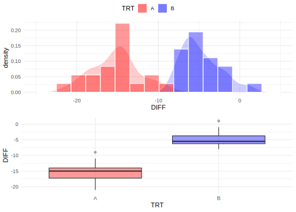

 \normalsize


**위 데이터로부터 어떤 결론을 도출할 수 있을까?**

> 1. 혈압치료제 A는 4 개월 복용 후 DBP를 감소시키는가? 
> 2. 위약 B를 4 개월 복용 후에도 DBP를 감소 시키는가? 
> 3. 치료약 A는 위약 B보다 효과가 있는가? 
> 4. 위약 대비 치료약 A의 효과는 어느 정도인가? 
> 5. 다른 고혈압 환자가 치료제 A를 복용하면 어떤 효과가 있을까?


\footnotesize


```r
require(tidymodels)
# Question 1-2: 일표본 t 검정
DBP %>% 
  mutate_if(is.character, factor) %>% 
  group_by(TRT) %>% 
  nest %>% # group 변수 별로 데이터 나누기
  # split한 데이터셋 각각에 일표본 t-검정 실시
  mutate(t_test_result = map(data,  ~ t.test(.x$DIFF))) %>% 
  # ttest 결과로부터 통계량 추출 후 tibble로 변환
  mutate(result = map(t_test_result, ~ tidy(.x))) %>% 
  select(TRT, result) %>% 
  unnest(cols = result) %>% 
  mutate_at(vars(statistic, conf.low, conf.high), 
            format, digits = 3) %>% 
  mutate(p.value = format(p.value, digits = 2)) %>% 
  select(-method, -alternative) %>% 
  set_names(c("Treatment", "$\\hat{\\delta}$", "t-value", "p-value", "df", 
              "LCL (95%)", "UCL (95%)")) %>% 
  kbl(escape = FALSE) %>%  
  kable_paper
```

<table class=" lightable-paper" style='font-family: "Arial Narrow", arial, helvetica, sans-serif; margin-left: auto; margin-right: auto;'>
 <thead>
  <tr>
   <th style="text-align:left;"> Treatment </th>
   <th style="text-align:right;"> $\hat{\delta}$ </th>
   <th style="text-align:left;"> t-value </th>
   <th style="text-align:left;"> p-value </th>
   <th style="text-align:right;"> df </th>
   <th style="text-align:left;"> LCL (95%) </th>
   <th style="text-align:left;"> UCL (95%) </th>
  </tr>
 </thead>
<tbody>
  <tr>
   <td style="text-align:left;"> A </td>
   <td style="text-align:right;"> -15.2 </td>
   <td style="text-align:left;"> -22.9 </td>
   <td style="text-align:left;"> 2.6e-15 </td>
   <td style="text-align:right;"> 19 </td>
   <td style="text-align:left;"> -16.6 </td>
   <td style="text-align:left;"> -13.8 </td>
  </tr>
  <tr>
   <td style="text-align:left;"> B </td>
   <td style="text-align:right;"> -4.8 </td>
   <td style="text-align:left;"> -8.87 </td>
   <td style="text-align:left;"> 3.5e-08 </td>
   <td style="text-align:right;"> 19 </td>
   <td style="text-align:left;"> -5.93 </td>
   <td style="text-align:left;"> -3.67 </td>
  </tr>
</tbody>
</table>

```r
# Question 3-4: 독립 이표본 t 검정
t.test(DIFF ~ TRT, data = DBP, var.equal = TRUE)
```

```

	Two Sample t-test

data:  DIFF by TRT
t = -12.15, df = 38, p-value = 1.169e-14
alternative hypothesis: true difference in means is not equal to 0
95 percent confidence interval:
 -12.132758  -8.667242
sample estimates:
mean in group A mean in group B 
          -15.2            -4.8 
```

 \normalsize


#### **중요 용어** {#stat-review .unnumbered}

- **모집단(population)**: 조사/실험/연구 등에서 관심의 대상이 되는 모든 개체의 관측값, 사건, 항목, 측정단위의 집합 $\rightarrow$ 획득한 데이터가 랜덤하게 표집되었다고 가정하는 분포 또는 집단 
   - 대한민국 20대 남녀을 대상으로 측정한 관찰값(예: 키, 몸무게, 설문지, 혈액검사, ECG, EEG 등)

- **모수(parameter)**: 모집단의 특성 또는 분포를 정의하는 알려지지 않은 상수(수식 표현 시 일반적으로 greek 문자로 표시) 
   - 이항분포(binomial distribution): 성공 또는 실패 중 하나가 결과로 나오는 실험을 $n$ 번 시행했을 때 성공이 나올 확률 $\theta$
   - 정규분포(normal distribution): 평균 $\mu$, 표준편차 $\sigma$


- **가설검정(hypothesis testing)**: 표본으로부터 얻은 정보를 토대로 모집단에 대한 특정 가설을 받아들이거나(accept) 혹은 기각(reject)을 위한 통계적 절차

- **귀무가설(null hypothesis)**: 모수에 대한 기존의 사실 또는 디폴트 값
   - 두 측정 변수 간 연관성이 존재하지 않음/ 두 집단 간 평균의 차이가 없음 ...
   - $H_0: \mu_X = \mu_Y$, $\rho_{XY} = 0$, ...

- **대립가설(alternative hypothesis)**: 모수에 대해 귀무가설과 대립해 증명하고 싶은 사실 또는 연구자가 입증하고 싶어하는 가설
   - $H_1: \mu_X \neq \mu_Y$, $\rho_{XY} \neq 0$ 
   
- **1종 오류(type I error)**: 사실인 귀무가설을 기각할 사건(오류)

- **2종 오류(type II error)**: 대립가설이 사실인데 이를 기각한 사건 = 귀무가설이 거짓인데 귀무가설을 기각하지 않은 사건

- **P 값(p-value)**: 귀무가설이 참일 때 실제 데이터가 보여준 정도로 특이한 값이 관측될 확률 $\rightarrow$ 귀무가설 하에서 실제 데이터로부터 얻은 통계량이 관찰된 것과 같거나 그 이상의 극단적 결과를 얻을 확률 $\rightarrow$ 귀무가설이 참이라는 검정 통계량을 바탕으로 귀무가설을 기각했을 때 실제로 제 1종 오류를 범할 최대 확률
   - p-value = 0.5: 귀무가설 하에서 주어진 데이터로부터 얻은 통계량보다 크거나 작은 값들이 두 번에 한 번 꼴로 관찰 $\rightarrow$ 귀무가설을 기각하기에 충분한 근거가 아님
   - p-value = 0.0001: 귀무가설 하에서 데이터로부터 획득한 통계량만큼의 값을 관찰할 확률이 매우 낮음 $\rightarrow$ 귀무가설 기각하기에 충분한 근거
   
   
- **표본(sample)**: 통계적 처리를 위해 임의의 모집단으로부터 관찰된 일부 관찰값 또는 측정값의 집합

<!-- - **데이터(data)**: 표본을 구성하는 관찰/측정 대상에 대응하는 측정값들의 집합(보통은 2차원 테이블 형태의 행렬) -->


**용어 연결(DBP 예제)**

- 모집단: 미국 또는 지구 상 존재하는 모든 고혈압 환자
- 모수: 고혈압 환자에 치료약(A)와 위약(B)을 투여 했을 때, 기저치 대비 4개월 후 DBP 변화량의 평균
- 표본: 랜덤하게 표집된 전체 40명의 고혈압 환자(각 투여군 당 20 명씩 무작위로 배정된 고혈압 환자)
- 통계량: 각 투여군 별 기저치 대비 4개월 후 DBP 변화(감소)량의 평균
- 귀무가설: 치료약 A와 위약 B를 투여 했을 때 두 집단 간 DBP 변화(감소)량은 차이가 없다. 
- 대립가설: 치료약 A를 투여 했을 때 DBP의 기저치 대비 변화(감소)량은 위약군에 비해 크다(같지 않다). 
- 1종 오류: 실제 치료약 A와 위약 B의 DBP 변화량이 차이가 없음에도 불구하고 차이가 있다고 결론내릴 오류
- 2종 오류: 실제 치료약 A와 위약 B의 DBP 변화량이 차이가 있는데 이를 감지하지 못해 차이가 없다고 결론내릴 오류
- P 값: 실제 두 투약군 간 차이가 없을 때 데이터가 보여준 두 군간 평균 변화량이 관찰된 값 이상의 극단적 결과를 얻을 확률


#### 표본분포 {#sampling-dist .unnumbered}

\footnotesize

\BeginKnitrBlock{rmdimportant}<div class="rmdimportant">**통계학의 가장 중요한 개념**: 우리가 현재 관측한 데이터는 특정 모수를 갖는 모집단에서 관측될 수 있는 여러 가능한 데이터 중 하나임. 예를 들어 DBP 예제처럼 또 다른 40명을 추출해 동일한 임상시험을 진행한다고 하면 DBP 변화량은 현재 데이터와 동일한 관찰값을 가지진 않을 것임. 즉, 표본을 추출할 때 마다 표본 간 그리고 표본 내 자연스러운 변동이 존재할 것임. 빈도론적 관점에서 통계학은 모집단으로부터 각기 다른 표본(일종의 평행우주)을 무수히 많이 추출 했다고 보고 이를 일반화 하는데서 모든 추론이 시작됨. 
</div>\EndKnitrBlock{rmdimportant}

 \normalsize


- **통계량(statistics)**: 모수를 추정하기 위해 표본(데이터)로부터 계산된 값(일반적으로 알파벳으로 표시)
   - 표본평균 $\bar{X}$, 표본분산 $s^2$
   - 통계량은 **확률변수(random variable)**


- **표본푼포(sampling distribution)**: 통계량의 분포. 즉, 여러 평행우주(표본)으로부터 도출한 각기 다른 값을 갖는 통계량이 이루는 분포

- 실제 관찰한 데이터 외에 "평행우주"로 지칭되는 나머지 표본은 관측되지 않은 값 $\rightarrow$ **시뮬레이션**을 통해 가상의 평행우주를 생성 가능함 


\footnotesize

<div class="figure" style="text-align: center">
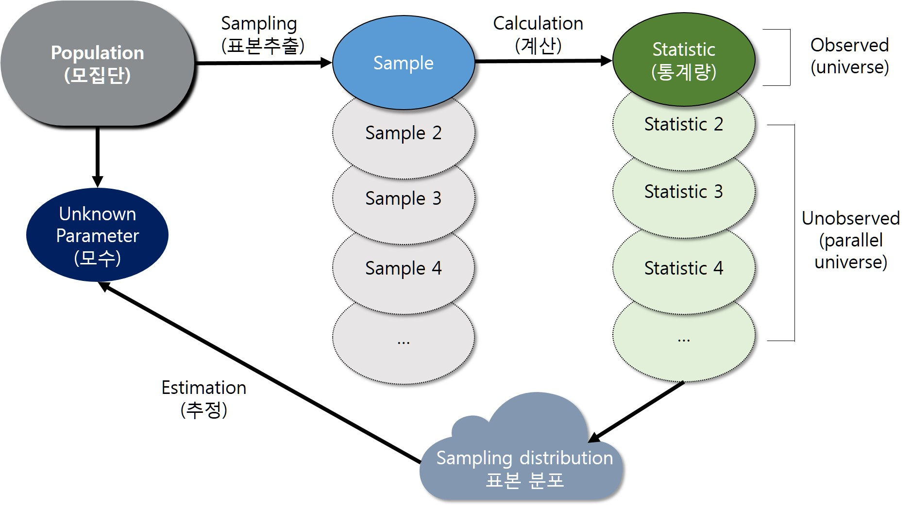
<p class="caption">(\#fig:unnamed-chunk-45)모집단, 표본, 통계량, 표본분포 관계</p>
</div>

 \normalsize


**DBP 예제에서 독립 이표본 t-검정을 시뮬레이션을 통해 확인**


\footnotesize


```r
# 1. 현재 획득한 표본으로부터 필요한 통계량 계산
n1 <- n2 <- 20
n <- n1 + n2 # 전체 표본 수
mu_real <- tapply(DBP$DIFF, DBP$TRT, mean)
sigma_real <- tapply(DBP$DIFF, DBP$TRT, sd)
delta_real <- -diff(mu_real)
sp <- sqrt(mean(sigma_real^2))
tval <- delta_real/(sp * sqrt(1/n1 + 1/n2))

set.seed(38317)
# 귀무가설이 참(mu_a = mu_b)이라는 가정 하에서 
# DBP 변화량의 두 군 간 차이에 대해 10,000개의 표본(평행우주) 생성
# 단, 분산(표준편차)은 현재 획득한 표본으로부터 구한 
# 합동표준편차(분산)과 동일하다고 가정
# 표본 개수는 40개로 동일
B <- 10000
delta_star <- replicate(B, rnorm(n, 0, sp))
md_star <- apply(delta_star, 2, mean)
sd_star <- apply(delta_star, 2, sd)
t_star <- md_star/(sd_star * sqrt(1/n1 + 1/n2))

par(mfrow = c(2, 2))
hist(md_star, nclass = 100, 
     main = expression(Histogram~of~bar(delta)), 
     xlim = c(-11, 2))
abline(v = delta_real, col = "red")
hist(sd_star, nclass = 100, 
     main = expression(Histogram~of~s[p]))
abline(v = sp, col = "red")
hist(t_star, nclass = 100, 
     main = expression(Histogram~of~t[0]), 
     xlim = c(-12.5, 3))
abline(v = tval, col = "red")
qqnorm(t_star); qqline(t_star)
```

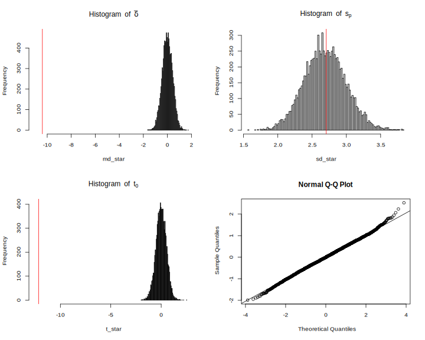

```r
# p-value 계산: 귀무가설 하에 관찰한 통계량만큼 큰(작은) 값이 발생할 확률
length(which(t_star < tval))/B
```

```
[1] 0
```

 \normalsize


#### 중심극한정리 {#clt .unnumbered}


- **표본평균**이 갖는 확률분포에 대한 정리
- **모집단의 분포와 관계 없이 표본의 크기(수)가 무한하게 크다면 표본평균의 분포는 정규분포에 근사**
- 평균이 $\mu$ 이고, 분산이 $\sigma^2$ 인 임의의 모집단에서 추출한 표본 $X_{1}, X_2, \ldots, X_n$ 의 평균 $\bar{X}$ 의 분포는 $n\rightarrow\infty$ 일 때(충분히 클 때), 근사적으로 평균이 $\mu$ 이고 분산이 $\sigma^2 /n$인 정규분포를 따르고, $Z=\sqrt{N}(\bar X - \mu)/\sigma$ 의 분포는 표준정규분포 $N(0, 1)$에 근사함. 
- 통계적 추론의 핵심인 가설검정의 이론적 토대 마련
- 경험적으로 $n \geq 30$ 이면 표본평균 $\bar X$는 정규분포를 따름
- 만약 표본의 크기가 무한하게 크다면( $n\rightarrow\infty$ ), 표본평균의 분산은 0에 가까워 질 것이기 때문에 $\bar X$ 를 모평균 $\mu$로 간주할 수 있음


\footnotesize


```r
# CLT 시각화를 위한 일반 함수
clt_test <- function(rep = 300, # 반복 수
                     n = 50, 
                     mtrue = NULL, 
                     strue = NULL, 
                     FUN = rbinom, 
                     plot = TRUE, 
                     sim.out = FALSE, 
                     ...) {
  # browser()
  dots <- list(...)
  x <- matrix(nrow = n, ncol = rep)
  for (i in 1:n) {
    x[i, ] <- apply(matrix(drop(
      mapply(FUN, i*rep, MoreArgs = dots)), i, rep), 
      2, mean)
  }
  
  if (is.null(mtrue)) mtrue = NA
  if (is.null(strue)) strue = NA
  
  
  mf <- match.call()
  FUN.name <- as.character(mf$FUN)
  title_name <- switch(FUN.name, 
                       rbinom = "Binomial distribution", 
                       rpois = "Poisson distribution", 
                       runif = "Uniform distribution", 
                       rexp = "Exponential distribution", 
                       rnorm = "Normal distribution", 
                       rchisq = expression(chi^2 ~ distribution), 
                       rt = "t distribution")
  
  xlim <- quantile(x, c(0.005, 0.995))
  # norm_line_x <- seq(xlim[1], xlim[2], length = 300)
  if (plot) {
    for (i in 1:n) {
      dev.hold()
      hist(x[i, ], freq = FALSE, 
           main = title_name, 
           xlab = substitute(italic(bar(X)[N == i]), 
            list(i = i)), 
           xlim = xlim)
      lines(density(x[i, ]), col = "red")
      if (!is.na(mtrue) && !is.na(strue)) {
        curve(dnorm(x, mtrue, strue/sqrt(i)), col = "blue", lty = 2, add = TRUE)
        legend("bottomright", legend = bquote(mu == .(sprintf("%.3f", mtrue)) ~  
                                              sigma/sqrt(n) == 
                                                .(sprintf("%.3f", strue/sqrt(i)))), 
               bty = "n", cex = 1.5)      
      }
      legend("topright", legend = bquote(bar(bar(x)) == 
                                           .(sprintf("%.3f", mean(x[i,]))) ~  
                                         hat(sigma)[bar(x)] == 
                                           .(sprintf("%.3f", sd(x[i,])))), 
             bty = "n", cex = 1.5)      
      dev.flush() #
      Sys.sleep(0.01)
    }
  }
  
  if (sim.out) return(x)
}


# binomial distribution
# p <- 0.25; size = 1
# clt_test(rep = 500, n = 50,
#          FUN = rbinom, mtrue = size * p,
#          strue = sqrt(size * p * (1 - p)), size = size, prob = p * size)
# 
# clt_test(rep = 300, n = 30, FUN = rchisq, mtrue = 5, strue = sqrt(2*5), df = 5)
```

 \normalsize


**이항분포**

> - 베르누이 시행(Bernoulli trial): 성공 또는 실패로 결과가 나오는 시행 또는 시험
> - 베르누이 시행을 $n$ 번 반복 했을 때, 성공이 나타난 횟수를 확률변수 $X$ $\rightarrow$ 이항확률변수(binomial random variable)
> - $n$ 번 베르누이 시행을 할 때, 각각의 시행은 서로 영향을 주지 않음 $\rightarrow$ **독립**
> - 성공 확률이 $\theta$ 이고, 실패확률이 $1-\theta$ 일 때, 베르누이 시행을 독립적으로 $n$ 번 시행했을 때 성공횟수에 대한 확률분포 $\rightarrow$ **이항분포**


- 이항분포의 확률질량함수

$$P(X = x) = f(x; n, \theta) = {n \choose x} \theta^x (1-\theta)^{n-x}$$

- 이항분포의 평균과 분산


$$\mu_X = n\theta,~\sigma^2_X = n\theta(1-\theta)$$

- CLT에 따른 표본 평균의 정규근사


$$
 \bar{X}_N \stackrel{d}{\rightarrow} \mathcal{N}(\mu, \frac{\sigma^2_X}{N}) = \mathcal{N}(n\theta, \frac{n\theta(1-\theta)}{N})
$$

- 예제

확률 변수 $X \sim \mathrm{binom}(n = 1, \theta = 0.25)$ 일때 표본분포의 CLT에 따른 표본 평균(300개의 평행우주로부터 표본 50개 추출) 의 정규 근사 과정

\footnotesize


```r
clt_test(rep = 300, n = 50, 
   FUN = rbinom, mtrue = size * p, 
   strue = sqrt(size * p * (1 - p)), size = size, prob = p)
```

 \normalsize


**포아송 분포**

> 단위 시간 안에 어떤 사건이 몇 번 발생할 것인지를 표현한 이산확률분포로 정해진 시간 안에 어떤 사건이 일어날 횟수의 기댓값을 $\lambda$ 라고 할 때, 사건이 $n$ 번 발생할 확률


- 확률질량함수


$$
P(X =x; \lambda) = \frac{\lambda^{x}e^{-\lambda}}{x!}
$$

- 포아송 분포의 평균과 분산

$$
\mu_X = \sigma^2_X = \lambda
$$


- CLT에 따른 표본 평균의 정규근사


$$
 \bar{X}_N \stackrel{d}{\rightarrow} \mathcal{N}(\mu, \frac{\sigma^2_X}{N}) = \mathcal{N}(\lambda, \frac{\lambda}{N})
$$


- 예제

확률 변수 $X \sim \mathrm{pois}(\lambda = 3)$ 일때 표본분포의 CLT에 따른 표본 평균(300개의 평행우주로부터 표본 50개 추출) 의 정규 근사 과정


\footnotesize


```r
l <- 3
clt_test(rep = 300, n = 50, 
   FUN = rpois, mtrue = l, 
   strue = sqrt(l), lambda = l)
```

 \normalsize


\footnotesize


 \normalsize


**연속 균일 분포**

- 확률밀도함수


$$
f(X = x; a, b) = \begin{cases}
\frac{1}{b - a}, & ~ -\infty < a < b < \infty \\
0, & \mathrm{otherwise}
\end{cases}
$$


- 균일분포의 평균과 분산


$$\mu_X = \frac{1}{2}(a + b), ~ \sigma^2_X = \frac{1}{12}(b - a)^2$$

- CLT에 따른 표본 평균의 정규근사


$$
 \bar{X}_N \stackrel{d}{\rightarrow} \mathcal{N}(\mu, \frac{\sigma^2_X}{N}) = \mathcal{N}(\frac{1}{2}(a +b), \frac{(b - a)^2}{12N})
$$


- 예제

확률 변수 $X \sim U(0, 1)$ 일때 표본분포의 CLT에 따른 표본 평균(300개의 평행우주로부터 표본 50개 추출) 의 정규 근사 과정


\footnotesize


```r
a = 0; b = 1
clt_test(rep = 300, n = 50, 
   FUN = runif, mtrue = 0.5 * (a + b), 
   strue = sqrt((b - a)^2/12), min = a, max = b)
```

 \normalsize


\footnotesize


 \normalsize


**$\chi^2$ 분포**

- 확률밀도함수


$$
\frac{1}{2^{\nu/2}\Gamma(\nu/2)}x^{(\nu/2) - 1}e^{-x/2}, ~ x \in (0, +\infty),~\nu \in \mathbb{N}
$$

- $\chi^2$ 분포의 평균과 분산


$$\mu_X = \nu, ~ \sigma^2 = 2\nu$$


- CLT에 따른 표본 평균의 정규근사


$$
 \bar{X}_N \stackrel{d}{\rightarrow} \mathcal{N}(\mu, \frac{\sigma^2_X}{N}) = \mathcal{N}(\nu, \frac{2\nu}{N})
$$


- 예제

확률 변수 $X \sim \chi^2(\nu = 3)$ 일때 표본분포의 CLT에 따른 표본 평균(300개의 평행우주로부터 표본 50개 추출) 의 정규 근사 과정


\footnotesize


```r
nu = 3
clt_test(rep = 300, n = 50, 
   FUN = rchisq, 
   mtrue = nu, 
   strue = sqrt(2*nu), df = nu)
```

 \normalsize


\footnotesize


 \normalsize


#### 신뢰구간의 정확한 의미 {#conf-int .unnumbered}

**모평균 $\mu$에 대한 $(1 - \alpha) \%$ 신뢰구간의 일반적 형태(모분산을 알고 있다고 가정한 경우)**


$$
  \hat{\mu} \pm \Phi^{-1}(\alpha /2)\frac{\sigma}{\sqrt{n}}
$$

- 신뢰구간: 같은 모형(분포)에서 반복적으로 표본을 추출해서 얻은 통계량에 대한 신뢰구간을 구했을 때 신뢰구간이 참 모수값을 포함할 확률이 $(1 - \alpha) %$가 되도록 만들어진 구간
   - 주어진 확률$(1 - \alpha) \%$ (**신뢰계수**)에 대해 표본분포의 통계량이 모집단 모수에 포함되는 구간
   - 모든 가능한 모수에 대한 표본 추정치의 신뢰구간 중 95 %가 모수를 포함


\footnotesize

\BeginKnitrBlock{rmdwarning}<div class="rmdwarning">- "모수가 신뢰구간에 포함될 확률"이라는 해석은 정확한 해석이 아님. </div>\EndKnitrBlock{rmdwarning}

 \normalsize


**예제: `sleep` 데이터**

 - 10명의 대상자가 수면제 1과 수면제 2를 복용 시 수면시간 증가량 데이터
 - 군 별 기술통계량 요약


\footnotesize


```r
# 독립 이표본 t 검정에서 두 군간 평균 차이에 대한 95% 신뢰구간
sleep %>% 
  group_by(group) %>% 
  summarise(N = n(), 
            Mean = mean(extra), 
            SD = sd(extra)) -> desc_sleep
```

```
`summarise()` ungrouping output (override with `.groups` argument)
```

```r
desc_sleep %>% 
  kbl() %>% 
  kable_paper
```

<table class=" lightable-paper" style='font-family: "Arial Narrow", arial, helvetica, sans-serif; margin-left: auto; margin-right: auto;'>
 <thead>
  <tr>
   <th style="text-align:left;"> group </th>
   <th style="text-align:right;"> N </th>
   <th style="text-align:right;"> Mean </th>
   <th style="text-align:right;"> SD </th>
  </tr>
 </thead>
<tbody>
  <tr>
   <td style="text-align:left;"> 1 </td>
   <td style="text-align:right;"> 10 </td>
   <td style="text-align:right;"> 0.75 </td>
   <td style="text-align:right;"> 1.789010 </td>
  </tr>
  <tr>
   <td style="text-align:left;"> 2 </td>
   <td style="text-align:right;"> 10 </td>
   <td style="text-align:right;"> 2.33 </td>
   <td style="text-align:right;"> 2.002249 </td>
  </tr>
</tbody>
</table>

 \normalsize

- 독립 이표본 t-검정


\footnotesize


```r
mean_diff <- -diff(desc_sleep$Mean); mean_diff
```

```
[1] -1.58
```

```r
sp <- sqrt(mean(desc_sleep$SD^2))
tval <- mean_diff/(sp * sqrt(sum(1/desc_sleep$N))); tval
```

```
[1] -1.860813
```

```r
# df = n1 + n2 - 2 = 10 + 10 - 2 = 18
p.value <-  2*(1 - pt(tval, df = 18)); p.value
```

```
[1] 1.920813
```

 \normalsize


- 해당 데이터가 주어졌을 때 두 군간 평균 차이에 대한 95 % 신뢰구간

\footnotesize


```r
alpha <- 0.05
lcl <- mean_diff - qt(1 - alpha/2, 18) * sqrt(sum((desc_sleep$SD^2)/10))
ucl <- mean_diff + qt(1 - alpha/2, 18) * sqrt(sum((desc_sleep$SD^2)/10))
lcl; ucl
```

```
[1] -3.363874
```

```
[1] 0.203874
```

```r
# check 
t.test(extra ~ group, data = sleep, var.equal = TRUE)
```

```

	Two Sample t-test

data:  extra by group
t = -1.8608, df = 18, p-value = 0.07919
alternative hypothesis: true difference in means is not equal to 0
95 percent confidence interval:
 -3.363874  0.203874
sample estimates:
mean in group 1 mean in group 2 
           0.75            2.33 
```

 \normalsize

- 실제 $X_1 \sim \mathcal{N}(1.0, 1.79^2)$, $X_2 \sim \mathcal{N}(3.0, 2.0^2)$ 이라고 가정하고, 현재 획득한 표본 수 만큼 해당 분포로 부터 추출($n_1 = 10, n_2 = 10$) 후, 두 군 간 평균 차이에 대한 95 % 신뢰구간을 구하는 작업을 100 번 반복


\footnotesize


```r
N <- 100
n1 <- n2 <- 10
m_true <- -2 # mu_x1 - mu_x2
mu_contain_count = 0

plot(c(1, N), 
     c(-8, 2), 
     type = "n", 
     ylab = "95 % CI", 
     xlab = "Replicates")
abline(h = m_true, col = "red", lty = 2)

set.seed(1313)
for (i in 1:N) {
  x1 <- rnorm(n1, 1, 1.79)
  x2 <- rnorm(n2, 3, 2.0)
  md <- mean(x1) - mean(x2)
  lcl <- md - qt(1 - alpha/2, n1 + n2 - 2) * sqrt((sd(x1)^2 + sd(x2)^2)/10)
  ucl <- md + qt(1 - alpha/2, n1 + n2 - 2) * sqrt((sd(x1)^2 + sd(x2)^2)/10)
  contain_mu <- lcl <= m_true & m_true <= ucl 
  if(contain_mu) mu_contain_count <- mu_contain_count + 1
  segments(i, lcl, i, ucl, col = as.numeric(!contain_mu) + 1)
}
legend("bottomright", 
       legend = sprintf("# of not containing true mu: %d",  N - mu_contain_count), 
       bty = "n")
```

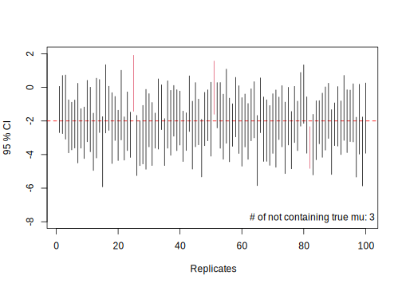

 \normalsize


- 위 `sleep` 데이터의 결과가 모집단의 특성을 충분히 반영했다고 가정하고, 독립 이표본 t 검정에서 귀무가설이 참일 때 두 집단 간 평균 차이에 대한 95 % 신뢰구간이 0을 포함하는 빈도


\footnotesize


```r
m_true <- 0 # mu_x1 - mu_x2
mu_contain_count = 0

plot(c(1, N), 
     c(-6, 3), 
     type = "n", 
     ylab = "95 % CI", 
     xlab = "Replicates")
abline(h = m_true, col = "red", lty = 2)

set.seed(1313)
for (i in 1:N) {
  x1 <- rnorm(n1, 0.75, 1.79)
  x2 <- rnorm(n2, 2.33, 2.0)
  md <- mean(x1) - mean(x2)
  lcl <- md - qt(1 - alpha/2, n1 + n2 - 2) * sqrt((sd(x1)^2 + sd(x2)^2)/10)
  ucl <- md + qt(1 - alpha/2, n1 + n2 - 2) * sqrt((sd(x1)^2 + sd(x2)^2)/10)
  contain_mu <- lcl <= m_true & m_true <= ucl 
  if(contain_mu) mu_contain_count <- mu_contain_count + 1
  segments(i, lcl, i, ucl, col = as.numeric(!contain_mu) + 1)
}
legend("bottomright", 
       legend = sprintf("# of not containing true mu: %d",  N - mu_contain_count), 
       bty = "n")
```

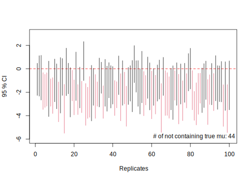

 \normalsize


#### P 값에 대한 이해

**Simulation setting 1: 귀무가설이 참인 경우**

- $X \sim \mathcal{N}(\mu_{X}, \sigma^{2}_{X})$, $Y \sim \mathcal{N}(\mu_{Y}, \sigma^{2}_{Y})$ 일 때, 
- $\mu_{X}=\mu_{Y}=100$ 이고 $\sigma_{X}=\sigma_{Y}=20$
- $X$와 $Y$의 분포로부터 $n_X = n_Y = 30$ 개를 추출한 데이터로 독립 이표본 t-검정 후 p-value 값 획득
- 10,000 번 반복


\footnotesize


```r
nsim <- 10000
p <- numeric(nsim)
set.seed(19780904)
for (i in 1:nsim) {
  x <- rnorm(n = 30, mean = 100, sd = 20)
  y <- rnorm(n = 30, mean = 100, sd = 20)
  p[i] <- t.test(x, y)$p.value
}

hist(p, main = "Histogram of p-values under the null hypothesis", 
     xlab = "Observed p-value", col = "#87DAFA")
```

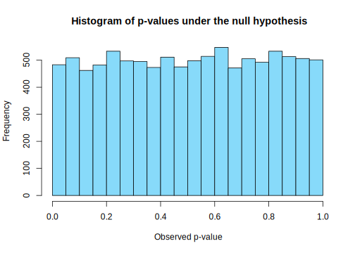

 \normalsize


$X$와 $Y$의 분포가 동일함에도 불구하고 관찰한 p-value의 **4.8** % 가 0.05보다 작게 나타남. 


**Simulation setting 2: 대립가설이 참인 경우**

- $\mu_{X} = 100$, $\mu_{Y} = 96$, $\sigma_{X}=\sigma_{Y}=20$
- 실제효과크기: $\eta = 0.2$
- 첫 번째 모의실험과 동일한 크기로 진행


\footnotesize


```r
set.seed(19780904)
for (i in 1:nsim) {
  x <- rnorm(n = 30, mean = 100, sd = 20)
  y <- rnorm(n = 30, mean = 96, sd = 20)
  p[i] <- t.test(x, y)$p.value
}

hist(p, main = "Histogram of p-values under the alternative hypothesis with ES = 0.2", 
     xlab = "Observed p-value", col = "#87DAFA")
```

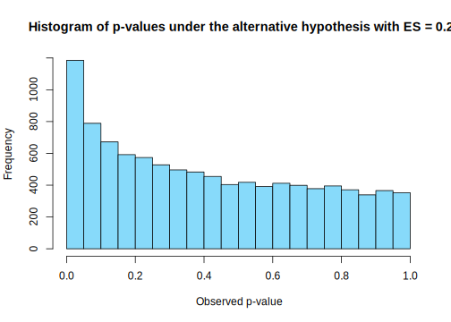

 \normalsize

$p<0.05$인 비율: **11.8** %


**Simulation setting 3: 대립가설이 참, 표본 크기를 증가시킨 경우**


- $\mu_{X} = 100$, $\mu_{Y} = 96$, $\sigma_{X}=\sigma_{Y}=20$
- $X$와 $Y$의 분포로부터 $n_X = n_Y = 100$ 개를 추출한 데이터로 독립 이표본 t-검정 후 p-value 값 획득


\footnotesize


```r
set.seed(19780904)
for (i in 1:nsim) {
  x <- rnorm(n = 100, mean = 100, sd = 20)
  y <- rnorm(n = 100, mean = 96, sd = 20)
  p[i] <- t.test(x, y)$p.value
}

hist(p, main = "Histogram of p-values under the alternative hypothesis with 100 samples per group", 
     xlab = "Observed p-value", col = "#87DAFA")
```

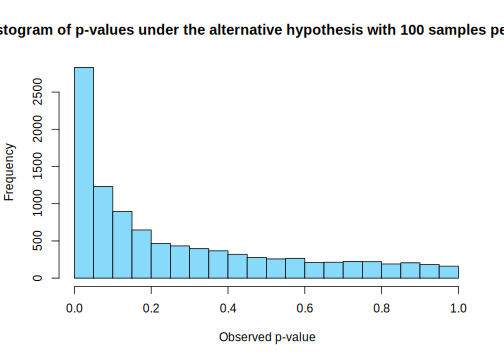

 \normalsize

$p<0.05$인 비율: **28.3** %


**Simulation setting 4: 대립가설이 참, 효과크기가 1.0인 경우**


- $\mu_{X} = 100$, $\mu_{Y} = 84$, $\sigma_{X}=\sigma_{Y}=20$
- $X$와 $Y$의 분포로부터 $n_X = n_Y = 30$ 개를 추출한 데이터로 독립 이표본 t-검정 후 p-value 값 획득


\footnotesize


```r
set.seed(19780904)
for (i in 1:nsim) {
  x <- rnorm(n = 30, mean = 100, sd = 20)
  y <- rnorm(n = 30, mean = 80, sd = 20)
  p[i] <- t.test(x, y)$p.value
}

hist(p, main = "Histogram of p-values under the alternative hypothesis: n = 30, eta = 1.0", 
     xlab = "Observed p-value", col = "#87DAFA")
```

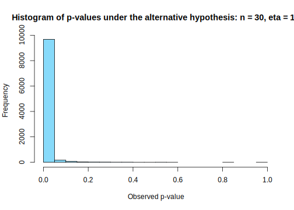

 \normalsize

$p<0.05$인 비율: **96.8** %


\footnotesize

\BeginKnitrBlock{rmdimportant}<div class="rmdimportant">**p-value와 "통계적 유의성"에 대한 미국 통계학회 성명**

  
- P-value는 가정한 통계 모형이 데이터와 호환되지 않음을 나타낸다(P-values can indicate how incompatible the data are with a specified statistical model)
- P-value는 연구 가설이 참인 확률이나 데이터가 랜덤하게 생성된 확률을 측정하지 않는다(P-values do not measure the probability that the studied hypothesis is true, or the probability that the data were produced by random chance alone)
- 과학적 연구 결론 도출이나 비지니스 및 정책 결정 과정에서 p-value가 어떤 경계값(임계점)보다 크거나 작다는 것에 근거해서는 안된다(Scientific conclusions and business or policy decisions should not be based only on whether a p-value passes a specific threshold)
- 제대로된 추론을 위해서는 연구과정 전반에 대한 보고서와 투명성이 필요하다(Proper inference requires full reporting and transparency)
- P-value나 통계적 유의성은 효과의 크기나 결과의 중요성을 나타내지 않는다(A p-value, or statistical significance, does not measure the size of an effect or the importance of a result)
- P-value 자체만으로는 모형이나 가설에 대한 증거가 될 수 없다(By itself, a p-value does not provide a good measure of evidence regarding a model or hypothesis)
</div>\EndKnitrBlock{rmdimportant}

 \normalsize


<!-- ```{r} -->
<!-- x <- seq(-1, 1, by = 0.01) -->
<!-- y <- sqrt((1 - x^2)) -->
<!-- plot(x, y, type = "l") -->


<!-- ani.options(nmax = 400, interval = 0.05) -->
<!-- buffon.needle() -->

<!-- ``` -->


<!-- ```{r, animation.hook="gifski", dev="png"} -->
<!-- # for (i in 1:2) { -->
<!-- #   pie(c(i %% 2, 6), col = c('red', 'yellow'), labels = NA) -->
<!-- # } -->

<!-- require(animation) -->
<!-- # # saveVideo({ -->
<!-- #   par(mar = c(3, 3, 1, 0.5), mgp = c(2, 0.5, 0), tcl = -0.3, -->
<!-- #     cex.axis = 0.8, cex.lab = 0.8, cex.main = 1) -->
<!-- #   ani.options(interval = 0.05, nmax = 400) -->
<!-- #   brownian.motion(pch = 21, cex = 5, col = "red", bg = "yellow") -->
<!-- # }, video.name = "BM.mp4", other.opts = "-pix_fmt yuv420p -b 300k") -->


<!-- ``` -->


