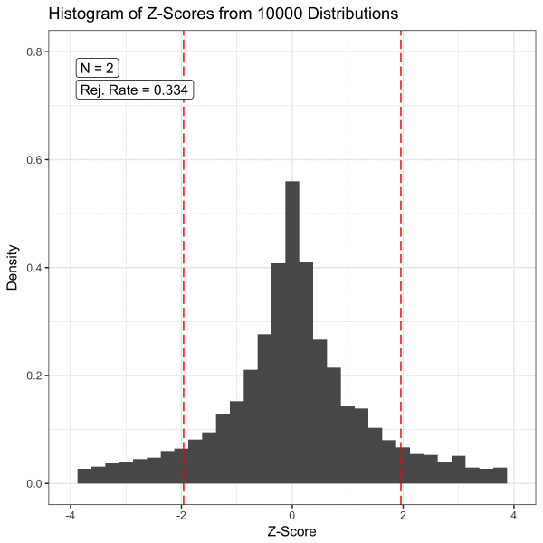

\footnotesize


```r
require(tidyverse)
```

```
필요한 패키지를 로딩중입니다: tidyverse
```

```
─ Attaching packages ───────────────────────────────────────────────────────────────────────────────────────────────────────── tidyverse 1.3.0 ─
```

```
✓ ggplot2 3.3.2     ✓ purrr   0.3.4
✓ tibble  3.0.3     ✓ dplyr   1.0.2
✓ tidyr   1.1.2     ✓ stringr 1.4.0
✓ readr   1.3.1     ✓ forcats 0.5.0
```

```
─ Conflicts ────────────────────────────────────────────────────────────────────────────────────────────────────────── tidyverse_conflicts() ─
x dplyr::filter() masks stats::filter()
x dplyr::lag()    masks stats::lag()
```

```r
require(rmarkdown)
```

```
필요한 패키지를 로딩중입니다: rmarkdown
```

```r
require(knitr)
require(kableExtra)
```

```
필요한 패키지를 로딩중입니다: kableExtra
```

```

다음의 패키지를 부착합니다: 'kableExtra'
```

```
The following object is masked from 'package:dplyr':

    group_rows
```

 \normalsize


# 시뮬레이션 {#Simulation}

> **Sketch**
>
> - 시뮬레이션..시뮬레이션??..시뮬레이션!!
> - 통계학에서 시뮬레이션이 왜 필요할까? 
> - 중요한 기초통계 이론을 눈으로 확인할 수 있을까?


\footnotesize



 \normalsize


## 시뮬레이션(모의실험)의 의미


**알반적 의미**


현실세계에서는 시간 및 비용 등의 문제로 실현하기 어렵거나 불가능한 시스템을 모형을 통해 실제 시스템을 모사함으로써 현상에 대한 문제를 이해하고자 하는 목적으로 고안한 일련의 방법


**시뮬레이션의 활용 사례**

- 군사 모의실험
- 비행 모의실험
- 선거 모의실험
- 민방위 훈련
- ...


**통계적 모의실험(statistical or stochastic simulation)**


통계학의 표본이론과 확률론에 근간을 두고 난수(random number)와 임의표본(random sample)을 이용해 어떤 결과나 문제의 해를 근사해 실제 이론으로 도출한 해와 비교함. 이러한 형태의 모의실험 방법을 몬테칼로 시뮬레이션(Monte Carlo simulation)이라고 함. 


> 통계적 모의실험에 Monte carlo 라는 명칭이 붙게된 계기는 2차 세계대전 당시 미국의 원자폭탄 계발계획인 Manhattan 프로젝트에서 중성자의 특성을 연구하기 위한 모의실험의 명칭에 모나코의 유명한 도박 도시 Monte Carlo 이름을 붙힌 것에서 유래함. 


**통계적 모의실험의 특징**

- 특정 분포를 따르는 확률변수의 관찰값이 필요
- 반복적으로 수많은 난수를 생성해야 하기 때문에 컴퓨터의 사용이 필수적
- 기본적으로 통계학의 가장 기본적 개념인 **대수의 법칙(law of the large number)**을 활용


**통계적 모의실험을 하는 방법**

- 통계적(확률) 모형은 보통 한 변수($X$)가 주어졌을 때 다른 변수($Y$)에 대한 조건부 분포임. 
- 대표적인 예: 단순선형회귀모형(simple linear regression model)

$$
\begin{eqnarray}
X   & \sim & \mathcal{N}(\mu_x, \sigma_1^2) \\
Y|X & \sim & \mathcal{N}(\beta_0 + \beta_1X, \sigma_2^2)
\end{eqnarray}
$$
- 위 식에서 우변에 주어진 확률변수를 생성하는 방법을 알고 있다면 위 회귀모형에 대한 시뮬레이션 가능 $\rightarrow$ 모든 종류의 확률 모형에 대한 시뮬레이션의 일반적 전략임(통계 프로그래밍 언어 기말고사 마지막 문제 상기!!)


\footnotesize

\BeginKnitrBlock{rmdimportant}<div class="rmdimportant">**통계적 모의실험(시뮬레이션) = 확률변수 생성문제**</div>\EndKnitrBlock{rmdimportant}

 \normalsize


**난수 생성의 방법**


- 난수(random number): 어떤 방법으로도 예측될 수 없는 일련의 수열(숫자)
- 통계적 의미로 난수는 특정 범위(보통 0에서 1 사이)의 균일분포(uniform distribution)에서 추출된 표본들의 관찰값으로 , 임의의 확률분포(예: 정규분포, 지수분포 등)를 따르는 확률변수와는 구별됨.
   - 보통 확률 변수는 균일분포를 따르는 확률변수로부터 적절한 변환을 통해 얻을 수 있음. 


## 통계 시뮬레이션에 필요한 몇 가지 함수들


### 수학함수


### 통계 분포 함수


\footnotesize

<table class=" lightable-paper lightable-striped" style='font-size: 12px; font-family: "Arial Narrow", arial, helvetica, sans-serif; margin-left: auto; margin-right: auto;'>
 <thead>
  <tr>
   <th style="text-align:left;"> Distribution </th>
   <th style="text-align:left;"> Density/Mass function </th>
   <th style="text-align:left;"> R pdf </th>
   <th style="text-align:left;"> R cdf </th>
   <th style="text-align:left;"> R quantile </th>
   <th style="text-align:left;"> RV generation </th>
   <th style="text-align:left;"> Parameter </th>
  </tr>
 </thead>
<tbody>
  <tr>
   <td style="text-align:left;"> 균일분포 </td>
   <td style="text-align:left;"> $\frac{1}{b -a},~\mathrm{for}~x \in [a, b]$ </td>
   <td style="text-align:left;"> dunif </td>
   <td style="text-align:left;"> punif </td>
   <td style="text-align:left;"> qunif </td>
   <td style="text-align:left;"> runif </td>
   <td style="text-align:left;"> min (a), max (b) </td>
  </tr>
  <tr>
   <td style="text-align:left;"> 지수분포 </td>
   <td style="text-align:left;"> $\lambda \exp{(-\lambda x)}$ </td>
   <td style="text-align:left;"> dexp </td>
   <td style="text-align:left;"> pexp </td>
   <td style="text-align:left;"> qexp </td>
   <td style="text-align:left;"> rexp </td>
   <td style="text-align:left;"> rate ($\lambda$) </td>
  </tr>
  <tr>
   <td style="text-align:left;"> 정규분포 </td>
   <td style="text-align:left;"> $\frac{1}{\sqrt{2\pi}\sigma}\exp \left\{-\frac{(x - \mu)^2}{2\sigma^2} \right \}$ </td>
   <td style="text-align:left;"> dnorm </td>
   <td style="text-align:left;"> pnorm </td>
   <td style="text-align:left;"> qnorm </td>
   <td style="text-align:left;"> rnorm </td>
   <td style="text-align:left;"> mean ($\mu$), sd ($\sigma$) </td>
  </tr>
  <tr>
   <td style="text-align:left;"> $\chi^2$ 분포 </td>
   <td style="text-align:left;"> $\frac{1}{\Gamma(\nu/2)2^{\nu/2}}x^{(\nu/2) - 1}e^{(-x/2)}$ </td>
   <td style="text-align:left;"> dchisq </td>
   <td style="text-align:left;"> pchisq </td>
   <td style="text-align:left;"> qchisq </td>
   <td style="text-align:left;"> rchisq </td>
   <td style="text-align:left;"> df ($\nu$) </td>
  </tr>
  <tr>
   <td style="text-align:left;"> $t$ 분포 </td>
   <td style="text-align:left;"> $\frac{\Gamma(\frac{\nu + 1}{2})}{\Gamma{(\frac{\nu}{2}})}\frac{1}{\sqrt{\nu\pi}}\frac{1}{(1 + x^2/\nu)^{(\nu + 1)/2}}$ </td>
   <td style="text-align:left;"> dt </td>
   <td style="text-align:left;"> pt </td>
   <td style="text-align:left;"> qt </td>
   <td style="text-align:left;"> rt </td>
   <td style="text-align:left;"> df ($\nu$) </td>
  </tr>
  <tr>
   <td style="text-align:left;"> 이항분포 </td>
   <td style="text-align:left;"> ${n \choose x} p^x (1 - p)^{n - x}$ </td>
   <td style="text-align:left;"> dbinom </td>
   <td style="text-align:left;"> pbinom </td>
   <td style="text-align:left;"> qbinom </td>
   <td style="text-align:left;"> rbinom </td>
   <td style="text-align:left;"> size ($n$), prob ($p$) </td>
  </tr>
  <tr>
   <td style="text-align:left;"> 포아송 분포 </td>
   <td style="text-align:left;"> $\frac{e^{-\lambda}\lambda^x}{x!}$ </td>
   <td style="text-align:left;"> dpois </td>
   <td style="text-align:left;"> ppois </td>
   <td style="text-align:left;"> qpois </td>
   <td style="text-align:left;"> rpois </td>
   <td style="text-align:left;"> lambda ($\lambda$) </td>
  </tr>
</tbody>
</table>

 \normalsize


<!-- $$\frac{1}{\sqrt{2\pi}\sigma}\exp \left\{-\frac{(x - \mu)^2}{2\sigma^2} \right \}$$ -->


\footnotesize

<div class="figure" style="text-align: center">

<p class="caption">(\#fig:unnamed-chunk-6)확률분포의 관계도(http://www.math.wm.edu/~leemis/chart/UDR/UDR.html)</p>
</div>

 \normalsize


## 기초 통계학(review) 

\footnotesize

<div class="figure" style="text-align: center">

<p class="caption">(\#fig:unnamed-chunk-7)모집단, 표본, 통계량, 표본분포 관계</p>
</div>

 \normalsize


