\footnotesize


 \normalsize

# R을 활용한 기초통계 분석{#basic-stat-analysis}


> **Sketch**
>
> - Q-Q plot $\rightarrow$ 데이터가 특정 분포를 따르는가? 
> - paired t test, independent two sample t test $\rightarrow$ 연속형 반응변수 vs. 범주가 2개인 범주형 변수
> - Oneway ANOVA test $\rightarrow$ 연속형 반응변수 vs. 범주가 2개 이상인 범주형 변수
> - $\chi^2$ & Fisher's exact test $\rightarrow$ 두 범주형 변수 간 연관성(독립성) 검정
> - Correlation between two continuous variables $\rightarrow$ Pearson's correlation coefficient


\footnotesize

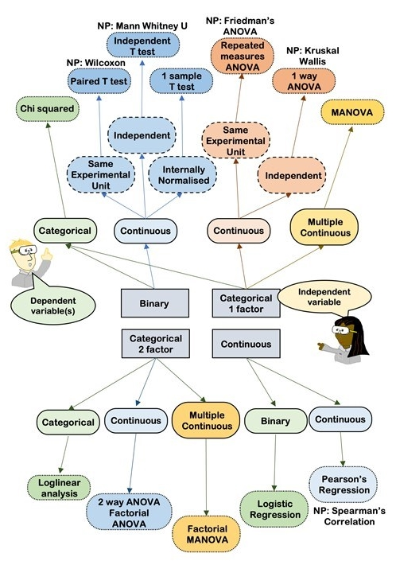

 \normalsize


## Q-Q plot {#qqplot}

> Q-Q plot = Quantile(분위수)-Quantile(분위수) plot


### 분위수(Quantile) {#quantile-def}


#### 정의 {#quantile-definition .unnumbered}

- 확률분포를 동등한 확률 구간으로 나누기 위해 설정한 구분점(cutpoint)
- 특정 확률분포의 누적분포함수의 역함수
- 주어진 표본의 관찰값을 오름차순으로 나열했을 때 전체 표본(데이터)을 특정 개수의 그룹으로 나눌 때 기준이 되는 값
- $q$ 분위수는 $q-1$ 개의 분위수 값을 갖음
- 예시
   - 2-quantile: 오름차순으로 정렬한 데이터를 50:50으로 나누기 위한 값 $\rightarrow$ 중앙값(median)
   - 3-quantiles (tertiles):  오름차순으로 정렬한 데이터를 3 등분 하기 위한 값 $\rightarrow$ 33.3 %, 66.6 %
   - 4-quantiles (quartiles): 오름차순 정렬 데이터를 4등분 하기 위한 값 $\rightarrow$ 25 % (Q1), 50 % (중앙값), 75 % (Q3)
      - 사분위수 범위(interquartile range, IQR): Q3 - Q1
   - 10-quantiles (deciles): 오름차순 정렬 데이터를 10 등분 $\rightarrow$ 10 %, 20 %, 30 %, ..., 90 %
   - 100-quantiles (percentiles): 오름차순 정렬 데이터를 10 등분 $\rightarrow$ 1 %, 2 %, ..., 99 %
- 일반적으로 $k^{\mathrm{th}}$ $q$ 분위수는 누적확률분포에서 $k/q$의 값을 갖는 데이터를 의미


#### (표본)분위수의 계산 {.unnumbered}


\footnotesize

\BeginKnitrBlock{rmdnote}<div class="rmdnote">R에서 표본 분위수는 `quantile()` 함수룰 통해 구할 수 있으먀, 크게 불연속 변수(discontinuous variable)와 
연속 변수(continuous variable)에 따라 방법이 조금씩 달라짐. 불연속변수인 경우 데이터 중에서
분위수 값을 정의하는 반면 연속변수인 경우 보간(interpolation)을 사용해 분위수 값을 정함. R은 총 9 가지의 분위수 계산 방법을 제공하며, 방법 1 ~ 3은 불연속 변수, 
방법 4 ~ 9 는 연속 변수를 대상으로 함. 
</div>\EndKnitrBlock{rmdnote}

 \normalsize


표본 분위수는 순서통계량(order statistics)^[순서통계량은 확률변수 $X$를 $n$ 개 관찰을 했을 때 $X$를 크기 순으로 배열한 
통계량으로 $X_{(1)} < X_{(2)} < \cdots <X_{(n)}$ 로 나타냄(순서통계량은 서로 독립이 아님)]의 가중평균으로 정의하며 임의의 표본이 주어졌을 때 
$p \times 100$ %  분위수 계산 식^[R `quantile(x, probs, type = 5)`와 동일]은 아래와 같음(연속 변수에 대해)


$$
Q(p) = (1 - \gamma) x_{(k)} + \gamma x_{(k+1)}
$$


이고, 여기서 $(k - 0.5)/n \leq p < (k - 0.5 +1)/n$, $x_{(k)}$는 $k$ 번째 순서통계량, $n$은 표본크기, $\gamma = np + m - k$, $k$는 $np + m$을 넘지 않는 
최대 정수이고 $m = 1/2$ 임. 


- 예시 


\footnotesize


```r
# 분위수 계산 함수 
my_quantile <- function(x, probs) {
  idx <- NULL
  o <- order(x); n <- length(x)
  xord <- x[o]
  k <- 1:n
  gamma <- n * probs + 0.5 - floor(n * probs + 0.5)
  pk <- (k - 0.5)/n
  for (pj in probs) {
    idx <- c(idx, which.max(pk[pk <= pj]))
  }
  res <- (1 - gamma) * xord[idx] + gamma * xord[idx + 1]
  names(res) <- sprintf("%.1f %%", round(probs * 100))
  return(res)
}


set.seed(10)
x <- rnorm(373)
my_quantile(x, probs = c(0.05, 0.95))
```

```
    5.0 %    95.0 % 
-1.601323  1.492466 
```

```r
# 확인
quantile(x, probs = c(0.05, 0.95), type = 5)
```

```
       5%       95% 
-1.601323  1.492466 
```

 \normalsize


#### Quantile-Quantile plot (Q-Q plot) {.unnumbered}


- 두 변수 $X$의 분위수와 $Y$의 분위수를 산점도 형태로 그린 도표로 두 변수의 분포를 비교하기 위한 용도로 사용되는 도표
- 예시
   - $X$: 충남대학교 정보통계학과 남학생의 키
   - $Y$: 충남대학교 자연과학대학 남학생의 몸무게

\footnotesize


```r
# 개념
set.seed(1234)
x <- rnorm(50, 172, 15)
y <- rnorm(500, 65, 20)

xq <- quantile(x, probs = seq(0, 1, by = 0.05))
yq <- quantile(y, probs = seq(0, 1, by = 0.05))
plot(xq, yq, 
     xlab = "height", 
     ylab = "weight")
```

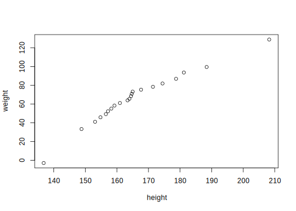

 \normalsize


- 일반적으로 측정 또는 표집한 연속형 변수가 이론적인 특정 분포와 얼마나 유사한지를 확인하기 위해 사용하며, 특히 데이터의 정규성 검정에 많이 활용됨. 
즉 표본으로 얻은 분포가 정규분포를 따르는지(유사한지)를 알아보기 위해 활용

- 보통 x 축은 theoretical quantile (이론적 분위수)로 하고 y 축은 표본 분위수(empirical/sample quantile)로 설정 

- R에서 Q-Q plot은 `qqnorm()`, `qqplot()` 등의 함수를 사용해 간단히 그릴 수 있으나 해당 함수를 사용하지 않고 직접 그리는 방법에 대해 알아봄. 


\footnotesize


```r
# 위 예제에서 생성한 충남대학교 여학생 몸무게의 Q-Q plot
# 정규분포와 비교
yord <- y[order(y)] # 데이터 정렬
n <- length(yord)
k <- 1:n
pk <- (k - 0.5)/n
# theoretical quantile
tq <- qnorm(pk, 0, 1) # 표준정규분포의 분위수
# empirical quantile
eq <- drop(scale(yord)) # z 변환

par(mfrow = c(1, 2))
plot(x = tq, y = eq, 
     type = "n", 
     xlim = c(-3.5, 3.5), 
     ylim = c(-3.5, 3.5), 
     xlab = "Theoretical Quantile", 
     ylab = "Empirical Quantile", 
     main = "Normal Q-Q plot (manual)")
points(tq, eq, pch=16, cex = 1, col = "darkgray")
points(tq, eq, pch=21, cex = 1, col = "black", lwd = 1)
abline(a = 0, b = 1)

# qqnorm() 함수 결과와 비교
qqnorm(eq, xlim = c(-3.5, 3.5), ylim = c(-3.5, 3.5))
qqline(eq)
```

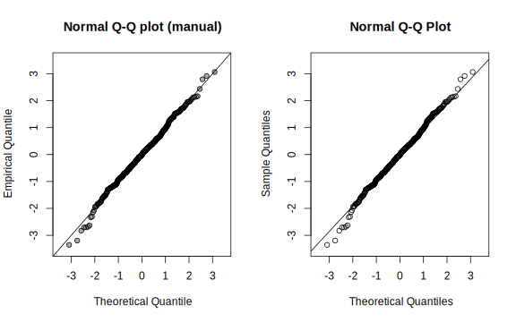

 \normalsize


\footnotesize

\BeginKnitrBlock{rmdnote}<div class="rmdnote">데이터의 정규성을 확인하기 위한 검정 방법으로 대표적으로 Kolmogrov-Smirnov test, Shapiro-Wilk test, Anderson-Darling test, Cramer-von Mises test 등이 
일반적으로 많이 사용되지만, 표본의 크기가 커질 경우 검정력이 높아지기 때문에 귀무가설인 "데이터가 정규분포를 따른다"를 기각할 확률이 높아짐. 그렇기 때문에 
정규성 검정과 동시에 Q-Q plot을 통한 데이터의 분포 확인이 필요함. 
</div>\EndKnitrBlock{rmdnote}

 \normalsize


#### Q-Q plot의 형태 {.unnumbered}

- 정규분포를 기준으로 Q-Q plot의 형태를 통해 표본자료의 데이터 분포 유추가 가능. 
- 예를 들어 표본 분위수를 $Q_E$, 표준정규분포의 분위수를 $Q_T$라고 할 때  

1) $Q_E < Q_T$: 이론적 분위수보다 표본 분위수가 작다 $\rightarrow$ 직선을 기준으로 오른쪽에 점 위치


\footnotesize

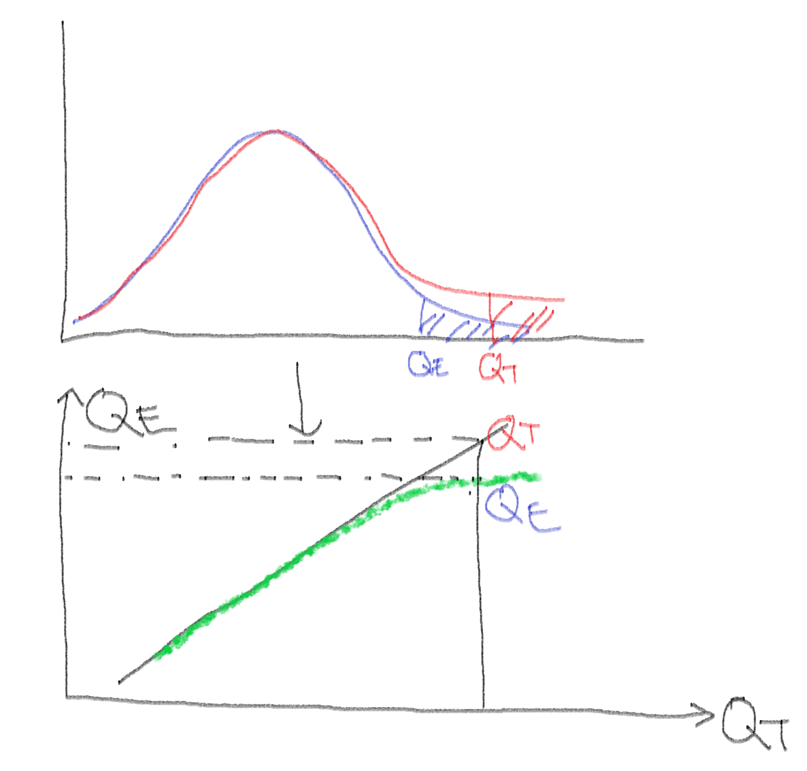

 \normalsize


2) $Q_E > Q_T$: 이론적 분위수보다 표본 분위수가 크다 $\rightarrow$ 직선을 기준으로 왼쪽에 점 위치


\footnotesize

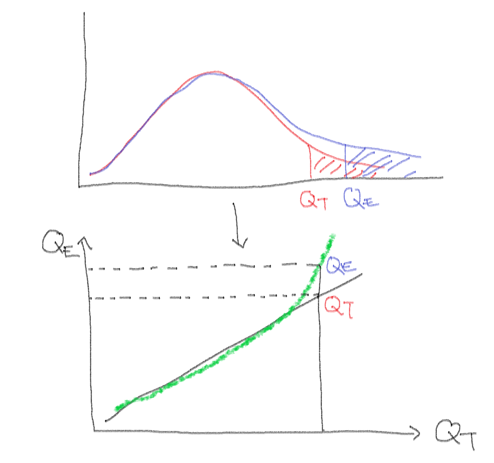

 \normalsize


**대칭이지만 표본데이터의 분포 꼬리가 표준정규분포에 비해 얇은 경우**

\footnotesize


```r
# X ~ U(-2, 2)
set.seed(100)
x <- runif(10000, -2, 2)

par(mfrow = c(1, 2))
qqnorm(scale(x), pch = 16, cex = 1, col = "darkgray")
qqline(scale(x))

plot(density(scale(x)), 
     xlim = c(-3, 3), 
     ylim = c(0, 0.4), 
     lwd = 1.5, col = "red", 
     main = "Light tailed distribution: X ~ U(-2, 2)")
z <- seq(-3, 3, by = 0.01)
lines(z, dnorm(z), lwd = 1.5, col = "black")
legend("topright", legend = c("Theoretical N(0, 1)", "Estimated density of the sample"), 
       lty = 1, lwd = 1.5, bty = "n", 
       col = c("black", "red"))
```

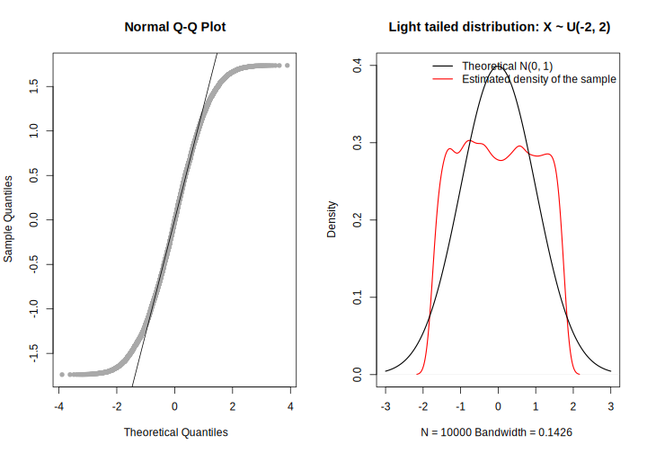

 \normalsize


**대칭이지만 표본데이터의 분포 꼬리가 표준정규분포에 비해 두꺼운 경우**


\footnotesize


```r
# 자유도가 8인 t 분포
set.seed(100)
x <- rt(10000, df = 8)

par(mfrow = c(1, 2))
qqnorm(scale(x), pch = 16, cex = 1, col = "darkgray")
qqline(scale(x))

plot(density(scale(x)), 
     xlim = c(-6, 6), 
     ylim = c(0, 0.5), 
     lwd = 1.5, col = "red", 
     main = "Heavy tailed distribution: X ~ t(df = 3)")
z <- seq(-6, 6, by = 0.01)
lines(z, dnorm(z), lwd = 1.5, col = "black")
legend("topright", legend = c("Theoretical N(0, 1)", "Estimated density of the sample"), 
       lty = 1, lwd = 1.5, bty = "n", 
       col = c("black", "red"))
```

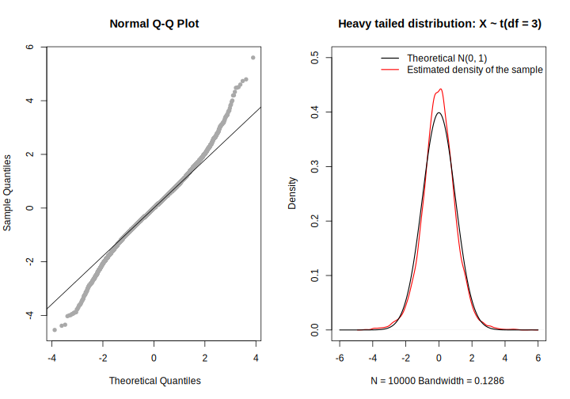

 \normalsize


**표본데이터가 표준정규분포에 비해 오른쪽으로 치우쳐진 경우(skewed to the right)**


\footnotesize


```r
# exp(lambda = 3)
set.seed(100)
x <- rexp(10000, rate = 3)

par(mfrow = c(1, 2))
qqnorm(scale(x), pch = 16, cex = 1, col = "darkgray")
qqline(scale(x))

plot(density(scale(x)), 
     xlim = c(-3, 6), 
     ylim = c(0, 0.8), 
     lwd = 1.5, col = "red", 
     main = "Skewed to the right: X ~ exp(lambda = 3)")
z <- seq(-3, 6, by = 0.01)
lines(z, dnorm(z), lwd = 1.5, col = "black")
legend("topright", legend = c("Theoretical N(0, 1)", "Estimated density of the sample"), 
       lty = 1, lwd = 1.5, bty = "n", 
       col = c("black", "red"))
```

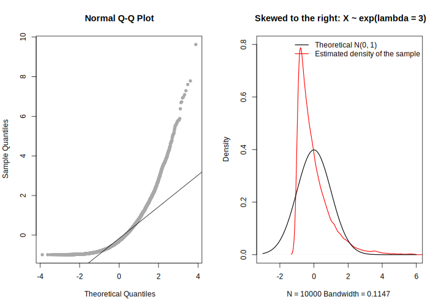

 \normalsize


**표본데이터가 표준정규분포에 비해 왼쪽으로 치우쳐진 경우(skewed to the left)**


\footnotesize


```r
# X ~ beta(4, 1)
set.seed(100)
x <- rbeta(10000, shape1 = 4, shape2 = 1)

par(mfrow = c(1, 2))
qqnorm(scale(x), pch = 16, cex = 1, col = "darkgray")
qqline(scale(x))

plot(density(scale(x)), 
     xlim = c(-5, 4), 
     ylim = c(0, 0.6), 
     lwd = 1.5, col = "red", 
     main = "Skewed to the left: X ~ beta(4, 1)")
z <- seq(-4, 4, by = 0.01)
lines(z, dnorm(z), lwd = 1.5, col = "black")
legend("topright", legend = c("Theoretical N(0, 1)", "Estimated density of the sample"), 
       lty = 1, lwd = 1.5, bty = "n", 
       col = c("black", "red"))
```

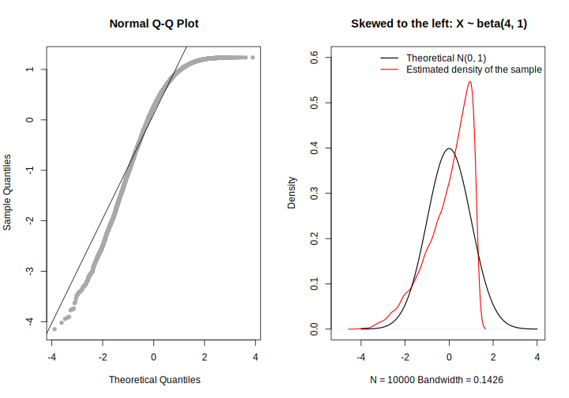

 \normalsize


- `qqnorm()`은 이론적인 표준정규분포와 표본 데이터의 분포를 비교하기 위한 함수이고, 다른 분포($\chi^2$ 분포, $t$ 분포 등)와 비교하기 위헤서는
`qqplot(x = theoretical, y = empirical)`를 사용해 Q-Q plot 생성 가능


\footnotesize


```r
# 카이제곱분포의 Q-Q plot 
set.seed(100)
y <- rchisq(500, df = 3)
x <- qchisq(ppoints(500), # 500 quantiles 생성
            df = 3)
qqplot(x, y, 
       main = expression("Q-Q plot for" ~~ {chi^2}[nu == 3]))
qqline(y, distribution = function(p) qchisq(p, df = 3), col = "red")
```

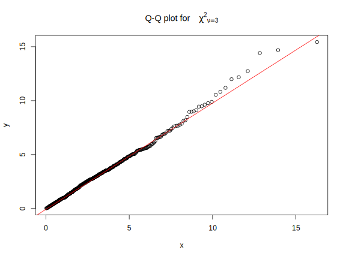

 \normalsize


#### Application {.unnumbered}


\footnotesize

\BeginKnitrBlock{rmdnote}<div class="rmdnote">1. 실제 데이터로부터 정규성 확인을 위헤 Q-Q plot 생성
2. `ggpubr` 패키지에서 제공하는 `ggqqplot()` 함수를 통해 Q-Q plot 생성
</div>\EndKnitrBlock{rmdnote}

 \normalsize

> `ggpubr`: 논문이나 출판을 위해 high-quality 도표를 생성하기 위한 목적으로 "ggplot based Publication Ready plots"의 약어를 이름으로 갖는 패키지


- R에서 제공하는 `iris` 데이터셋 활용
- `tidyverse` 세계에서 데이터 전처리 및 Q-Q plot 출력


\footnotesize


```r
# 각 붓꽃 종과 측정 변수에 따른 Q-Q plot 생성
# install.packages("ggpubr")
# require(tidyverse)
# require(ggpubr)
iris_tb <- as_tibble(iris)
iris_tb %>% 
  rownames_to_column %>% # 데이터프레임 행이름을 변수로 변환
  pivot_longer(cols = matches("Sepal|Petal"), 
               names_to = "Measures") %>% # long-format으로 변환
  group_by(Species, Measures) %>% 
  mutate(zvalue = drop(scale(value))) %>% # 정규성 확인을 위해 각 변수의 종별 표준화
  ungroup %>% 
  ggpubr::ggqqplot(x = "zvalue", 
                   color = "Species", 
                   facet.by = c("Species", "Measures"), 
                   palette = c("#00AFBB", "#E7B800", "#FC4E07"), 
                   ggtheme = ggpubr::theme_pubclean(base_size = 15)) 
```

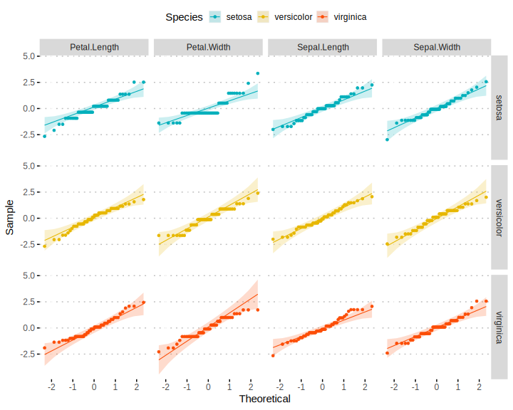

 \normalsize


\footnotesize

\BeginKnitrBlock{rmdtip}<div class="rmdtip">그래프 생성 시 원하는 색에 대한 코드를 쉽게 추출하고 싶다면 `colourpicker` 패키지를 설치해 보자. 
</div>\EndKnitrBlock{rmdtip}

 \normalsize


## 연속형 변수의 비교 {#group-comp}


\footnotesize

\BeginKnitrBlock{rmdnote}<div class="rmdnote">기초 통계학 또는 타 과목에서 학습한 독립 이표본 $t$ 검정이나 일원배치분산분석은 모두 선형모형의 특별한 케이스임. 두 방법 모두 연속형 변수를 반응변수로 놓고 
범주형 변수를 예측변수로 설정한 회귀모형으로 간주할 수 있음. 


- 독립 이표본 $t$ 검정 


$$
  y_i = \beta_0 + \beta_1 x_i + \epsilon_i, ~~ \epsilon_i \sim \mathcal{N}(0, \sigma^2), ~~ x_i = \{0, 1\}
$$


- 일원배치분산분석(수준 $k = 3$, 각 수준 별 반복 $n = 2$)


$$
  \mathbf{y}_{6 \times 1} = \mathbf{X}_{6\times 4}\boldsymbol{\mathbf{\beta}}_{4\times 1} + \boldsymbol{\mathbf{\epsilon}}_{6\times 1}
$$
  

$$\mathbf{y}_{6 \times 1}  = 
\begin{bmatrix}
y_{11} \\
y_{21} \\
y_{31} \\
y_{41} \\
y_{51} \\
y_{61} 
\end{bmatrix}, ~~ \mathbf{X}_{6\times 4} = 
\begin{bmatrix}
1 & 1 & 0 & 0 \\
1 & 1 & 0 & 0 \\
1 & 0 & 1 & 0 \\
1 & 0 & 1 & 0 \\
1 & 0 & 0 & 1 \\
1 & 0 & 0 & 1 
\end{bmatrix}, ~~ \boldsymbol{\mathbf{\beta}}_{4\times 1} = 
\begin{bmatrix}
\beta_0 \\
\beta_1 \\
\beta_2 \\
\beta_3 \\
\end{bmatrix}, ~~ \boldsymbol{\mathbf{\epsilon}}_{6\times 1}
\begin{bmatrix}
\epsilon_{11} \\
\epsilon_{21} \\
\epsilon_{31} \\
\epsilon_{41} \\
\epsilon_{51} \\
\epsilon_{61} 
\end{bmatrix}
$$


</div>\EndKnitrBlock{rmdnote}

 \normalsize


일반적으로 우리가 분석을 위한 데이터는 두 가지 방법을 통해 획득


- 관찰(observation): 반응변수($Y$) 및 예측변수($X$) 모두 관찰을 통해 획득
   - 예: 표본조사(sample survey), 코호트 연구(cohort study), 단면연구(cross-sectional study) 등
- 실험(experiment): 예측변수를 실험자가 결정하고 실험을 통해 반응변수를 관찰
   - 실험을 진행하는 사람이 제어하는 예측변수를 **요인(factor)**
   - 요인의 가능한 값을 **수준(level)**
   - 요인의 수준에 따라 관찰하고자 하는 대상을 **무작위**로 할당
   - 예: 무작위 임상시험, 실험설계


### 대응 표본 t 검정(paired samples t test) {#paired-t-test}

#### 대응 표본(paired sample) {.unnumbered}

동일한 대상자에 대해 쌍으로 이루어진 데이터 

- 새 교습방법에 대한 적용 전·후 수학 점수
- 실험용 쥐에 실험약 투여 전·후 대사량
- 다이어트 약 복용 전·후 체중

데이터 형태: $X \sim \mathcal{N}(\mu_X, \sigma^2_X)$이고 $Y \sim \mathcal{N}(\mu_Y, \sigma^2_Y)$


$$\begin{align}
x_1, x_2, \ldots, x_n & & \mathrm{before~treatment} \\
y_1, y_2, \ldots, y_n & & \mathrm{after~treatment} \\
\end{align}
$$


여기서 $x_i$와 $y_i$는 서로 독립이 아님 $\rightarrow$ 전·후 차이를 계산한 새로운 변수 $d_i = y_i - x_i$를 생성 후 $D = \{d_1, \ldots, d_n\}$에 대한 
일표본 $t$ 검정을 실시($D \sim \mathcal{N}(\mu_D, \sigma_D^2)$)

$$
\mu_D = \mu_Y - \mu_X, ~~\sigma^2_D = \sigma^2_X + \sigma^2_Y - 2\rho_{XY}\sigma_X\sigma_Y 
$$

여기서 $\rho_{XY}$는 $X$와 $Y$의 (피어슨) 상관계수임. 검정을 위한 귀무가설과 대립가설은 아래와 같음


$$
H_0: \mu_D = 0~~~\mathrm{vs.}~~~H_1:\mu_D \neq 0
$$

검정통계량

$$
t_0 = \frac{\hat{\mu}_D - 0}{\hat{\sigma}/\sqrt{n}} \sim t_{(\nu = n-1)}
$$


혈압강하제 임상시험 데이터(`DBP.txt`)에서 시험약 복용 전(`DBP1`) 대비 복용 1개월 후(`DBP2`) 이완기 혈압(diastolic blood pressure)의 차이 검정


\footnotesize


```r
DBP <- read_delim("data/DBP.txt", delim = "\t")
```

```
Parsed with column specification:
cols(
  Subject = col_double(),
  TRT = col_character(),
  DBP1 = col_double(),
  DBP2 = col_double(),
  DBP3 = col_double(),
  DBP4 = col_double(),
  DBP5 = col_double(),
  Age = col_double(),
  Sex = col_character()
)
```

```r
DBP <- DBP %>% 
  mutate(D1 = DBP2 - DBP1)
treatment <- DBP %>% 
  filter(TRT == "A")
D1 <- treatment$D1
mD1 <- mean(D1)
sD1 <- sd(D1)
### check 
# mb <- mean(treatment$DBP1); ma <- mean(treatment$DBP2)
# sD1_check <- with(treatment, 
#                   sqrt(var(DBP1) + var(DBP2) - 
#                          2*cor(DBP1, DBP2)*sd(DBP1)*sd(DBP2)))
# mD1; ma - mb
# sD1; sD1_check

tstat <- mD1/(sD1/sqrt(length(D1)))
p.val <- 2*(pt(tstat, df = length(D1) - 1))

## t.test() check
tstat; t.test(D1)$statistic
```

```
[1] -7.493656
```

```
        t 
-7.493656 
```

```r
p.val; t.test(D1)$p.value
```

```
[1] 4.364575e-07
```

```
[1] 4.364575e-07
```

 \normalsize


\footnotesize

\BeginKnitrBlock{rmdnote}<div class="rmdnote">R에서 대응표본(일표본) 및 독립 이표본 $t$ 검정을 하기 위한 함수는 `t.test()`이고 아래와 같은 인수를 가짐

- `x`: 검정을 할 데이터 
- `y`: 독립 이표본 검정 수행 시 두 번째 데이터
  - 독립 이표본 t 검정 시 수식 형태 `y ~ x`로 표현 가능하며, 이 때 입력 데이터는 데이터 프레임 형태임 
- `alternative`: 대립가설 형태(양측 또는 단측: "two.sided", "greater", "less")
- `var.equal`: 논리값을 가지며 독립 이표본 t 검정 시 두 집단의 분산에 대한 가정(FALSE = 이분산, TRUE=등분산)
- `conf.level`: 신뢰수준(default 값은 0.95)


R은 다양한 가설검정 관련 함수를 제공하는데 검정 결과는 `htest`라는 클래스 개체에 저장함. `htest` 객체는 다음과 같은 출력결과를 가짐(검정함수에 따라 달라질 수 있음)

- `statistic`: 검정 통계량
- `parametmer`: 검정통계량 계산에 사용된 자유도(degree of freedom)
- `p.value`: P 값
- `conf.int`: 신뢰구간
- `estimate`: 추정 평균 또는 평균 차이 (t 검정인 경우)

</div>\EndKnitrBlock{rmdnote}

 \normalsize


### 독립 이표본 t 검정(independent two-sample t-test)

서로 독립인 두 모집단의 평균을 비교하기 위한 가장 기본적인 통계적 가설검정 방법으로 반응 변수 $y_{ij}$는 

$$
y_{ij} \sim \mathcal{N}(\mu_i, \sigma^2_i = \sigma^2)
$$


이고, $i = 1, 2$, $j = 1, \ldots, n_i$, $n_i$는 $i$ 번째 집단의 표본 크기임. 

위 모형은 다음과 같은 가정을 내포함. 

- 두 집단의 관찰값은 **정규분포**를 따르며, 각 집단 간 평균은 서로 다름. 
- 각 관찰값은 **서로 독립**
- 두 집단의 **분산은 동일**: $\sigma^2_1 = \sigma^2_2 = \sigma$


두 집단 간 평균 차이 검정에 대한 귀무가설과 대립가설은 아래와 같이 설정 


$$
H_0: \mu_1 = \mu_2~~~\mathrm{vs.}~~~H_1: \mu_1 \neq \mu_2
$$

위 가설검정을 위한 검정 통계량


$$
t_0 = \frac{\hat{\mu}_1 - \hat{\mu}_2 - 0}{s_p\sqrt{\frac{1}{n_1} + \frac{1}{n_2}}} \sim t_{\nu = n_1 + n_2 -2}
$$

여기서 $\hat{\mu}_{1} = \sum_{j=1}^{n_1} y_{1j}/n_1$, $\hat{\mu}_{2} = \sum_{j=1}^{n_2} y_{2j}/n_2$, 집단 1과 집단 2의 표본합동분산(sample pooled-variance)는 
아래와 같음

$$
\sigma_p^2 = \frac{(n_1 - 1)\hat{\sigma_1}^2 + (n_2 -1)\hat{\sigma}_2^2}{n_1 + n_2 - 2}, ~~~ \hat{\sigma}_i^2 = \frac{\sum_{j=1}^{n_i} (y_{ij} - \hat{\mu}_i)^2}{n_i - 1}
$$


<!-- ### 일원배치 분산분석(oneway analysis of variance, ANOVA) -->


<!-- ## 범주형 자료분석(categorical data analysis) -->


<!-- ### 적합성 검정(goodness-of-fit test) -->


<!-- ### 독립성 검정 -->


<!-- ### Fisher 정확검정 -->


<!-- ## 두 변수의 상관 -->


