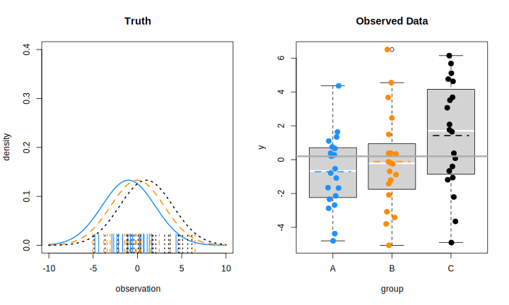
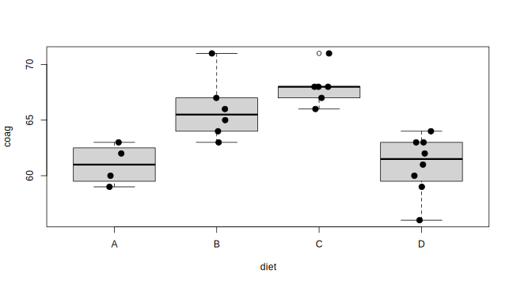
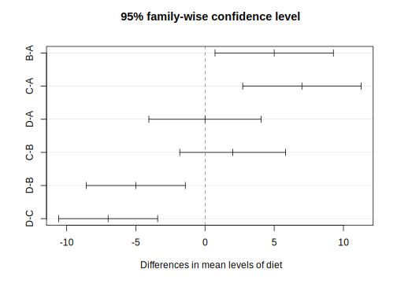

\footnotesize


 \normalsize

# R을 활용한 기초통계 분석{#basic-stat-analysis}


> **Sketch**
>
> - Q-Q plot $\rightarrow$ 데이터가 특정 분포를 따르는가? 
> - paired t test, independent two sample t test $\rightarrow$ 연속형 반응변수 vs. 범주가 2개인 범주형 변수
> - Oneway ANOVA test $\rightarrow$ 연속형 반응변수 vs. 범주가 2개 이상인 범주형 변수
> - $\chi^2$ & Fisher's exact test $\rightarrow$ 두 범주형 변수 간 연관성(독립성) 검정
> - Correlation between two continuous variables $\rightarrow$ Pearson's correlation coefficient


\footnotesize


 \normalsize


## Q-Q plot {#qqplot}

> Q-Q plot = Quantile(분위수)-Quantile(분위수) plot


### 분위수(Quantile) {#quantile-def}


#### 정의 {#quantile-definition .unnumbered}

- 확률분포를 동등한 확률 구간으로 나누기 위해 설정한 구분점(cutpoint)
- 특정 확률분포의 누적분포함수의 역함수
- 주어진 표본의 관찰값을 오름차순으로 나열했을 때 전체 표본(데이터)을 특정 개수의 그룹으로 나눌 때 기준이 되는 값
- $q$ 분위수는 $q-1$ 개의 분위수 값을 갖음
- 예시
   - 2-quantile: 오름차순으로 정렬한 데이터를 50:50으로 나누기 위한 값 $\rightarrow$ 중앙값(median)
   - 3-quantiles (tertiles):  오름차순으로 정렬한 데이터를 3 등분 하기 위한 값 $\rightarrow$ 33.3 %, 66.6 %
   - 4-quantiles (quartiles): 오름차순 정렬 데이터를 4등분 하기 위한 값 $\rightarrow$ 25 % (Q1), 50 % (중앙값), 75 % (Q3)
      - 사분위수 범위(interquartile range, IQR): Q3 - Q1
   - 10-quantiles (deciles): 오름차순 정렬 데이터를 10 등분 $\rightarrow$ 10 %, 20 %, 30 %, ..., 90 %
   - 100-quantiles (percentiles): 오름차순 정렬 데이터를 10 등분 $\rightarrow$ 1 %, 2 %, ..., 99 %
- 일반적으로 $k^{\mathrm{th}}$ $q$ 분위수는 누적확률분포에서 $k/q$의 값을 갖는 데이터를 의미


#### (표본)분위수의 계산 {.unnumbered}


\footnotesize

\BeginKnitrBlock{rmdnote}<div class="rmdnote">R에서 표본 분위수는 `quantile()` 함수룰 통해 구할 수 있으먀, 크게 불연속 변수(discontinuous variable)와 
연속 변수(continuous variable)에 따라 방법이 조금씩 달라짐. 불연속변수인 경우 데이터 중에서
분위수 값을 정의하는 반면 연속변수인 경우 보간(interpolation)을 사용해 분위수 값을 정함. R은 총 9 가지의 분위수 계산 방법을 제공하며, 방법 1 ~ 3은 불연속 변수, 
방법 4 ~ 9 는 연속 변수를 대상으로 함. 
</div>\EndKnitrBlock{rmdnote}

 \normalsize


표본 분위수는 순서통계량(order statistics)^[순서통계량은 확률변수 $X$를 $n$ 개 관찰을 했을 때 $X$를 크기 순으로 배열한 
통계량으로 $X_{(1)} < X_{(2)} < \cdots <X_{(n)}$ 로 나타냄(순서통계량은 서로 독립이 아님)]의 가중평균으로 정의하며 임의의 표본이 주어졌을 때 
$p \times 100$ %  분위수 계산 식^[R `quantile(x, probs, type = 5)`와 동일]은 아래와 같음(연속 변수에 대해)


$$
Q(p) = (1 - \gamma) x_{(k)} + \gamma x_{(k+1)}
$$


이고, 여기서 $(k - 0.5)/n \leq p < (k - 0.5 +1)/n$, $x_{(k)}$는 $k$ 번째 순서통계량, $n$은 표본크기, $\gamma = np + m - k$, $k$는 $np + m$을 넘지 않는 
최대 정수이고 $m = 1/2$ 임. 


- 예시 


\footnotesize


```r
# 분위수 계산 함수 
my_quantile <- function(x, probs) {
  idx <- NULL
  o <- order(x); n <- length(x)
  xord <- x[o]
  k <- 1:n
  gamma <- n * probs + 0.5 - floor(n * probs + 0.5)
  pk <- (k - 0.5)/n
  for (pj in probs) {
    idx <- c(idx, which.max(pk[pk <= pj]))
  }
  res <- (1 - gamma) * xord[idx] + gamma * xord[idx + 1]
  names(res) <- sprintf("%.1f %%", round(probs * 100))
  return(res)
}


set.seed(10)
x <- rnorm(373)
my_quantile(x, probs = c(0.05, 0.95))
```

```
    5.0 %    95.0 % 
-1.601323  1.492466 
```

```r
# 확인
quantile(x, probs = c(0.05, 0.95), type = 5)
```

```
       5%       95% 
-1.601323  1.492466 
```

 \normalsize


#### Quantile-Quantile plot (Q-Q plot) {.unnumbered}


- 두 변수 $X$의 분위수와 $Y$의 분위수를 산점도 형태로 그린 도표로 두 변수의 분포를 비교하기 위한 용도로 사용되는 도표
- 예시
   - $X$: 충남대학교 정보통계학과 남학생의 키
   - $Y$: 충남대학교 자연과학대학 남학생의 몸무게

\footnotesize


```r
# 개념
set.seed(1234)
x <- rnorm(50, 172, 15)
y <- rnorm(500, 65, 20)

xq <- quantile(x, probs = seq(0, 1, by = 0.05))
yq <- quantile(y, probs = seq(0, 1, by = 0.05))
plot(xq, yq, 
     xlab = "height", 
     ylab = "weight")
```


 \normalsize


- 일반적으로 측정 또는 표집한 연속형 변수가 이론적인 특정 분포와 얼마나 유사한지를 확인하기 위해 사용하며, 특히 데이터의 정규성 검정에 많이 활용됨. 
즉 표본으로 얻은 분포가 정규분포를 따르는지(유사한지)를 알아보기 위해 활용

- 보통 x 축은 theoretical quantile (이론적 분위수)로 하고 y 축은 표본 분위수(empirical/sample quantile)로 설정 

- R에서 Q-Q plot은 `qqnorm()`, `qqplot()` 등의 함수를 사용해 간단히 그릴 수 있으나 해당 함수를 사용하지 않고 직접 그리는 방법에 대해 알아봄. 


\footnotesize


```r
# 위 예제에서 생성한 충남대학교 여학생 몸무게의 Q-Q plot
# 정규분포와 비교
yord <- y[order(y)] # 데이터 정렬
n <- length(yord)
k <- 1:n
pk <- (k - 0.5)/n
# theoretical quantile
tq <- qnorm(pk, 0, 1) # 표준정규분포의 분위수
# empirical quantile
eq <- drop(scale(yord)) # z 변환

par(mfrow = c(1, 2))
plot(x = tq, y = eq, 
     type = "n", 
     xlim = c(-3.5, 3.5), 
     ylim = c(-3.5, 3.5), 
     xlab = "Theoretical Quantile", 
     ylab = "Empirical Quantile", 
     main = "Normal Q-Q plot (manual)")
points(tq, eq, pch=16, cex = 1, col = "darkgray")
points(tq, eq, pch=21, cex = 1, col = "black", lwd = 1)
abline(a = 0, b = 1)

# qqnorm() 함수 결과와 비교
qqnorm(eq, xlim = c(-3.5, 3.5), ylim = c(-3.5, 3.5))
qqline(eq)
```


 \normalsize


\footnotesize

\BeginKnitrBlock{rmdnote}<div class="rmdnote">데이터의 정규성을 확인하기 위한 검정 방법으로 대표적으로 Kolmogrov-Smirnov test, Shapiro-Wilk test, Anderson-Darling test, Cramer-von Mises test 등이 
일반적으로 많이 사용되지만, 표본의 크기가 커질 경우 검정력이 높아지기 때문에 귀무가설인 "데이터가 정규분포를 따른다"를 기각할 확률이 높아짐. 그렇기 때문에 
정규성 검정과 동시에 Q-Q plot을 통한 데이터의 분포 확인이 필요함. 
</div>\EndKnitrBlock{rmdnote}

 \normalsize


#### Q-Q plot의 형태 {.unnumbered}

- 정규분포를 기준으로 Q-Q plot의 형태를 통해 표본자료의 데이터 분포 유추가 가능. 
- 예를 들어 표본 분위수를 $Q_E$, 표준정규분포의 분위수를 $Q_T$라고 할 때  

1) $Q_E < Q_T$: 이론적 분위수보다 표본 분위수가 작다 $\rightarrow$ 직선을 기준으로 오른쪽에 점 위치


\footnotesize


 \normalsize


2) $Q_E > Q_T$: 이론적 분위수보다 표본 분위수가 크다 $\rightarrow$ 직선을 기준으로 왼쪽에 점 위치


\footnotesize


 \normalsize


**대칭이지만 표본데이터의 분포 꼬리가 표준정규분포에 비해 얇은 경우**

\footnotesize


```r
# X ~ U(-2, 2)
set.seed(100)
x <- runif(10000, -2, 2)

par(mfrow = c(1, 2))
qqnorm(scale(x), pch = 16, cex = 1, col = "darkgray")
qqline(scale(x))

plot(density(scale(x)), 
     xlim = c(-3, 3), 
     ylim = c(0, 0.4), 
     lwd = 1.5, col = "red", 
     main = "Light tailed distribution: X ~ U(-2, 2)")
z <- seq(-3, 3, by = 0.01)
lines(z, dnorm(z), lwd = 1.5, col = "black")
legend("topright", legend = c("Theoretical N(0, 1)", "Estimated density of the sample"), 
       lty = 1, lwd = 1.5, bty = "n", 
       col = c("black", "red"))
```


 \normalsize


**대칭이지만 표본데이터의 분포 꼬리가 표준정규분포에 비해 두꺼운 경우**


\footnotesize


```r
# 자유도가 8인 t 분포
set.seed(100)
x <- rt(10000, df = 8)

par(mfrow = c(1, 2))
qqnorm(scale(x), pch = 16, cex = 1, col = "darkgray")
qqline(scale(x))

plot(density(scale(x)), 
     xlim = c(-6, 6), 
     ylim = c(0, 0.5), 
     lwd = 1.5, col = "red", 
     main = "Heavy tailed distribution: X ~ t(df = 3)")
z <- seq(-6, 6, by = 0.01)
lines(z, dnorm(z), lwd = 1.5, col = "black")
legend("topright", legend = c("Theoretical N(0, 1)", "Estimated density of the sample"), 
       lty = 1, lwd = 1.5, bty = "n", 
       col = c("black", "red"))
```


 \normalsize


**표본데이터가 표준정규분포에 비해 오른쪽으로 치우쳐진 경우(skewed to the right)**


\footnotesize


```r
# exp(lambda = 3)
set.seed(100)
x <- rexp(10000, rate = 3)

par(mfrow = c(1, 2))
qqnorm(scale(x), pch = 16, cex = 1, col = "darkgray")
qqline(scale(x))

plot(density(scale(x)), 
     xlim = c(-3, 6), 
     ylim = c(0, 0.8), 
     lwd = 1.5, col = "red", 
     main = "Skewed to the right: X ~ exp(lambda = 3)")
z <- seq(-3, 6, by = 0.01)
lines(z, dnorm(z), lwd = 1.5, col = "black")
legend("topright", legend = c("Theoretical N(0, 1)", "Estimated density of the sample"), 
       lty = 1, lwd = 1.5, bty = "n", 
       col = c("black", "red"))
```


 \normalsize


**표본데이터가 표준정규분포에 비해 왼쪽으로 치우쳐진 경우(skewed to the left)**


\footnotesize


```r
# X ~ beta(4, 1)
set.seed(100)
x <- rbeta(10000, shape1 = 4, shape2 = 1)

par(mfrow = c(1, 2))
qqnorm(scale(x), pch = 16, cex = 1, col = "darkgray")
qqline(scale(x))

plot(density(scale(x)), 
     xlim = c(-5, 4), 
     ylim = c(0, 0.6), 
     lwd = 1.5, col = "red", 
     main = "Skewed to the left: X ~ beta(4, 1)")
z <- seq(-4, 4, by = 0.01)
lines(z, dnorm(z), lwd = 1.5, col = "black")
legend("topright", legend = c("Theoretical N(0, 1)", "Estimated density of the sample"), 
       lty = 1, lwd = 1.5, bty = "n", 
       col = c("black", "red"))
```


 \normalsize


- `qqnorm()`은 이론적인 표준정규분포와 표본 데이터의 분포를 비교하기 위한 함수이고, 다른 분포($\chi^2$ 분포, $t$ 분포 등)와 비교하기 위헤서는
`qqplot(x = theoretical, y = empirical)`를 사용해 Q-Q plot 생성 가능


\footnotesize


```r
# 카이제곱분포의 Q-Q plot 
set.seed(100)
y <- rchisq(500, df = 3)
x <- qchisq(ppoints(500), # 500 quantiles 생성
            df = 3)
qqplot(x, y, 
       main = expression("Q-Q plot for" ~~ {chi^2}[nu == 3]))
qqline(y, distribution = function(p) qchisq(p, df = 3), col = "red")
```


 \normalsize


#### Application {.unnumbered}


\footnotesize

\BeginKnitrBlock{rmdnote}<div class="rmdnote">1. 실제 데이터로부터 정규성 확인을 위헤 Q-Q plot 생성
2. `ggpubr` 패키지에서 제공하는 `ggqqplot()` 함수를 통해 Q-Q plot 생성
</div>\EndKnitrBlock{rmdnote}

 \normalsize

> `ggpubr`: 논문이나 출판을 위해 high-quality 도표를 생성하기 위한 목적으로 "ggplot based Publication Ready plots"의 약어를 이름으로 갖는 패키지


- R에서 제공하는 `iris` 데이터셋 활용
- `tidyverse` 세계에서 데이터 전처리 및 Q-Q plot 출력


\footnotesize


```r
# 각 붓꽃 종과 측정 변수에 따른 Q-Q plot 생성
# install.packages("ggpubr")
# require(tidyverse)
# require(ggpubr)
iris_tb <- as_tibble(iris)
iris_tb %>% 
  rownames_to_column %>% # 데이터프레임 행이름을 변수로 변환
  pivot_longer(cols = matches("Sepal|Petal"), 
               names_to = "Measures") %>% # long-format으로 변환
  group_by(Species, Measures) %>% 
  mutate(zvalue = drop(scale(value))) %>% # 정규성 확인을 위해 각 변수의 종별 표준화
  ungroup %>% 
  ggpubr::ggqqplot(x = "zvalue", 
                   color = "Species", 
                   facet.by = c("Species", "Measures"), 
                   palette = c("#00AFBB", "#E7B800", "#FC4E07"), 
                   ggtheme = ggpubr::theme_pubclean(base_size = 15)) 
```


 \normalsize


\footnotesize

\BeginKnitrBlock{rmdtip}<div class="rmdtip">그래프 생성 시 원하는 색에 대한 코드를 쉽게 추출하고 싶다면 `colourpicker` 패키지를 설치해 보자. 
</div>\EndKnitrBlock{rmdtip}

 \normalsize


## 연속형 변수의 비교 {#group-comp}


\footnotesize

\BeginKnitrBlock{rmdnote}<div class="rmdnote">기초 통계학 또는 타 과목에서 학습한 독립 이표본 $t$ 검정이나 일원배치분산분석은 모두 선형모형의 특별한 케이스임. 두 방법 모두 연속형 변수를 반응변수로 놓고 
범주형 변수를 예측변수로 설정한 회귀모형으로 간주할 수 있음. 


- 독립 이표본 $t$ 검정 


$$
  y_i = \beta_0 + \beta_1 x_i + \epsilon_i, ~~ \epsilon_i \sim \mathcal{N}(0, \sigma^2), ~~ x_i = \{0, 1\}
$$


- 일원배치분산분석(수준 $k = 3$, 각 수준 별 반복 $n = 2$)


$$
  \mathbf{y}_{6 \times 1} = \mathbf{X}_{6\times 4}\boldsymbol{\mathbf{\beta}}_{4\times 1} + \boldsymbol{\mathbf{\epsilon}}_{6\times 1}
$$
  

$$\mathbf{y}_{6 \times 1}  = 
\begin{bmatrix}
y_{11} \\
y_{21} \\
y_{31} \\
y_{41} \\
y_{51} \\
y_{61} 
\end{bmatrix}, ~~ \mathbf{X}_{6\times 4} = 
\begin{bmatrix}
1 & 1 & 0 & 0 \\
1 & 1 & 0 & 0 \\
1 & 0 & 1 & 0 \\
1 & 0 & 1 & 0 \\
1 & 0 & 0 & 1 \\
1 & 0 & 0 & 1 
\end{bmatrix}, ~~ \boldsymbol{\mathbf{\beta}}_{4\times 1} = 
\begin{bmatrix}
\beta_0 \\
\beta_1 \\
\beta_2 \\
\beta_3 \\
\end{bmatrix}, ~~ \boldsymbol{\mathbf{\epsilon}}_{6\times 1}
\begin{bmatrix}
\epsilon_{11} \\
\epsilon_{21} \\
\epsilon_{31} \\
\epsilon_{41} \\
\epsilon_{51} \\
\epsilon_{61} 
\end{bmatrix}
$$


</div>\EndKnitrBlock{rmdnote}

 \normalsize


일반적으로 우리가 분석을 위한 데이터는 두 가지 방법을 통해 획득


- 관찰(observation): 반응변수($Y$) 및 예측변수($X$) 모두 관찰을 통해 획득
   - 예: 표본조사(sample survey), 코호트 연구(cohort study), 단면연구(cross-sectional study) 등
- 실험(experiment): 예측변수를 실험자가 결정하고 실험을 통해 반응변수를 관찰
   - 실험을 진행하는 사람이 제어하는 예측변수를 **요인(factor)**
   - 요인의 가능한 값을 **수준(level)**
   - 요인의 수준에 따라 관찰하고자 하는 대상을 **무작위**로 할당
   - 예: 무작위 임상시험, 실험설계


### 대응 표본 t 검정(paired samples t test) {#paired-t-test}

#### 대응 표본(paired sample) {.unnumbered}

동일한 대상자에 대해 쌍으로 이루어진 데이터 

- 새 교습방법에 대한 적용 전·후 수학 점수
- 실험용 쥐에 실험약 투여 전·후 대사량
- 다이어트 약 복용 전·후 체중

데이터 형태: $X \sim \mathcal{N}(\mu_X, \sigma^2_X)$이고 $Y \sim \mathcal{N}(\mu_Y, \sigma^2_Y)$


$$\begin{align}
x_1, x_2, \ldots, x_n & & \mathrm{before~treatment} \\
y_1, y_2, \ldots, y_n & & \mathrm{after~treatment} \\
\end{align}
$$


여기서 $x_i$와 $y_i$는 서로 독립이 아님 $\rightarrow$ 전·후 차이를 계산한 새로운 변수 $d_i = y_i - x_i$를 생성 후 $D = \{d_1, \ldots, d_n\}$에 대한 
일표본 $t$ 검정을 실시($D \sim \mathcal{N}(\mu_D, \sigma_D^2)$)

$$
\mu_D = \mu_Y - \mu_X, ~~\sigma^2_D = \sigma^2_X + \sigma^2_Y - 2\rho_{XY}\sigma_X\sigma_Y 
$$

여기서 $\rho_{XY}$는 $X$와 $Y$의 (피어슨) 상관계수임. 검정을 위한 귀무가설과 대립가설은 아래와 같음


$$
H_0: \mu_D = 0~~~\mathrm{vs.}~~~H_1:\mu_D \neq 0
$$

검정통계량

$$
t_0 = \frac{\hat{\mu}_D - 0}{\hat{\sigma}/\sqrt{n}} \sim t_{(\nu = n-1)}
$$


혈압강하제 임상시험 데이터(`DBP.txt`)에서 시험약 복용 전(`DBP1`) 대비 복용 1개월 후(`DBP2`) 이완기 혈압(diastolic blood pressure)의 차이 검정


\footnotesize


```r
DBP <- read_delim("data/DBP.txt", delim = "\t")
```

```
Parsed with column specification:
cols(
  Subject = col_double(),
  TRT = col_character(),
  DBP1 = col_double(),
  DBP2 = col_double(),
  DBP3 = col_double(),
  DBP4 = col_double(),
  DBP5 = col_double(),
  Age = col_double(),
  Sex = col_character()
)
```

```r
DBP <- DBP %>% 
  mutate(D1 = DBP2 - DBP1)
treatment <- DBP %>% 
  filter(TRT == "A")
D1 <- treatment$D1
mD1 <- mean(D1)
sD1 <- sd(D1)
### check 
# mb <- mean(treatment$DBP1); ma <- mean(treatment$DBP2)
# sD1_check <- with(treatment, 
#                   sqrt(var(DBP1) + var(DBP2) - 
#                          2*cor(DBP1, DBP2)*sd(DBP1)*sd(DBP2)))
# mD1; ma - mb
# sD1; sD1_check

tstat <- mD1/(sD1/sqrt(length(D1)))
p.val <- 2*(pt(tstat, df = length(D1) - 1))

## t.test() check
tstat; t.test(D1)$statistic
```

```
[1] -7.493656
```

```
        t 
-7.493656 
```

```r
p.val; t.test(D1)$p.value
```

```
[1] 4.364575e-07
```

```
[1] 4.364575e-07
```

 \normalsize


\footnotesize

\BeginKnitrBlock{rmdnote}<div class="rmdnote">R에서 대응표본(일표본) 및 독립 이표본 $t$ 검정을 하기 위한 함수는 `t.test()`이고 아래와 같은 인수를 가짐

- `x`: 검정을 할 데이터 
- `y`: 독립 이표본 검정 수행 시 두 번째 데이터
  - 독립 이표본 t 검정 시 수식 형태 `y ~ x`로 표현 가능하며, 이 때 입력 데이터는 데이터 프레임 형태임 
- `alternative`: 대립가설 형태(양측 또는 단측: "two.sided", "greater", "less")
- `var.equal`: 논리값을 가지며 독립 이표본 t 검정 시 두 집단의 분산에 대한 가정(FALSE = 이분산, TRUE=등분산)
- `conf.level`: 신뢰수준(default 값은 0.95)


R은 다양한 가설검정 관련 함수를 제공하는데 검정 결과는 `htest`라는 클래스 개체에 저장함. `htest` 객체는 다음과 같은 출력결과를 가짐(검정함수에 따라 달라질 수 있음)

- `statistic`: 검정 통계량
- `parametmer`: 검정통계량 계산에 사용된 자유도(degree of freedom)
- `p.value`: P 값
- `conf.int`: 신뢰구간
- `estimate`: 추정 평균 또는 평균 차이 (t 검정인 경우)

</div>\EndKnitrBlock{rmdnote}

 \normalsize


### 독립 이표본 t 검정(independent two-sample t-test)

서로 독립인 두 모집단의 평균을 비교하기 위한 가장 기본적인 통계적 가설검정 방법으로 반응 변수 $y_{ij}$는 

$$
y_{ij} \sim \mathcal{N}(\mu_i, \sigma^2_i = \sigma^2)
$$


이고, $i = 1, 2$, $j = 1, \ldots, n_i$, $n_i$는 $i$ 번째 집단의 표본 크기임. 

위 모형은 다음과 같은 가정을 내포함. 

- 두 집단의 관찰값은 **정규분포**를 따르며, 각 집단 간 평균은 서로 다름. 
- 각 관찰값은 **서로 독립**
- 두 집단의 **분산은 동일**: $\sigma^2_1 = \sigma^2_2 = \sigma^2$


두 집단 간 평균 차이 검정에 대한 귀무가설과 대립가설은 아래와 같이 설정 


$$
H_0: \mu_1 = \mu_2~~~\mathrm{vs.}~~~H_1: \mu_1 \neq \mu_2
$$

위 가설검정을 위한 검정 통계량


$$
t_0 = \frac{\hat{\mu}_1 - \hat{\mu}_2 - 0}{s_p\sqrt{\frac{1}{n_1} + \frac{1}{n_2}}} \sim t_{\nu = n_1 + n_2 -2}
$$

여기서 $\hat{\mu}_{1} = \sum_{j=1}^{n_1} y_{1j}/n_1$, $\hat{\mu}_{2} = \sum_{j=1}^{n_2} y_{2j}/n_2$, 집단 1과 집단 2의 표본합동분산(sample pooled-variance)는 
아래와 같음

$$
\sigma_p^2 = \frac{(n_1 - 1)\hat{\sigma_1}^2 + (n_2 -1)\hat{\sigma}_2^2}{n_1 + n_2 - 2}, ~~~ \hat{\sigma}_i^2 = \frac{\sum_{j=1}^{n_i} (y_{ij} - \hat{\mu}_i)^2}{n_i - 1}
$$


- 예시: 월경통 데이터


\footnotesize

\BeginKnitrBlock{rmdnote}<div class="rmdnote">20대 월경통 환자와 대조군 간 요골동맥(손목) 맥파의 차이를 탐색하기 위한 임상연구에서 수집한 데이터의 일부이고, 해당 데이터는 
통계패키지활용 [Github 저장소](https://github.com/zorba78/stat-package-lecture/blob/master/data/dysmenorrhea.rds)에서 다운로드 가능
</div>\EndKnitrBlock{rmdnote}

 \normalsize


\footnotesize


```r
# 독립 이표본 t-검정 함수 만들어 보기
indep_t_test <- function(y = y, group = group, 
                         conf.level = 0.95, 
                         na.rm = TRUE) {
  if (!is.numeric(y)) stop("y는 수치형 벡터만 가능합니다")
  if (length(unique(group)) != 2) stop("수준의 수가 2가 아닙니다")
  if (!is.factor(group)) group <- factor(group)

  nvec <- tapply(y, group, FUN = function(x) sum(!is.na(x))) 
  mvec <- tapply(y, group, mean, na.rm = TRUE) # 집단별 평균
  vvec <- tapply(y, group, var, na.rm = TRUE) # 집단별 분산
  
  degf <- sum(nvec) - 2 # 자유도
  mean_diff <- mvec[1] - mvec[2] # 평균 차이
  pool_var <- sum((nvec - 1) * vvec)/(sum(nvec) - 2) # 합동분산
  std_err <- sqrt(sum(pool_var * (1/nvec)))
  t_stat <- mean_diff/std_err
  pvalue <- 2*(1 - pt(abs(t_stat), df = sum(nvec) - 2)) # 양측검정
  ucl <- mean_diff + qt(1 - (1 - conf.level)/2, df = degf) * std_err
  lcl <- mean_diff - qt(1 - (1 - conf.level)/2, df = degf) * std_err
  
  out <- list(
    statistic = t_stat, 
    parameter = degf, 
    p.value = pvalue, 
    conf.int = c(ucl, lcl), 
    estimate = mean_diff, 
    stderr = std_err
  )
  return(out)
}


# 데이터 불러오기
dysmenorrhea <- read_rds("data/dysmenorrhea.rds")
head(dysmenorrhea) %>% 
  kbl() %>% 
  kable_paper() %>% 
  scroll_box(width = "100%", height = "200px")
```

<div style="border: 1px solid #ddd; padding: 0px; overflow-y: scroll; height:200px; overflow-x: scroll; width:100%; "><table class=" lightable-paper" style='font-family: "Arial Narrow", arial, helvetica, sans-serif; margin-left: auto; margin-right: auto;'>
 <thead>
  <tr>
   <th style="text-align:left;position: sticky; top:0; background-color: #FFFFFF;"> id </th>
   <th style="text-align:left;position: sticky; top:0; background-color: #FFFFFF;"> pidyn </th>
   <th style="text-align:right;position: sticky; top:0; background-color: #FFFFFF;"> age </th>
   <th style="text-align:right;position: sticky; top:0; background-color: #FFFFFF;"> height </th>
   <th style="text-align:right;position: sticky; top:0; background-color: #FFFFFF;"> weight </th>
   <th style="text-align:right;position: sticky; top:0; background-color: #FFFFFF;"> bmi </th>
   <th style="text-align:right;position: sticky; top:0; background-color: #FFFFFF;"> sysbp </th>
   <th style="text-align:right;position: sticky; top:0; background-color: #FFFFFF;"> diabp </th>
   <th style="text-align:right;position: sticky; top:0; background-color: #FFFFFF;"> pulse </th>
   <th style="text-align:right;position: sticky; top:0; background-color: #FFFFFF;"> temp </th>
   <th style="text-align:right;position: sticky; top:0; background-color: #FFFFFF;"> mmpscr </th>
   <th style="text-align:right;position: sticky; top:0; background-color: #FFFFFF;"> pdi </th>
  </tr>
 </thead>
<tbody>
  <tr>
   <td style="text-align:left;"> 1 </td>
   <td style="text-align:left;"> Dysmenorrhea </td>
   <td style="text-align:right;"> 26 </td>
   <td style="text-align:right;"> 170.2 </td>
   <td style="text-align:right;"> 55.3 </td>
   <td style="text-align:right;"> 19.09000 </td>
   <td style="text-align:right;"> 116 </td>
   <td style="text-align:right;"> 80 </td>
   <td style="text-align:right;"> 71 </td>
   <td style="text-align:right;"> 36.9 </td>
   <td style="text-align:right;"> 7.000000 </td>
   <td style="text-align:right;"> 6.633891 </td>
  </tr>
  <tr>
   <td style="text-align:left;"> 2 </td>
   <td style="text-align:left;"> Control </td>
   <td style="text-align:right;"> 26 </td>
   <td style="text-align:right;"> 156.0 </td>
   <td style="text-align:right;"> 48.7 </td>
   <td style="text-align:right;"> 20.01151 </td>
   <td style="text-align:right;"> 83 </td>
   <td style="text-align:right;"> 53 </td>
   <td style="text-align:right;"> 53 </td>
   <td style="text-align:right;"> 36.6 </td>
   <td style="text-align:right;"> 2.185714 </td>
   <td style="text-align:right;"> 8.602493 </td>
  </tr>
  <tr>
   <td style="text-align:left;"> 3 </td>
   <td style="text-align:left;"> Dysmenorrhea </td>
   <td style="text-align:right;"> 19 </td>
   <td style="text-align:right;"> 168.0 </td>
   <td style="text-align:right;"> 53.2 </td>
   <td style="text-align:right;"> 18.84921 </td>
   <td style="text-align:right;"> 120 </td>
   <td style="text-align:right;"> 75 </td>
   <td style="text-align:right;"> 72 </td>
   <td style="text-align:right;"> 36.6 </td>
   <td style="text-align:right;"> 5.000000 </td>
   <td style="text-align:right;"> 8.643624 </td>
  </tr>
  <tr>
   <td style="text-align:left;"> 4 </td>
   <td style="text-align:left;"> Dysmenorrhea </td>
   <td style="text-align:right;"> 23 </td>
   <td style="text-align:right;"> 153.0 </td>
   <td style="text-align:right;"> 44.5 </td>
   <td style="text-align:right;"> 19.00978 </td>
   <td style="text-align:right;"> 100 </td>
   <td style="text-align:right;"> 79 </td>
   <td style="text-align:right;"> 67 </td>
   <td style="text-align:right;"> 36.8 </td>
   <td style="text-align:right;"> 6.685714 </td>
   <td style="text-align:right;"> 9.321545 </td>
  </tr>
  <tr>
   <td style="text-align:left;"> 5 </td>
   <td style="text-align:left;"> Dysmenorrhea </td>
   <td style="text-align:right;"> 24 </td>
   <td style="text-align:right;"> 168.3 </td>
   <td style="text-align:right;"> 57.0 </td>
   <td style="text-align:right;"> 20.12364 </td>
   <td style="text-align:right;"> 105 </td>
   <td style="text-align:right;"> 77 </td>
   <td style="text-align:right;"> 78 </td>
   <td style="text-align:right;"> 36.1 </td>
   <td style="text-align:right;"> 5.885714 </td>
   <td style="text-align:right;"> 10.290806 </td>
  </tr>
  <tr>
   <td style="text-align:left;"> 6 </td>
   <td style="text-align:left;"> Dysmenorrhea </td>
   <td style="text-align:right;"> 27 </td>
   <td style="text-align:right;"> 159.1 </td>
   <td style="text-align:right;"> 53.4 </td>
   <td style="text-align:right;"> 21.09604 </td>
   <td style="text-align:right;"> 97 </td>
   <td style="text-align:right;"> 64 </td>
   <td style="text-align:right;"> 61 </td>
   <td style="text-align:right;"> 36.6 </td>
   <td style="text-align:right;"> 6.757143 </td>
   <td style="text-align:right;"> 8.282563 </td>
  </tr>
</tbody>
</table></div>

 \normalsize


- PDI(맥의 깊이)의 두 집단(월경통 vs. 대조군) 간 평균 차이 검정 $\rightarrow$ 독립 이표본 t-검정


\footnotesize


```r
# indep_t_test(), t.test(..., var.equal=TRUE), lm() 함수 비교
y <- dysmenorrhea$pdi
grp <- dysmenorrhea$pidyn

indep_t_test(y = y, group = grp)
```

```
$statistic
Control 
2.68792 

$parameter
[1] 45

$p.value
   Control 
0.01004294 

$conf.int
  Control   Control 
1.9523625 0.2797803 

$estimate
 Control 
1.116071 

$stderr
[1] 0.4152176
```

```r
# t.test() 함수 사용: 수식표현
t.test(pdi ~ pidyn, data = dysmenorrhea, var.equal = TRUE)
```

```

	Two Sample t-test

data:  pdi by pidyn
t = 2.6879, df = 45, p-value = 0.01004
alternative hypothesis: true difference in means is not equal to 0
95 percent confidence interval:
 0.2797803 1.9523625
sample estimates:
     mean in group Control mean in group Dysmenorrhea 
                 10.414276                   9.298205 
```

```r
# t.test(y[grp == "Control"], y[grp == "Dysmenorrhea"], var.equal = TRUE) 
## 위 결과와 동일

# lm() 함수 사용
m1 <- lm(y ~ grp)
summary(m1)
```

```

Call:
lm(formula = y ~ grp)

Residuals:
    Min      1Q  Median      3Q     Max 
-3.3332 -0.8051 -0.1235  1.0716  2.2801 

Coefficients:
                Estimate Std. Error t value Pr(>|t|)    
(Intercept)      10.4143     0.2905  35.854   <2e-16 ***
grpDysmenorrhea  -1.1161     0.4152  -2.688     0.01 *  
---
Signif. codes:  0 '***' 0.001 '**' 0.01 '*' 0.05 '.' 0.1 ' ' 1

Residual standard error: 1.423 on 45 degrees of freedom
Multiple R-squared:  0.1383,	Adjusted R-squared:  0.1192 
F-statistic: 7.225 on 1 and 45 DF,  p-value: 0.01004
```

```r
m2 <- lm(pdi ~ pidyn, data = dysmenorrhea) # m1과 동일
boxplot(y ~ grp, col = c("darkgray", "orange"))
```


 \normalsize


### 일원배치 분산분석(oneway analysis of variance)

- 두 모집단의 평균을 비교하는 경우 $t$ 검정 사용
- 3 개 이상 집단의 평균비교: 3개 집단 중 두 집단씩 짝을 지어 $t$ 검정을 실시하는 방법 $\rightarrow$ 총 3번($_3\mathrm{C}_2 = 6$)의 $t$ 검정 실시


**위 기술 방법의 문제점**

- 모든 통계적 가설검정은 1종 오류(type I error)를 포함하고 있음. 
- 유의수준이 0.05인 경우($\alpha = 0.05$), 통계적 검정 시 귀무가설을 지지할 확률은 95 %임. 
- 만약 3 번의 $t$ 검정을 수행했을 때, 모든 검정 시 귀무가설을 지지할 확률 = $(1 - 0.05)^3 = 0.8574$ 
- 즉 귀무가설이 참일 때 3 번의 검정 중 하나라도 차이를 보일 확률(대립가설을 지지할 확률) = 1 - 0.8754 = 0.1426 $\rightarrow$ 처음 설정한 유의수준보다 커짐


#### 일원배치 분산분석의 개념{.unnumbered}

다음과 같이 확률변수가 주어졌을 때, 


**가정**

1. 각 집단의 관찰값은 정규분포를 따른다
2. 각 집단의 분산은 동일하다
3. 오차항은 서로 독립이며, 평균이 0이고 분산이 $\sigma^2$인 정규분포를 따른다. 


$$
\begin{cases}
Y_{11}, \cdots, Y_{1n_1} & \stackrel{iid}{\sim} & \mathcal{N}(\mu_1, \sigma^2) \\
Y_{21}, \cdots, Y_{2n_2} & \stackrel{iid}{\sim} & \mathcal{N}(\mu_2, \sigma^2) \\
& \vdots & \leftarrow \mathrm{independent} \\
Y_{i1}, \cdots, Y_{in_i} & \stackrel{iid}{\sim} & \mathcal{N}(\mu_i, \sigma^2) \\
\end{cases}, ~~~ i \geq 2
$$

아래와 같은 선형모형을 고려해보자. 


$$
y_{ij} = \mu + \alpha_i + \epsilon_{ij}, ~~~ \epsilon_{ij} \stackrel{iid}{\sim} \mathcal{N}(0, \sigma^2)
$$

여기서 $i = 1, \ldots, g$로 집단의 개수(요인의 수준 수)를 나타내며 $j = 1, \ldots, n_i$로 집단(수준) $i$의 관측수(표본 크기)를 나타내고, $\alpha_i$는 
요인의 효과를 나타내고 아래와 같은 제약조건을 가짐.


$$
\sum_{i=1}^{g}\alpha_i = \sum_{i=1}^{g}(\mu_i - \mu) = 0
$$


\footnotesize

<div class="figure">

<p class="caption">(\#fig:unnamed-chunk-25)효과 $\alpha$에 대한 이해</p>
</div>

 \normalsize


위 모형에 대한 통계적 가설

$$
H_0: \mu_1 = \mu_2 = \cdots =\mu_g~~~\mathrm{vs.}~~~H_1: \mathrm{not}~H_0~(\mathrm{not~all}~\mu_i~\mathrm{are ~ equal})
$$


$H_0$가 참일 때 $\mu_1 = \mu_2 = \cdots =\mu_g = \mu$ 이므로, 위 통계적 가설을 $\alpha_i$에 대해 다시 표현하면


$$
H_0: \alpha_1 = \alpha_2 = \cdots =\alpha_g = 0~~~\mathrm{vs.}~~~H_1: \mathrm{not}~H_0~(\mathrm{not~all}~\alpha_i~\mathrm{are ~ equal~ to~ 0})
$$


이러한 검정을 일원배치 분산분석(oneway analysis of variance, oneway ANOVA)라고 함. 


- ANOVA는 요인의 수준에 기인한 변동(집단 간 변동, between group)과 각 개인 간 변동(집단 내 변동, within group)을 비교
- 즉, 각 집단의 평균이 전체평균(grand mean)으로부터 얼마나 멀리 떨어졌는지와 집단 내 변동을 비교해 각 집단의 평균이 동일한지를 검정
- 평균의 동질성을 확인하기 위해 평균의 변동성을 사용했기 때문에 분산분석이라는 이름을 가짐


#### 분산분석의 변동분해 과정{.unnumbered}

분산분석을 위해 필요한 기본 통계량


- 각 집단의 평균


$$
\hat{\mu}_i = \bar{y}_{i.} = \frac{1}{n_i} \sum_{j = 1}^{n_i} y_{ij}
$$

- 전체 평균

$$
\hat{\mu} = \bar{y}_{..} = \frac{1}{N}\sum_{i = 1}^{g} \sum_{j = 1}^{n_i} y_{ij}, ~~ N=\sum_{i=1}^{g} n_i
$$

- 각 집단의 표본 분산


$$
\hat{\sigma}^2_i = s_i^2 = \frac{1}{n_i - 1} \sum_{i = 1}^{n_i} (y_{ij} - \bar{y}_{i.})^2
$$

위 통계량을 이용해 처음 고려한 선형 모형을 표현해 보면, 


$$
y_{ij} = \bar{y}_{..} + (\bar{y}_{i.} - \bar{y}_{..}) + (y_{ij} - \bar{y}_{i.}) 
$$

- 귀무가설이 사실인 경우($\alpha_i = 0$), $y_{ij} = \mu + \epsilon_{ij}$ 일 것이고 $\hat{\alpha}_i = \bar{y}_{i.} - \bar{y}_{..}$의 값은 0에 가깝게 나타날 것임
- 위의 식을 다시 표현하면


$$
y_{ij} - \bar{y}_{..} =  (\bar{y}_{i.} - \bar{y}_{..}) + (y_{ij} - \bar{y}_{i.}) 
$$

이고, 


- $y_{ij} - \bar{y}_{..}$: 각 관찰값에서 전체 평균을 뺀 값 $\rightarrow$ 전체 평균으로부터의 편차 $\rightarrow$ **전체 편차(total deviation)**
- $\bar{y}_{i.} - \bar{y}_{..}$: 각 집단 평균에서 전체 평균을 뺀 값 $\rightarrow$ **집단(처리효과) 편차(between group deviation)**
- $y_{ij} - \bar{y}_{i.}$: 각 관찰값에서 해당 관찰값에 대응한 집단 평균을 뺀 값 $\rightarrow$ **집단내 편차(within group deviation)**


즉 **총 변동(편차)은 집단 간 변동(편차)과 집단 내 변동(편차)으로 분해 가능**하고 제곱합으로 표현

- SST: total sum of squares (전체 편차 제곱합)

$$
SST = \sum_{i=1}^{g} \sum_{j=1}^{n_i} (y_{ij} - \bar{y}_{..})^2
$$


- SSB: between group sum of squares (집단 간 편차 제곱합)


$$
SSB = \sum_{i=1}^{g} \sum_{j=1}^{n_i} (\bar{y}_{i.} - \bar{y}_{..})^2 = \sum_{i=1}^{g} n_i (\bar{y}_{i.} - \bar{y}_{..})^2
$$


- SSW: within group sum of squares (집단 내 편차 제곱합)


$$
SSW = \sum_{i=1}^{g} \sum_{j=1}^{n_i} (y_{ij} - \bar{y}_{i.})^2 = \sum_{i=1}^{g} n_i s_i^2
$$

최종적으로 아래와 같은 표현이 가능함

$$
\sum_{i=1}^{g} \sum_{j=1}^{n_i} (y_{ij} - \bar{y}_{..})^2 ~(=SST) = \sum_{i=1}^{g} n_i (\bar{y}_{i.} - \bar{y}_{..})^2~(=SSB) + \sum_{i=1}^{g} n_i s_i^2~(=SSW)\\
$$


#### 분산분석의 검정 원리{.unnumbered}

- 요인의 효과가 크다 $\rightarrow$ 집단 간 변동이 커짐 $\rightarrow$ $SSB$가 커짐 $\rightarrow$ 집단 간 평균 차이가 존재
- 요인의 효과가 없다 $\rightarrow$ 집단 간 변동이 작음  $\rightarrow$ $SSB$가 작음 $\rightarrow$ 집단 간 평균 차이가 없음

> - 총변동($SST$) 중 집단 간 변동($SSB$)이 커지게 되면 $SSW$는 작아지고 귀무가설을 기각할 가능성이 높아짐 
> - $SSW$와 $SSB$의 비율을 검정 통계량으로 사용 $\rightarrow$ 제곱합의 비율 $\rightarrow$ 분산의 비율 $\rightarrow$ $F$ 검정 

- 실제 분산분석은  제곱합을 대응하는 자유도로 나눈 평균제곱합을 기반으로 검정 실시
- 각 제곱합의 자유도
   - $SST$: 총관측수 - 전체평균 = $\sum_{i=1}^{g} n_i - 1 = N - 1$ 
   - $SSB$: 전체 수준(집단)의 수 - 전체 평균 = $g - 1$
   - $SSW$: 각 집단마다 제곱합 계신 기준이 다름. 즉 첫 번째 집단의 첫 번째 관찰값 $y_{11}$ 의 편차 계산 시 $\bar{y}_{1.}$ 만 사용
      - $(n_1 - 1) + (n_2 - 1) + \cdots + (n_g -1) = \sum_{i = 1}^{g}n_i - g = N - g$

- 검정에 기초가 되는 평균제곱
   - $MSB = SSB/(g - 1)$: 집단(요인 수준) 평균들의 분산
   - $MSW = SSE/(N - g)$: 평균제곱오차(mean square error: MSW) $\rightarrow$ $\sigma^2$의 불편 추정량

- $H_0$ 하에서 $SSB/\sigma^2 \sim \chi^2_{\nu = g - 1}$, $SSW/\sigma^2 \sim \chi^2_{\nu = N-g}$ 이므로, 두 평균 변동의 비율은 

$$
 F_0 = \frac{(SSB/\sigma^2)/(g - 1)}{(SSW/\sigma^2)/(N-g)} = \frac{MSB}{MSW} \sim F_{\nu_1 = g - 1, \nu_2 = N - g}
$$

- 분산분석 표(ANOVA table)


| Source  | Sum of Squares | Degrees of Freedom | Mean Square | $F$         |
|---------|----------------|--------------------|-------------|-------------|
| Between | SSB            | $g - 1$            | SSB / DFB   | MSB / MSW   |
| Within  | SSW            | $N - g$            | SSW / DFW   |             |
| Total   | SST            | $N - 1$            |             |             |


- 예제1: 분산분석 원리를 시뮬레이션을 통해 확인 (집단의 수 $g = 3$, 각 집단 내 표본크기 $n_1=n_2=n_3=20$)


\footnotesize


```r
# 함수 생성
plot_anova_sim <- function(n = 20, #각 집단의 관찰값 개수
                           g = 3, 
                           mvec = c(0, 0, 0), 
                           sigma = 1, 
                           cols = c("dodgerblue", "darkorange", "black")) 
{
  y <- rnorm(n * g, mean = mvec, sd = sigma) # 주어진 인수로부터 관찰값 생성
  group <- factor(rep(LETTERS[1:g], n)) # 요인의 수준(집단) 생성
  
  # 이론적 분포 도표 생성
  xmin <- min(mvec) - 3 * sigma # 이론적 분포의 최솟값: 도표 생성 시 사용
  xmax <- max(mvec) + 3 * sigma # 이론적 분포의 최댓값: 도표 생성 시 사용
  dx <- seq(xmin, xmax, length = 500) # 정규분포 밀도함수 x축 범위

  plot(0, main = "Truth", 
       xlim = c(xmin, xmax), 
       ylim = c(0, 0.4), type = "n", 
       xlab = "observation", ylab = "density")
  for (i in 1:g) {
    lines(dx, dnorm(dx, mean = mvec[i], sd = sigma), 
          col = cols[i], 
          lty = i, lwd = 2)
    rug(y[group == levels(group)[i]], 
        col = cols[i], ticksize = 0.1, lty = i, lwd = 1.5)
  }
  
  boxplot(y ~ group, xlab = "group", main = "Observed Data", 
          medcol = "white", varwidth = FALSE) 
  stripchart(y ~ group, vertical = TRUE, 
             method = "jitter", add = TRUE, 
             pch = 20, cex = 2, col  = cols)
  abline(h = mean(y), lwd = 3, lty = 1, col = "darkgray")
  for (i in 1:g) {
    segments(x0 = i - round(1/g, 1), 
             x1 = i + round(1/g, 1), 
             y0 = mean(y[group == levels(group)[i]]), 
             y1 = mean(y[group == levels(group)[i]]), 
             lty = 2, col = cols[i], lwd = 2)
  } # 집단 별 평균선 표시
  
  # 일원배치 분산분석
  grand_mean_obs <- mean(y) # 전체평균
  group_mean_obs <- tapply(y, group, mean) # 집단 평균
  sst <- sum((y - grand_mean_obs)^2) 
  ssw <- rep(NA, g)
  for (i in 1:g) {
    ssw[i] <- sum((y[group == levels(group)[i]] - group_mean_obs[i])^2)
  }
  ssw <- sum(ssw)
  ssb <- sst - ssw
  msb <- ssb/(g - 1)
  msw <- ssw/(length(y) - g)
  Fval <- msb/msw
  pval <- 1 - pf(Fval, g - 1, length(y) - g)
  
  test_result <- data.frame(
   Source = c("Between", "Within", "Total"), 
   SS = c(ssb, ssw, sst), 
   degf = c(g - 1, length(y) - g, length(y) - 1), 
   MS = c(msb, msw, NA), 
   F.value = c(Fval, NA, NA), 
   p.value = c(pval, NA, NA)
  )
  out <- list(y = y, group = group, 
              result = test_result)
  return(out)
}
```

 \normalsize


- Case 1: 집단 간 평균 차이가 존재하지 않는 경우 ($\mu_1 = \mu_2 = \mu_3 = 0, \sigma^2 = 1$)


\footnotesize


```r
par(mfrow = c(1, 2))
set.seed(123)
out1 <- plot_anova_sim(n = 20, g = 3, mvec = c(0, 0, 0), sigma = 1)
```


```r
out1$result %>% 
  kbl(caption = "ANOVA table ($\\mu_1 = \\mu_2 = \\mu_3 = 0, \\sigma^2 = 1$)", 
      escape = FALSE) %>% # kableExtra 패키지 사용방법 참고
  kable_paper()
```

<table class=" lightable-paper" style='font-family: "Arial Narrow", arial, helvetica, sans-serif; margin-left: auto; margin-right: auto;'>
<caption>(\#tab:unnamed-chunk-27)ANOVA table ($\mu_1 = \mu_2 = \mu_3 = 0, \sigma^2 = 1$)</caption>
 <thead>
  <tr>
   <th style="text-align:left;"> Source </th>
   <th style="text-align:right;"> SS </th>
   <th style="text-align:right;"> degf </th>
   <th style="text-align:right;"> MS </th>
   <th style="text-align:right;"> F.value </th>
   <th style="text-align:right;"> p.value </th>
  </tr>
 </thead>
<tbody>
  <tr>
   <td style="text-align:left;"> Between </td>
   <td style="text-align:right;"> 0.3568695 </td>
   <td style="text-align:right;"> 2 </td>
   <td style="text-align:right;"> 0.1784348 </td>
   <td style="text-align:right;"> 0.2095279 </td>
   <td style="text-align:right;"> 0.8115888 </td>
  </tr>
  <tr>
   <td style="text-align:left;"> Within </td>
   <td style="text-align:right;"> 48.5414289 </td>
   <td style="text-align:right;"> 57 </td>
   <td style="text-align:right;"> 0.8516040 </td>
   <td style="text-align:right;"> NA </td>
   <td style="text-align:right;"> NA </td>
  </tr>
  <tr>
   <td style="text-align:left;"> Total </td>
   <td style="text-align:right;"> 48.8982984 </td>
   <td style="text-align:right;"> 59 </td>
   <td style="text-align:right;"> NA </td>
   <td style="text-align:right;"> NA </td>
   <td style="text-align:right;"> NA </td>
  </tr>
</tbody>
</table>

```r
# check
# anova(with(out1, lm(y ~ group)))
```

 \normalsize


- Case 2: 집단 간 평균 차이가 뚜렷한 경우 ($\mu_1 = -5, \mu_2 = 0, \mu_3 = 5, \sigma^2 = 1$)


\footnotesize


```r
par(mfrow = c(1, 2))
set.seed(123)
out2 <- plot_anova_sim(n = 20, g = 3, mvec = c(-5, 0, 5), sigma = 1)
```


```r
out2$result %>% 
  kbl(caption = "ANOVA table ($\\mu_1 = -5, \\mu_2 = 0, \\mu_3 = 5, \\sigma^2 = 1$)", 
      escape = FALSE) %>% # kableExtra 패키지 사용방법 참고
  kable_paper()
```

<table class=" lightable-paper" style='font-family: "Arial Narrow", arial, helvetica, sans-serif; margin-left: auto; margin-right: auto;'>
<caption>(\#tab:unnamed-chunk-28)ANOVA table ($\mu_1 = -5, \mu_2 = 0, \mu_3 = 5, \sigma^2 = 1$)</caption>
 <thead>
  <tr>
   <th style="text-align:left;"> Source </th>
   <th style="text-align:right;"> SS </th>
   <th style="text-align:right;"> degf </th>
   <th style="text-align:right;"> MS </th>
   <th style="text-align:right;"> F.value </th>
   <th style="text-align:right;"> p.value </th>
  </tr>
 </thead>
<tbody>
  <tr>
   <td style="text-align:left;"> Between </td>
   <td style="text-align:right;"> 1009.30665 </td>
   <td style="text-align:right;"> 2 </td>
   <td style="text-align:right;"> 504.653326 </td>
   <td style="text-align:right;"> 592.5915 </td>
   <td style="text-align:right;"> 0 </td>
  </tr>
  <tr>
   <td style="text-align:left;"> Within </td>
   <td style="text-align:right;"> 48.54143 </td>
   <td style="text-align:right;"> 57 </td>
   <td style="text-align:right;"> 0.851604 </td>
   <td style="text-align:right;"> NA </td>
   <td style="text-align:right;"> NA </td>
  </tr>
  <tr>
   <td style="text-align:left;"> Total </td>
   <td style="text-align:right;"> 1057.84808 </td>
   <td style="text-align:right;"> 59 </td>
   <td style="text-align:right;"> NA </td>
   <td style="text-align:right;"> NA </td>
   <td style="text-align:right;"> NA </td>
  </tr>
</tbody>
</table>

 \normalsize


- Case 3-a: 집단 간 평균 차이가 존재 ($\mu_1 = -1, \mu_2 = 0, \mu_3 = 1, \sigma^2 = 1$)

\footnotesize


```r
par(mfrow = c(1, 2))
set.seed(123)
out3 <- plot_anova_sim(n = 20, g = 3, mvec = c(-1, 0, 1), sigma = 1)
```


```r
out3$result %>% 
  kbl(caption = "ANOVA table ($\\mu_1 = -1, \\mu_2 = 0, \\mu_3 = 1, \\sigma^2 = 1$)", 
      escape = FALSE) %>% # kableExtra 패키지 사용방법 참고
  kable_paper()
```

<table class=" lightable-paper" style='font-family: "Arial Narrow", arial, helvetica, sans-serif; margin-left: auto; margin-right: auto;'>
<caption>(\#tab:unnamed-chunk-29)ANOVA table ($\mu_1 = -1, \mu_2 = 0, \mu_3 = 1, \sigma^2 = 1$)</caption>
 <thead>
  <tr>
   <th style="text-align:left;"> Source </th>
   <th style="text-align:right;"> SS </th>
   <th style="text-align:right;"> degf </th>
   <th style="text-align:right;"> MS </th>
   <th style="text-align:right;"> F.value </th>
   <th style="text-align:right;"> p.value </th>
  </tr>
 </thead>
<tbody>
  <tr>
   <td style="text-align:left;"> Between </td>
   <td style="text-align:right;"> 42.14683 </td>
   <td style="text-align:right;"> 2 </td>
   <td style="text-align:right;"> 21.073413 </td>
   <td style="text-align:right;"> 24.74555 </td>
   <td style="text-align:right;"> 0 </td>
  </tr>
  <tr>
   <td style="text-align:left;"> Within </td>
   <td style="text-align:right;"> 48.54143 </td>
   <td style="text-align:right;"> 57 </td>
   <td style="text-align:right;"> 0.851604 </td>
   <td style="text-align:right;"> NA </td>
   <td style="text-align:right;"> NA </td>
  </tr>
  <tr>
   <td style="text-align:left;"> Total </td>
   <td style="text-align:right;"> 90.68825 </td>
   <td style="text-align:right;"> 59 </td>
   <td style="text-align:right;"> NA </td>
   <td style="text-align:right;"> NA </td>
   <td style="text-align:right;"> NA </td>
  </tr>
</tbody>
</table>

 \normalsize


- Case 3-b: 집단 간 평균 차이가 존재 ($\mu_1 = -1, \mu_2 = 0, \mu_3 = 1, \sigma^2 = 3$)


\footnotesize


```r
par(mfrow = c(1, 2))
set.seed(123)
out4 <- plot_anova_sim(n = 20, g = 3, mvec = c(-1, 0, 1), sigma = 3)
```



```r
out4$result %>% 
  kbl(caption = "ANOVA table ($\\mu_1 = -1, \\mu_2 = 0, \\mu_3 = 1, \\sigma^2 = 3$)", 
      escape = FALSE) %>% # kableExtra 패키지 사용방법 참고
  kable_paper()
```

<table class=" lightable-paper" style='font-family: "Arial Narrow", arial, helvetica, sans-serif; margin-left: auto; margin-right: auto;'>
<caption>(\#tab:unnamed-chunk-30)ANOVA table ($\mu_1 = -1, \mu_2 = 0, \mu_3 = 1, \sigma^2 = 3$)</caption>
 <thead>
  <tr>
   <th style="text-align:left;"> Source </th>
   <th style="text-align:right;"> SS </th>
   <th style="text-align:right;"> degf </th>
   <th style="text-align:right;"> MS </th>
   <th style="text-align:right;"> F.value </th>
   <th style="text-align:right;"> p.value </th>
  </tr>
 </thead>
<tbody>
  <tr>
   <td style="text-align:left;"> Between </td>
   <td style="text-align:right;"> 48.5817 </td>
   <td style="text-align:right;"> 2 </td>
   <td style="text-align:right;"> 24.290848 </td>
   <td style="text-align:right;"> 3.169294 </td>
   <td style="text-align:right;"> 0.0495319 </td>
  </tr>
  <tr>
   <td style="text-align:left;"> Within </td>
   <td style="text-align:right;"> 436.8729 </td>
   <td style="text-align:right;"> 57 </td>
   <td style="text-align:right;"> 7.664436 </td>
   <td style="text-align:right;"> NA </td>
   <td style="text-align:right;"> NA </td>
  </tr>
  <tr>
   <td style="text-align:left;"> Total </td>
   <td style="text-align:right;"> 485.4546 </td>
   <td style="text-align:right;"> 59 </td>
   <td style="text-align:right;"> NA </td>
   <td style="text-align:right;"> NA </td>
   <td style="text-align:right;"> NA </td>
  </tr>
</tbody>
</table>

 \normalsize


- 예제2: `faraway` 패키지 내 `coagulation` 데이터셋
   - 24 마리 쥐를 무작위로 4 가지 종류의 먹이(A, B, C, D)를 주고 혈액 응고 시간 측정
   
\footnotesize


```r
# 데이터 테이블 생성
# install.packages("faraway")
require(faraway)
coagulation %>% 
  mutate(rowname = c(1:4, 1:6, 1:6, 1:8)) %>% 
  pivot_wider(
    names_from = "diet", 
    values_from = coag
  ) %>% 
  kbl %>% 
  kable_paper
```

<table class=" lightable-paper" style='font-family: "Arial Narrow", arial, helvetica, sans-serif; margin-left: auto; margin-right: auto;'>
 <thead>
  <tr>
   <th style="text-align:right;"> rowname </th>
   <th style="text-align:right;"> A </th>
   <th style="text-align:right;"> B </th>
   <th style="text-align:right;"> C </th>
   <th style="text-align:right;"> D </th>
  </tr>
 </thead>
<tbody>
  <tr>
   <td style="text-align:right;"> 1 </td>
   <td style="text-align:right;"> 62 </td>
   <td style="text-align:right;"> 63 </td>
   <td style="text-align:right;"> 68 </td>
   <td style="text-align:right;"> 56 </td>
  </tr>
  <tr>
   <td style="text-align:right;"> 2 </td>
   <td style="text-align:right;"> 60 </td>
   <td style="text-align:right;"> 67 </td>
   <td style="text-align:right;"> 66 </td>
   <td style="text-align:right;"> 62 </td>
  </tr>
  <tr>
   <td style="text-align:right;"> 3 </td>
   <td style="text-align:right;"> 63 </td>
   <td style="text-align:right;"> 71 </td>
   <td style="text-align:right;"> 71 </td>
   <td style="text-align:right;"> 60 </td>
  </tr>
  <tr>
   <td style="text-align:right;"> 4 </td>
   <td style="text-align:right;"> 59 </td>
   <td style="text-align:right;"> 64 </td>
   <td style="text-align:right;"> 67 </td>
   <td style="text-align:right;"> 61 </td>
  </tr>
  <tr>
   <td style="text-align:right;"> 5 </td>
   <td style="text-align:right;"> NA </td>
   <td style="text-align:right;"> 65 </td>
   <td style="text-align:right;"> 68 </td>
   <td style="text-align:right;"> 63 </td>
  </tr>
  <tr>
   <td style="text-align:right;"> 6 </td>
   <td style="text-align:right;"> NA </td>
   <td style="text-align:right;"> 66 </td>
   <td style="text-align:right;"> 68 </td>
   <td style="text-align:right;"> 64 </td>
  </tr>
  <tr>
   <td style="text-align:right;"> 7 </td>
   <td style="text-align:right;"> NA </td>
   <td style="text-align:right;"> NA </td>
   <td style="text-align:right;"> NA </td>
   <td style="text-align:right;"> 63 </td>
  </tr>
  <tr>
   <td style="text-align:right;"> 8 </td>
   <td style="text-align:right;"> NA </td>
   <td style="text-align:right;"> NA </td>
   <td style="text-align:right;"> NA </td>
   <td style="text-align:right;"> 59 </td>
  </tr>
</tbody>
</table>

 \normalsize
   

- 데이터 탐색


\footnotesize


```r
boxplot(coag ~ diet, data = coagulation)
stripchart(coag ~ diet, data = coagulation, 
           vertical = TRUE, method = "jitter", 
           add = TRUE, pch = 20, cex = 2)
```



 \normalsize

- 일원배치 분산분석

\footnotesize


```r
# install.packages("car")
require(car)
require(tidymodels)
# 등분산 검정: Fligner-Kileen's test
fligner.test(coag ~ diet, data = coagulation)
```

```

	Fligner-Killeen test of homogeneity of variances

data:  coag by diet
Fligner-Killeen:med chi-squared = 1.5559, df = 3, p-value = 0.6694
```

```r
# 등분산 검정: Levene's test (SPSS)
car::leveneTest(coag ~ diet, data = coagulation)
```

<div data-pagedtable="false">
  <script data-pagedtable-source type="application/json">
{"columns":[{"label":[""],"name":["_rn_"],"type":[""],"align":["left"]},{"label":["Df"],"name":[1],"type":["int"],"align":["right"]},{"label":["F value"],"name":[2],"type":["dbl"],"align":["right"]},{"label":["Pr(>F)"],"name":[3],"type":["dbl"],"align":["right"]}],"data":[{"1":"3","2":"0.6491885","3":"0.5926459","_rn_":"group"},{"1":"20","2":"NA","3":"NA","_rn_":""}],"options":{"columns":{"min":{},"max":[10]},"rows":{"min":[10],"max":[10]},"pages":{}}}
  </script>
</div>

```r
# 정규성 검정: shapiro-wilk's test
coagulation %>% 
  group_by(diet) %>% 
  nest %>% 
  mutate(normal_test = map(data, ~shapiro.test(.x$coag))) %>% 
  mutate(result = map(normal_test, ~ tidy(.x))) %>% 
  unnest(cols = result) %>% 
  select(diet, statistic:method) %>% 
  kbl() %>% 
  kable_paper()
```

<table class=" lightable-paper" style='font-family: "Arial Narrow", arial, helvetica, sans-serif; margin-left: auto; margin-right: auto;'>
 <thead>
  <tr>
   <th style="text-align:left;"> diet </th>
   <th style="text-align:right;"> statistic </th>
   <th style="text-align:right;"> p.value </th>
   <th style="text-align:left;"> method </th>
  </tr>
 </thead>
<tbody>
  <tr>
   <td style="text-align:left;"> A </td>
   <td style="text-align:right;"> 0.9497060 </td>
   <td style="text-align:right;"> 0.7142802 </td>
   <td style="text-align:left;"> Shapiro-Wilk normality test </td>
  </tr>
  <tr>
   <td style="text-align:left;"> B </td>
   <td style="text-align:right;"> 0.9223854 </td>
   <td style="text-align:right;"> 0.5227052 </td>
   <td style="text-align:left;"> Shapiro-Wilk normality test </td>
  </tr>
  <tr>
   <td style="text-align:left;"> C </td>
   <td style="text-align:right;"> 0.8727857 </td>
   <td style="text-align:right;"> 0.2375366 </td>
   <td style="text-align:left;"> Shapiro-Wilk normality test </td>
  </tr>
  <tr>
   <td style="text-align:left;"> D </td>
   <td style="text-align:right;"> 0.9317252 </td>
   <td style="text-align:right;"> 0.5319098 </td>
   <td style="text-align:left;"> Shapiro-Wilk normality test </td>
  </tr>
</tbody>
</table>

```r
# 일원배치 분산분석
mod <- lm(coag ~ diet, data = coagulation)
anova(mod)
```

<div data-pagedtable="false">
  <script data-pagedtable-source type="application/json">
{"columns":[{"label":[""],"name":["_rn_"],"type":[""],"align":["left"]},{"label":["Df"],"name":[1],"type":["int"],"align":["right"]},{"label":["Sum Sq"],"name":[2],"type":["dbl"],"align":["right"]},{"label":["Mean Sq"],"name":[3],"type":["dbl"],"align":["right"]},{"label":["F value"],"name":[4],"type":["dbl"],"align":["right"]},{"label":["Pr(>F)"],"name":[5],"type":["dbl"],"align":["right"]}],"data":[{"1":"3","2":"228","3":"76.0","4":"13.57143","5":"4.658471e-05","_rn_":"diet"},{"1":"20","2":"112","3":"5.6","4":"NA","5":"NA","_rn_":"Residuals"}],"options":{"columns":{"min":{},"max":[10]},"rows":{"min":[10],"max":[10]},"pages":{}}}
  </script>
</div>

```r
# 사후검정(post-hoc test): Tukey's honestly significant difference (HSD)
plot(TukeyHSD(aov(mod), conf.level = 0.95))
```



```r
# install.packages("emmeans")
require(emmeans)
em0 <- emmeans(mod, ~ diet)
pair_cont <- contrast(em0, method = "pairwise", adjust = "tukey") # 대비검정
tidy(pair_cont) %>% 
  mutate_if(is.numeric, format, digits = 3) %>% 
  kbl %>% 
  kable_paper
```

<table class=" lightable-paper" style='font-family: "Arial Narrow", arial, helvetica, sans-serif; margin-left: auto; margin-right: auto;'>
 <thead>
  <tr>
   <th style="text-align:left;"> term </th>
   <th style="text-align:left;"> contrast </th>
   <th style="text-align:left;"> null.value </th>
   <th style="text-align:left;"> estimate </th>
   <th style="text-align:left;"> std.error </th>
   <th style="text-align:left;"> df </th>
   <th style="text-align:left;"> statistic </th>
   <th style="text-align:left;"> adj.p.value </th>
  </tr>
 </thead>
<tbody>
  <tr>
   <td style="text-align:left;"> diet </td>
   <td style="text-align:left;"> A - B </td>
   <td style="text-align:left;"> 0 </td>
   <td style="text-align:left;"> -5.00e+00 </td>
   <td style="text-align:left;"> 1.53 </td>
   <td style="text-align:left;"> 20 </td>
   <td style="text-align:left;"> -3.27e+00 </td>
   <td style="text-align:left;"> 0.018328 </td>
  </tr>
  <tr>
   <td style="text-align:left;"> diet </td>
   <td style="text-align:left;"> A - C </td>
   <td style="text-align:left;"> 0 </td>
   <td style="text-align:left;"> -7.00e+00 </td>
   <td style="text-align:left;"> 1.53 </td>
   <td style="text-align:left;"> 20 </td>
   <td style="text-align:left;"> -4.58e+00 </td>
   <td style="text-align:left;"> 0.000958 </td>
  </tr>
  <tr>
   <td style="text-align:left;"> diet </td>
   <td style="text-align:left;"> A - D </td>
   <td style="text-align:left;"> 0 </td>
   <td style="text-align:left;"> 1.58e-14 </td>
   <td style="text-align:left;"> 1.45 </td>
   <td style="text-align:left;"> 20 </td>
   <td style="text-align:left;"> 1.09e-14 </td>
   <td style="text-align:left;"> 1.000000 </td>
  </tr>
  <tr>
   <td style="text-align:left;"> diet </td>
   <td style="text-align:left;"> B - C </td>
   <td style="text-align:left;"> 0 </td>
   <td style="text-align:left;"> -2.00e+00 </td>
   <td style="text-align:left;"> 1.37 </td>
   <td style="text-align:left;"> 20 </td>
   <td style="text-align:left;"> -1.46e+00 </td>
   <td style="text-align:left;"> 0.476601 </td>
  </tr>
  <tr>
   <td style="text-align:left;"> diet </td>
   <td style="text-align:left;"> B - D </td>
   <td style="text-align:left;"> 0 </td>
   <td style="text-align:left;"> 5.00e+00 </td>
   <td style="text-align:left;"> 1.28 </td>
   <td style="text-align:left;"> 20 </td>
   <td style="text-align:left;"> 3.91e+00 </td>
   <td style="text-align:left;"> 0.004411 </td>
  </tr>
  <tr>
   <td style="text-align:left;"> diet </td>
   <td style="text-align:left;"> C - D </td>
   <td style="text-align:left;"> 0 </td>
   <td style="text-align:left;"> 7.00e+00 </td>
   <td style="text-align:left;"> 1.28 </td>
   <td style="text-align:left;"> 20 </td>
   <td style="text-align:left;"> 5.48e+00 </td>
   <td style="text-align:left;"> 0.000127 </td>
  </tr>
</tbody>
</table>

 \normalsize


\footnotesize

\BeginKnitrBlock{rmdimportant}<div class="rmdimportant">분산분석 결과는 각 집단(처리) 중 어느 한 집단이라도 차이를 보이면 기각. 만약 분산분석 시 귀무가설(평균이 모두 같다)을 기각했을 경우 
어떤 집단에서 평균의 차이를 보였는지 알아볼 필요가 있음. 

**사후검정**

- F 검정 결과 집단 간 평균이 다르다는 결론을 얻은 경우 어떤 집단의 평균이 다른 집단과 차이가 있는지를 알아보기 위한 검정 방법
- 가장 기본이 되는 원리는 type I error의 조절(t 검정 예 참조)
   - Sheffe: 절차 간단, 표본 크기가 달라도 적용 가능
   - Bonferroni: 유의수준을 비교집단 수로 나눈 유의수준 사용
   - Tukey(honestly significant difference): 매우 보수적
   - Duncan: 다른 다중비교 방법에 비해 덜 보수적임 
   - Bonferroni > Tukey > Duncan > Sheffe 

</div>\EndKnitrBlock{rmdimportant}

 \normalsize


## Miscellaneous {#ch4-misc}


### Formula

\footnotesize

\BeginKnitrBlock{rmdtip}<div class="rmdtip">**R에서 통계적 모형 표현 방법**

- 지금까지 별다른 설명 없이 `~`가 들어간 수식표현을 특정함수(예: `lm()`, `t.test()`, 심지어 그래프 생성에 필요한 함수 등)의 인수로 사용함.
- R은 (통계적) 모형을 표현하기 위해 **formula** 표현을 사용 $\rightarrow$ 일반적으로 `좌변 ~ 우변`형태로 표시
- 보통은 특정 함수 내에서 호출되며 데이터에 포함되어 있는 변수를 평가하지 않고 해당 함수에서 해석할 수 있도록 변수값을 불러올 수 있음.
- **formula**는 "language" 객체의 일종이며 "formula" 클래스를 속성으로 갖는 평가되지 않은 표현식(unevaluated expression)
</div>\EndKnitrBlock{rmdtip}

 \normalsize


\footnotesize


```r
typeof(quote(x + 10)) # 객체의 형태가 "language"
```

```
[1] "language"
```

```r
class(quote(x + 10)) # 객체의 클래스가 "call"
```

```
[1] "call"
```

 \normalsize

- R에서 **formula**을 특정하는 `~`의 의미는 "즉시 평가(evaluate)하지 않고 이 코드의 의미를 전달(캡쳐)" $\rightarrow$ 인용(quote) 연산자로 볼 수 있는 이유임

\footnotesize


```r
# 수식 표현
a <- y ~ x
b <- y ~ x + b
c <- ~ x + y + z

typeof(c); class(c); attributes(c)
```

```
[1] "language"
```

```
[1] "formula"
```

```
$class
[1] "formula"

$.Environment
<environment: R_GlobalEnv>
```

 \normalsize

- 가장 기본적인 **formula**의 형태는 아래와 같음


```
반응변수(response variable) ~ 독립변수(independent variables)
```


- `~` 는 "(좌변)은 (우변)의 함수로 나타낸 모형" 으로 해석됨. 
- 우변과 좌변 모두 일반적으로 여러 개의 변수들이 있을 수 있으며, 해당 변수듸 추가는 `+`로 표시됨
- 좌변은 반응변수, 우변은 설명변수를 의미

\footnotesize

\BeginKnitrBlock{rmdtip}<div class="rmdtip">일반적으로 좌편에 $y$로 표현되는 반응변수는 학문 분야에 따라 종속변수(dependent variable), 표적변수(target variable), 결과변수(outcome variable), 
레이블(label, $y$가 범주형일 경우) 등으로 명칭되며, 우변에 $y$를 설명하기 위해 사용하는 변수($x$)를 마찬가지로 분야와 성격에 따라 독립변수(independent variable), 
설명변수(exploratory variable), 예측변수(predictor variable), 위험 인자(risck factor), 공변량(covariate) 등으로 명칭된다. 
</div>\EndKnitrBlock{rmdtip}

 \normalsize


- **formula**를 구성하는 항으로 벡터 객체를 직접 사용할 수 있으나, 데이터 프레임의 변수명을 **formula**의 항으로 구성할 수 있음. 
- **formula**의 항으로 지정된 벡터 또는 변수들의 값은 **formula**를 호출해 사용할 때 까지 연결되지 않은 "언어"로써만 존재
- **formula**는 양면수식(two-sided formula, 좌변과 우변 모두에 하나 이상의 항이 존재)과 단면수식(one-sided formula, 우변에만 하나 이상의 항 존재)
 

\footnotesize


```r
set.seed(1)
x1 <- rnorm(100, 2, 4)
x2 <- runif(100, 2, 4)
x3 <- rpois(100, 3)
y <- 2*x1 + 3*x2 + 0.5*x3 + 5 + rnorm(100, 0, 4)

f1 <- y ~ x # y는 x의 함수
f2 <- y ~ x1 + x2 # y는 x1과 x2의 함수를 지칭하는 모형
typeof(f2); class(f2); attributes(f2)
```

```
[1] "language"
```

```
[1] "formula"
```

```
$class
[1] "formula"

$.Environment
<environment: R_GlobalEnv>
```

```r
names(iris)
```

```
[1] "Sepal.Length" "Sepal.Width"  "Petal.Length" "Petal.Width"  "Species"     
```

```r
f3 <- Species ~ Sepal.Length + Sepal.Width + Petal.Length
# 붓꽃의 종은 꽃받침 길이와 너비, 꽃잎의 길이에 대한 함수


f4 <- ~ x1 + x2
f5 <- y ~ x1 + x2 + x3
length(f3); length(f4)
```

```
[1] 3
```

```
[1] 2
```

```r
f4[[1]]; f4[[2]]
```

```
`~`
```

```
x1 + x2
```

```r
f5[[1]]; f5[[2]]; f5[[3]]
```

```
`~`
```

```
y
```

```
x1 + x2 + x3
```

 \normalsize


**수식 사용 이유**

> - 변수 간의 관계를 알기 쉽게 표현
> - 복잡한 변수의 관계를 표현해 함수 내에서 손쉽게 해당 항에 대응하는 데이터 값에 접근 가능


**수식표현 방법**

- 위에서 기술환대로 `좌변항 ~ 우변항`으로 표현
- `formula()` 또는 `as.formula()` 함수를 통해 텍스트를 **formula** 형태로 생성 가능

\footnotesize


```r
f6 <- "y ~ x1 + x2 + x3"
h <- as.formula(f6)
h
```

```
y ~ x1 + x2 + x3
```

```r
h <- formula(f6)
h
```

```
y ~ x1 + x2 + x3
```

```r
fs <- c(f1, f2, f6) # formula 객체를 concatenate 할 경우 list 객체
fl <- lapply(fs, as.formula)
```

 \normalsize

**formula**로 표현한 모형의 항에 대응하는 값으로 데이터 행렬 및 데이터 프레임 생성

- `model.frame()`: formula 객체에 표현된 항에 대응하는 데이터 값으로 이루어진 데이터 프레임 반환
- `model.matrix()`: 디자인 행렬을 생성하는 함수로 


\footnotesize


```r
d1 <- model.frame(y ~ x1 + x2) # 벡터값을 데이터 프레임으로 반환
head(d1)
```

<div data-pagedtable="false">
  <script data-pagedtable-source type="application/json">
{"columns":[{"label":[""],"name":["_rn_"],"type":[""],"align":["left"]},{"label":["y"],"name":[1],"type":["dbl"],"align":["right"]},{"label":["x1"],"name":[2],"type":["dbl"],"align":["right"]},{"label":["x2"],"name":[3],"type":["dbl"],"align":["right"]}],"data":[{"1":"15.23103","2":"-0.5058152","3":"2.535016","_rn_":"1"},{"1":"25.03651","2":"2.7345733","3":"2.437291","_rn_":"2"},{"1":"19.26211","2":"-1.3425144","3":"3.033594","_rn_":"3"},{"1":"29.55232","2":"8.3811232","3":"2.537901","_rn_":"4"},{"1":"10.58213","2":"3.3180311","3":"2.362337","_rn_":"5"},{"1":"25.53836","2":"-1.2818735","3":"3.037152","_rn_":"6"}],"options":{"columns":{"min":{},"max":[10]},"rows":{"min":[10],"max":[10]},"pages":{}}}
  </script>
</div>

```r
# formula를 구성하고 있는 변수명에 대응하는 변수를 데이터 프레임에서 추출
f3
```

```
Species ~ Sepal.Length + Sepal.Width + Petal.Length
```

```r
d2 <- model.frame(f3, iris) 
head(d2)
```

<div data-pagedtable="false">
  <script data-pagedtable-source type="application/json">
{"columns":[{"label":[""],"name":["_rn_"],"type":[""],"align":["left"]},{"label":["Species"],"name":[1],"type":["fctr"],"align":["left"]},{"label":["Sepal.Length"],"name":[2],"type":["dbl"],"align":["right"]},{"label":["Sepal.Width"],"name":[3],"type":["dbl"],"align":["right"]},{"label":["Petal.Length"],"name":[4],"type":["dbl"],"align":["right"]}],"data":[{"1":"setosa","2":"5.1","3":"3.5","4":"1.4","_rn_":"1"},{"1":"setosa","2":"4.9","3":"3.0","4":"1.4","_rn_":"2"},{"1":"setosa","2":"4.7","3":"3.2","4":"1.3","_rn_":"3"},{"1":"setosa","2":"4.6","3":"3.1","4":"1.5","_rn_":"4"},{"1":"setosa","2":"5.0","3":"3.6","4":"1.4","_rn_":"5"},{"1":"setosa","2":"5.4","3":"3.9","4":"1.7","_rn_":"6"}],"options":{"columns":{"min":{},"max":[10]},"rows":{"min":[10],"max":[10]},"pages":{}}}
  </script>
</div>

```r
# model.matrix()에서는 디자인 행렬만 반환
# y 값은 포함하지 않고 우변에 해당하는 항에 대응하는 데이터 반환
X1 <- model.matrix(y ~ x1 + x2)
head(X1)
```

```
  (Intercept)         x1       x2
1           1 -0.5058152 2.535016
2           1  2.7345733 2.437291
3           1 -1.3425144 3.033594
4           1  8.3811232 2.537901
5           1  3.3180311 2.362337
6           1 -1.2818735 3.037152
```

 \normalsize


**formula** 관련 함수

- `terms()`: formula 객체에 포함되어 있는 항의 구조 파악 
- `all.vars()`:  formula에 포함되어 있는 변수명 추출
- `update()`: formula를 구성하는 항을 수정


\footnotesize


```r
terms(f2)
```

```
y ~ x1 + x2
attr(,"variables")
list(y, x1, x2)
attr(,"factors")
   x1 x2
y   0  0
x1  1  0
x2  0  1
attr(,"term.labels")
[1] "x1" "x2"
attr(,"order")
[1] 1 1
attr(,"intercept")
[1] 1
attr(,"response")
[1] 1
attr(,".Environment")
<environment: R_GlobalEnv>
```

```r
all.vars(f2)
```

```
[1] "y"  "x1" "x2"
```

```r
update(f2, ~ . + x3)
```

```
y ~ x1 + x2 + x3
```

 \normalsize


**formula**에 사용되는 연산자와 의미


| Symbol  | Example      | Meaning                             |
|---------|--------------|-------------------------------------|
| `+`     | `X + Z`      | 변수 항 포함                        |
| `-`     | `X + Z - X`  | 변수 항 제거                        |
| `:`     | `X:W`        | X와 W의 교호작용                    |
| `%in%`  | `X:W`        | 지분(nesting)                       |
| `*`     | `X*Z`        | X + Z + X:Z                         |
| `^`     | `(X+W+Z)^3`  | 3차 교호작용항까지 모든 항을 포함   |
| `I`     | `I(X^2)`     | as is: X^2을 포함                   |
| `1`     | `X - 1`      | 절편 제거                           |
| `.`     | `Y ~ .`      | 모든 변수 포함(X + W + Z)           |


\footnotesize

\BeginKnitrBlock{rmdtip}<div class="rmdtip">일반 연산 시 `A %in% B`의 의미는 `A`가 `B`의 원소를 포함하는지에 대한 논리값을 반환해 주지만, **formula**에서 `%in%`은 중첩 또는 지분(nesting)을 내포함. 
R의 리스트 객체는 중첩 및 지분 구조의 대표적 형태임. 예를 들어 리스트에 포함된 한 원소에 대응하는 데이터의 형태 및 값은 동일 리스트의 다른 원소에 대응한 
데이터의 형태 및 값이 다름. 즉, 리스트 객체는 한 객체에 여러 형태의 데이터 구조를 가질 수 있고 이를 중접된 구조라고 함. 

또한 실험계획법(experimental design)에서 지분 설계(nested design) 방법이 있는데, 두 개 요인(factor) A와 B가 존재할 때 A의 수준에 따른 B의 수준이 모두 다른 경우, 
즉 교호작용이 존재하지 않는 형태의 실험설계법을 지칭함. 예를 들어 A사와 B사의 오랜지 주스 당도에 차이가 있는지를 알기 위해 각 회사에서 생산하고 있는 주스 3종을 
랜덤하게 선택했다고 가정해 보자. 여기서 주 관심사는 두 회사에서 생산한 주스의 당도의 동질성이지 오랜지 주스 간 당도 차이는 관삼사항이 아님. 이 경우, 
주 관심요인은 회사(C)이고, 요인 C는 회사 A, B라는 두 개의 수준(level)을 갖고 있음. 오랜지 주스(O)는 각 회사 별로 3개의 수준을 갖고 있는데, 
각 회사에서 생산하는 오랜지 주스는 생산 공정에 차이가 있기 떄문에 각 회사에 지분되어 있음. 즉, 회사 A에서 생산한 오랜지 주스 O~1~, O~2~, O~3~은 
회사 B에서 생산한 O~1~, O~2~, O~3~과 다름. 
</div>\EndKnitrBlock{rmdtip}

 \normalsize


\footnotesize


```r
set.seed(10)
x <- runif(30)
z <- runif(30, 2, 3)
w <- sample(0:1, 30, replace = TRUE)
y <- 3 + 2.5*x + x^2 + 1.5*z + 0.5 * w + 2*w*x + rnorm(30, 0, 2)

head(model.matrix(~ x))
```

```
  (Intercept)          x
1           1 0.50747820
2           1 0.30676851
3           1 0.42690767
4           1 0.69310208
5           1 0.08513597
6           1 0.22543662
```

```r
head(model.matrix(~ x + z)) # x + z
```

```
  (Intercept)          x        z
1           1 0.50747820 2.535597
2           1 0.30676851 2.093088
3           1 0.42690767 2.169803
4           1 0.69310208 2.899832
5           1 0.08513597 2.422638
6           1 0.22543662 2.747746
```

```r
head(model.matrix(~ x + z - x)) # x + z에서 z 항 제거
```

```
  (Intercept)        z
1           1 2.535597
2           1 2.093088
3           1 2.169803
4           1 2.899832
5           1 2.422638
6           1 2.747746
```

```r
head(model.matrix(~ x:w)) # 교호작용항만 포함
```

```
  (Intercept)       x:w
1           1 0.5074782
2           1 0.3067685
3           1 0.0000000
4           1 0.0000000
5           1 0.0000000
6           1 0.0000000
```

```r
head(model.matrix(~ x*w)) # x + w + x:w
```

```
  (Intercept)          x w       x:w
1           1 0.50747820 1 0.5074782
2           1 0.30676851 1 0.3067685
3           1 0.42690767 0 0.0000000
4           1 0.69310208 0 0.0000000
5           1 0.08513597 0 0.0000000
6           1 0.22543662 0 0.0000000
```

```r
head(model.matrix(~ (x + z + w)^3)) # x + z + w + x:z + z:w + x:w + x:w:z
```

```
  (Intercept)          x        z w       x:z       x:w      z:w     x:z:w
1           1 0.50747820 2.535597 1 1.2867602 0.5074782 2.535597 1.2867602
2           1 0.30676851 2.093088 1 0.6420935 0.3067685 2.093088 0.6420935
3           1 0.42690767 2.169803 0 0.9263056 0.0000000 0.000000 0.0000000
4           1 0.69310208 2.899832 0 2.0098799 0.0000000 0.000000 0.0000000
5           1 0.08513597 2.422638 0 0.2062536 0.0000000 0.000000 0.0000000
6           1 0.22543662 2.747746 0 0.6194427 0.0000000 0.000000 0.0000000
```

```r
head(model.matrix(~ x + I(x^2))) # x + x^2
```

```
  (Intercept)          x      I(x^2)
1           1 0.50747820 0.257534127
2           1 0.30676851 0.094106916
3           1 0.42690767 0.182250156
4           1 0.69310208 0.480390494
5           1 0.08513597 0.007248133
6           1 0.22543662 0.050821668
```

```r
# head(model.matrix(~ x + x^2))
head(model.matrix(~ x - 1))
```

```
           x
1 0.50747820
2 0.30676851
3 0.42690767
4 0.69310208
5 0.08513597
6 0.22543662
```

```r
dat <- data.frame(y, x, w, z)
head(model.matrix(y ~ ., data = dat))
```

```
  (Intercept)          x w        z
1           1 0.50747820 1 2.535597
2           1 0.30676851 1 2.093088
3           1 0.42690767 0 2.169803
4           1 0.69310208 0 2.899832
5           1 0.08513597 0 2.422638
6           1 0.22543662 0 2.747746
```

```r
head(model.matrix(y ~ .^2, data = dat))
```

```
  (Intercept)          x w        z       x:w       x:z      w:z
1           1 0.50747820 1 2.535597 0.5074782 1.2867602 2.535597
2           1 0.30676851 1 2.093088 0.3067685 0.6420935 2.093088
3           1 0.42690767 0 2.169803 0.0000000 0.9263056 0.000000
4           1 0.69310208 0 2.899832 0.0000000 2.0098799 0.000000
5           1 0.08513597 0 2.422638 0.0000000 0.2062536 0.000000
6           1 0.22543662 0 2.747746 0.0000000 0.6194427 0.000000
```

```r
# nested 구조
dat2 <- expand.grid(C = c("A", "B"), O = paste0("O", 1:3), 
                    y = runif(3, 1, 2))
dat2 <- dat2[order(dat2$C, dat2$O), ]
model.matrix(y ~ C + O %in% C, data = dat2)
```

```
   (Intercept) CB CA:OO2 CB:OO2 CA:OO3 CB:OO3
1            1  0      0      0      0      0
7            1  0      0      0      0      0
13           1  0      0      0      0      0
3            1  0      1      0      0      0
9            1  0      1      0      0      0
15           1  0      1      0      0      0
5            1  0      0      0      1      0
11           1  0      0      0      1      0
17           1  0      0      0      1      0
2            1  1      0      0      0      0
8            1  1      0      0      0      0
14           1  1      0      0      0      0
4            1  1      0      1      0      0
10           1  1      0      1      0      0
16           1  1      0      1      0      0
6            1  1      0      0      0      1
12           1  1      0      0      0      1
18           1  1      0      0      0      1
attr(,"assign")
[1] 0 1 2 2 2 2
attr(,"contrasts")
attr(,"contrasts")$C
[1] "contr.treatment"

attr(,"contrasts")$O
[1] "contr.treatment"
```

 \normalsize


### tidyverse 모형 정리 및 테이블 생성


- 독립 이표본 t 검정 및 일원배치 분산분석은 간단히 실행할 수 있으나, 그 결과를 추출하는 일은 여러 단계를 거침
- `lm()` 및 `httest` 계열 함수의 결과는 R 콘솔에서 그 결과 확인이 가능하지만, 결과에 대응하는 수치들이 저장되지는 않음
- 임의 변수를 지정에 위에 해당하는 함수의 결과물을 저장할 수 있으나, 보통은 리스트 형태의 객체이고 정리하기가 번거로움


\footnotesize


```r
# sleep 데이터: 독립이표본 t 검정 결과 
# require(tidyverse)
# require(tidymodels)
t1 <- t.test(extra ~ group, data = sleep, var.equal = TRUE)
summ_t1 <- with(t1, data.frame(mean_diff = -diff(estimate), 
                               lcl = conf.int[1], 
                               ucl = conf.int[2], 
                               statistic = statistic, 
                               degf = parameter, 
                               p.value = p.value))
summ_t1
```

<div data-pagedtable="false">
  <script data-pagedtable-source type="application/json">
{"columns":[{"label":[""],"name":["_rn_"],"type":[""],"align":["left"]},{"label":["mean_diff"],"name":[1],"type":["dbl"],"align":["right"]},{"label":["lcl"],"name":[2],"type":["dbl"],"align":["right"]},{"label":["ucl"],"name":[3],"type":["dbl"],"align":["right"]},{"label":["statistic"],"name":[4],"type":["dbl"],"align":["right"]},{"label":["degf"],"name":[5],"type":["dbl"],"align":["right"]},{"label":["p.value"],"name":[6],"type":["dbl"],"align":["right"]}],"data":[{"1":"-1.58","2":"-3.363874","3":"0.203874","4":"-1.860813","5":"18","6":"0.07918671","_rn_":"mean in group 2"}],"options":{"columns":{"min":{},"max":[10]},"rows":{"min":[10],"max":[10]},"pages":{}}}
  </script>
</div>

```r
# 일원배치 분산분석 결과 
mtcars2 <- mtcars %>% 
  as_tibble %>% 
  mutate(cyl = factor(cyl))

m1 <- lm(mpg ~ cyl, data = mtcars2)
aov_m1 <- anova(m1)
mean_mpg <- with(mtcars2, tapply(mpg, cyl, mean))
summ_m1 <- cbind(t(mean_mpg), 
                 Fval = aov_m1$`F value`[1], 
                 p.value = aov_m1$`Pr(>F)`[1])
```

 \normalsize


- **broom** 패키지에서 제공하는 `tidy()`, `glance()` 함수를 이용해 위의 예시보다 간편하게 tidyverse 문법 하에서 손쉽게 결과 정리 가능
- **broom** 패키지는 `tidymodels` 라는 패키지 번들에 포함
- **broom** 패키지 주요함수
   - `tidy()`: 통계적 검정 결과 또는 모형 결과를 요약해 데이터 프레임으로 제공
   - `glance()`: 모형을 한줄로 간략히 요약 
   - `augment()`: 원 데이터프레임에 잔차(`resid()`), 예측값(`predict()`) 등의 정보를 추가 

- 예시 

\footnotesize


```r
tidy(t1)
```

<div data-pagedtable="false">
  <script data-pagedtable-source type="application/json">
{"columns":[{"label":["estimate"],"name":[1],"type":["dbl"],"align":["right"]},{"label":["estimate1"],"name":[2],"type":["dbl"],"align":["right"]},{"label":["estimate2"],"name":[3],"type":["dbl"],"align":["right"]},{"label":["statistic"],"name":[4],"type":["dbl"],"align":["right"]},{"label":["p.value"],"name":[5],"type":["dbl"],"align":["right"]},{"label":["parameter"],"name":[6],"type":["dbl"],"align":["right"]},{"label":["conf.low"],"name":[7],"type":["dbl"],"align":["right"]},{"label":["conf.high"],"name":[8],"type":["dbl"],"align":["right"]},{"label":["method"],"name":[9],"type":["chr"],"align":["left"]},{"label":["alternative"],"name":[10],"type":["chr"],"align":["left"]}],"data":[{"1":"-1.58","2":"0.75","3":"2.33","4":"-1.860813","5":"0.07918671","6":"18","7":"-3.363874","8":"0.203874","9":"Two Sample t-test","10":"two.sided","_row":"t"}],"options":{"columns":{"min":{},"max":[10]},"rows":{"min":[10],"max":[10]},"pages":{}}}
  </script>
</div>

```r
tidy(m1); glance(m1); tidy(aov_m1)
```

<div data-pagedtable="false">
  <script data-pagedtable-source type="application/json">
{"columns":[{"label":["term"],"name":[1],"type":["chr"],"align":["left"]},{"label":["estimate"],"name":[2],"type":["dbl"],"align":["right"]},{"label":["std.error"],"name":[3],"type":["dbl"],"align":["right"]},{"label":["statistic"],"name":[4],"type":["dbl"],"align":["right"]},{"label":["p.value"],"name":[5],"type":["dbl"],"align":["right"]}],"data":[{"1":"(Intercept)","2":"26.663636","3":"0.9718008","4":"27.437347","5":"2.688358e-22"},{"1":"cyl6","2":"-6.920779","3":"1.5583482","4":"-4.441099","5":"1.194696e-04"},{"1":"cyl8","2":"-11.563636","3":"1.2986235","4":"-8.904534","5":"8.568209e-10"}],"options":{"columns":{"min":{},"max":[10]},"rows":{"min":[10],"max":[10]},"pages":{}}}
  </script>
</div><div data-pagedtable="false">
  <script data-pagedtable-source type="application/json">
{"columns":[{"label":["r.squared"],"name":[1],"type":["dbl"],"align":["right"]},{"label":["adj.r.squared"],"name":[2],"type":["dbl"],"align":["right"]},{"label":["sigma"],"name":[3],"type":["dbl"],"align":["right"]},{"label":["statistic"],"name":[4],"type":["dbl"],"align":["right"]},{"label":["p.value"],"name":[5],"type":["dbl"],"align":["right"]},{"label":["df"],"name":[6],"type":["dbl"],"align":["right"]},{"label":["logLik"],"name":[7],"type":["dbl"],"align":["right"]},{"label":["AIC"],"name":[8],"type":["dbl"],"align":["right"]},{"label":["BIC"],"name":[9],"type":["dbl"],"align":["right"]},{"label":["deviance"],"name":[10],"type":["dbl"],"align":["right"]},{"label":["df.residual"],"name":[11],"type":["int"],"align":["right"]},{"label":["nobs"],"name":[12],"type":["int"],"align":["right"]}],"data":[{"1":"0.7324601","2":"0.714009","3":"3.223099","4":"39.69752","5":"4.978919e-09","6":"2","7":"-81.28198","8":"170.564","9":"176.4269","10":"301.2626","11":"29","12":"32","_row":"value"}],"options":{"columns":{"min":{},"max":[10]},"rows":{"min":[10],"max":[10]},"pages":{}}}
  </script>
</div><div data-pagedtable="false">
  <script data-pagedtable-source type="application/json">
{"columns":[{"label":["term"],"name":[1],"type":["chr"],"align":["left"]},{"label":["df"],"name":[2],"type":["int"],"align":["right"]},{"label":["sumsq"],"name":[3],"type":["dbl"],"align":["right"]},{"label":["meansq"],"name":[4],"type":["dbl"],"align":["right"]},{"label":["statistic"],"name":[5],"type":["dbl"],"align":["right"]},{"label":["p.value"],"name":[6],"type":["dbl"],"align":["right"]}],"data":[{"1":"cyl","2":"2","3":"824.7846","4":"412.39230","5":"39.69752","6":"4.978919e-09"},{"1":"Residuals","2":"29","3":"301.2626","4":"10.38837","5":"NA","6":"NA"}],"options":{"columns":{"min":{},"max":[10]},"rows":{"min":[10],"max":[10]},"pages":{}}}
  </script>
</div>

```r
augdat <- augment(m1)
augdat
```

<div data-pagedtable="false">
  <script data-pagedtable-source type="application/json">
{"columns":[{"label":["mpg"],"name":[1],"type":["dbl"],"align":["right"]},{"label":["cyl"],"name":[2],"type":["fctr"],"align":["left"]},{"label":[".fitted"],"name":[3],"type":["dbl"],"align":["right"]},{"label":[".resid"],"name":[4],"type":["dbl"],"align":["right"]},{"label":[".std.resid"],"name":[5],"type":["dbl"],"align":["right"]},{"label":[".hat"],"name":[6],"type":["dbl"],"align":["right"]},{"label":[".sigma"],"name":[7],"type":["dbl"],"align":["right"]},{"label":[".cooksd"],"name":[8],"type":["dbl"],"align":["right"]}],"data":[{"1":"21.0","2":"6","3":"19.74286","4":"1.25714286","5":"0.42129317","6":"0.14285714","7":"3.270096","8":"9.860441e-03"},{"1":"21.0","2":"6","3":"19.74286","4":"1.25714286","5":"0.42129317","6":"0.14285714","7":"3.270096","8":"9.860441e-03"},{"1":"22.8","2":"4","3":"26.66364","4":"-3.86363636","5":"-1.25724228","6":"0.09090909","7":"3.189504","8":"5.268861e-02"},{"1":"21.4","2":"6","3":"19.74286","4":"1.65714286","5":"0.55534100","6":"0.14285714","7":"3.262661","8":"1.713353e-02"},{"1":"18.7","2":"8","3":"15.10000","4":"3.60000000","5":"1.15910087","6":"0.07142857","7":"3.203267","8":"3.444910e-02"},{"1":"18.1","2":"6","3":"19.74286","4":"-1.64285714","5":"-0.55055357","6":"0.14285714","7":"3.262962","8":"1.683940e-02"},{"1":"14.3","2":"8","3":"15.10000","4":"-0.80000000","5":"-0.25757797","6":"0.07142857","7":"3.276395","8":"1.701190e-03"},{"1":"24.4","2":"4","3":"26.66364","4":"-2.26363636","5":"-0.73659607","6":"0.09090909","7":"3.249319","8":"1.808579e-02"},{"1":"22.8","2":"4","3":"26.66364","4":"-3.86363636","5":"-1.25724228","6":"0.09090909","7":"3.189504","8":"5.268861e-02"},{"1":"19.2","2":"6","3":"19.74286","4":"-0.54285714","5":"-0.18192205","6":"0.14285714","7":"3.278277","8":"1.838646e-03"},{"1":"17.8","2":"6","3":"19.74286","4":"-1.94285714","5":"-0.65108944","6":"0.14285714","7":"3.256087","8":"2.355097e-02"},{"1":"16.4","2":"8","3":"15.10000","4":"1.30000000","5":"0.41856420","6":"0.07142857","7":"3.270226","8":"4.492205e-03"},{"1":"17.3","2":"8","3":"15.10000","4":"2.20000000","5":"0.70833942","6":"0.07142857","7":"3.251650","8":"1.286525e-02"},{"1":"15.2","2":"8","3":"15.10000","4":"0.10000000","5":"0.03219725","6":"0.07142857","7":"3.280091","8":"2.658109e-05"},{"1":"10.4","2":"8","3":"15.10000","4":"-4.70000000","5":"-1.51327059","6":"0.07142857","7":"3.147978","8":"5.871764e-02"},{"1":"10.4","2":"8","3":"15.10000","4":"-4.70000000","5":"-1.51327059","6":"0.07142857","7":"3.147978","8":"5.871764e-02"},{"1":"14.7","2":"8","3":"15.10000","4":"-0.40000000","5":"-0.12878899","6":"0.07142857","7":"3.279211","8":"4.252975e-04"},{"1":"32.4","2":"4","3":"26.66364","4":"5.73636364","5":"1.86663501","6":"0.09090909","7":"3.076792","8":"1.161442e-01"},{"1":"30.4","2":"4","3":"26.66364","4":"3.73636364","5":"1.21582724","6":"0.09090909","7":"3.195455","8":"4.927453e-02"},{"1":"33.9","2":"4","3":"26.66364","4":"7.23636364","5":"2.35474084","6":"0.09090909","7":"2.949946","8":"1.848268e-01"},{"1":"21.5","2":"4","3":"26.66364","4":"-5.16363636","5":"-1.68026733","6":"0.09090909","7":"3.116392","8":"9.410994e-02"},{"1":"15.5","2":"8","3":"15.10000","4":"0.40000000","5":"0.12878899","6":"0.07142857","7":"3.279211","8":"4.252975e-04"},{"1":"15.2","2":"8","3":"15.10000","4":"0.10000000","5":"0.03219725","6":"0.07142857","7":"3.280091","8":"2.658109e-05"},{"1":"13.3","2":"8","3":"15.10000","4":"-1.80000000","5":"-0.57955044","6":"0.07142857","7":"3.261098","8":"8.612275e-03"},{"1":"19.2","2":"8","3":"15.10000","4":"4.10000000","5":"1.32008711","6":"0.07142857","7":"3.180069","8":"4.468282e-02"},{"1":"27.3","2":"4","3":"26.66364","4":"0.63636364","5":"0.20707520","6":"0.09090909","7":"3.277723","8":"1.429338e-03"},{"1":"26.0","2":"4","3":"26.66364","4":"-0.66363636","5":"-0.21594985","6":"0.09090909","7":"3.277511","8":"1.554478e-03"},{"1":"30.4","2":"4","3":"26.66364","4":"3.73636364","5":"1.21582724","6":"0.09090909","7":"3.195455","8":"4.927453e-02"},{"1":"15.8","2":"8","3":"15.10000","4":"0.70000000","5":"0.22538073","6":"0.07142857","7":"3.277275","8":"1.302474e-03"},{"1":"19.7","2":"6","3":"19.74286","4":"-0.04285714","5":"-0.01436227","6":"0.14285714","7":"3.280137","8":"1.145971e-05"},{"1":"15.0","2":"8","3":"15.10000","4":"-0.10000000","5":"-0.03219725","6":"0.07142857","7":"3.280091","8":"2.658109e-05"},{"1":"21.4","2":"4","3":"26.66364","4":"-5.26363636","5":"-1.71280772","6":"0.09090909","7":"3.109812","8":"9.779034e-02"}],"options":{"columns":{"min":{},"max":[10]},"rows":{"min":[10],"max":[10]},"pages":{}}}
  </script>
</div>

```r
# 참고

# .fitted <- predict(m1) # 예측값(predicted value): X %*% bhat
# .resid <- residuals(m1) # 잔차 y - X %*% bhat
# .hat <- hatvalues(m1) # hat matrix의 대각원소
# hat matrix
# H <- X %*% solve(t(X) %*% X) %*% t(X)
# H2 <- H %*% H # H = H^2
# .std.resid <- rstandard(m1) # 표준화 잔차
# .resid/(sigma(m1) * sqrt(1 - .hat)) 
# sse <- sigma(m1)^2 * (32 - 2 - 1)
# .sigma <- sqrt((sse - .resid^2/(1 - .hat))/(df.residual(m1)))
# .cooksd <- cooks.distance(m1)
```

 \normalsize


#### 다수 변수에 대한 독립 이표본 t 검정 결과 정리 {.unnumbered}

\footnotesize


```r
require(kableExtra)
dat <- read_rds("data/dysmenorrhea.rds")
dat_lab <- Hmisc::label(dat)
remove_attribute <- function(x) {attributes(x) <- NULL; x}

## two sample t-test: making table
dat %>% 
  mutate_at(vars(age:pdi), 
            ~ remove_attribute(.)) %>% 
  pivot_longer(
    cols = age:pdi,
    names_to = "variable", 
    values_to = "value"
  ) %>% 
  group_by(variable) %>% 
  nest %>% 
  ungroup %>% 
  mutate(ttest_result = map(data, ~ t.test(value ~ pidyn, data = .x)), 
         name = dat_lab[3:12]) %>% 
  mutate(ttest_result = map(ttest_result, ~tidy(.x))) %>% 
  select(variable, name, ttest_result) %>% 
  unnest(cols = ttest_result) -> ttest_summary

dat %>% 
  mutate_at(vars(age:pdi), 
            ~ remove_attribute(.)) %>% 
  pivot_longer(
    cols = age:pdi,
    names_to = "variable", 
    values_to = "value"
  ) %>% 
  group_by(variable, pidyn) %>% 
  summarise(Mean = mean(value), 
            SD = sd(value)) %>% 
  mutate(res = sprintf("%.1f ± %.1f", Mean, SD)) %>% 
  select(-Mean, -SD) %>% 
  pivot_wider(names_from = pidyn, 
              values_from = res) -> desc_summary
```

```
`summarise()` regrouping output by 'variable' (override with `.groups` argument)
```

```r
desc_summary %>% 
  inner_join(ttest_summary %>% 
               select(variable:name, statistic, parameter, p.value), 
             by = "variable") %>% 
  mutate(stat = sprintf("$t_{\\nu=%.1f}$ = %.2f", parameter, statistic)) %>% 
  select(name, Control:Dysmenorrhea, stat, p.value) %>% 
  mutate_if(is.numeric, format, digits = 4) %>% 
  kbl(escape = FALSE) %>% 
  kable_paper()
```

```
Adding missing grouping variables: `variable`
```

```
`mutate_if()` ignored the following grouping variables:
Column `variable`
```

<table class=" lightable-paper" style='font-family: "Arial Narrow", arial, helvetica, sans-serif; margin-left: auto; margin-right: auto;'>
 <thead>
  <tr>
   <th style="text-align:left;"> variable </th>
   <th style="text-align:left;"> name </th>
   <th style="text-align:left;"> Control </th>
   <th style="text-align:left;"> Dysmenorrhea </th>
   <th style="text-align:left;"> stat </th>
   <th style="text-align:left;"> p.value </th>
  </tr>
 </thead>
<tbody>
  <tr>
   <td style="text-align:left;"> age </td>
   <td style="text-align:left;"> Age [yr] </td>
   <td style="text-align:left;"> 22.5 ± 1.7 </td>
   <td style="text-align:left;"> 23.0 ± 2.5 </td>
   <td style="text-align:left;"> $t_{\nu=38.2}$ = -0.80 </td>
   <td style="text-align:left;"> 0.4279 </td>
  </tr>
  <tr>
   <td style="text-align:left;"> bmi </td>
   <td style="text-align:left;"> BMI [kg/m^2^] </td>
   <td style="text-align:left;"> 20.5 ± 2.3 </td>
   <td style="text-align:left;"> 20.8 ± 1.7 </td>
   <td style="text-align:left;"> $t_{\nu=42.6}$ = -0.55 </td>
   <td style="text-align:left;"> 0.5884 </td>
  </tr>
  <tr>
   <td style="text-align:left;"> diabp </td>
   <td style="text-align:left;"> Diastolic BP [mmHg] </td>
   <td style="text-align:left;"> 73.8 ± 7.8 </td>
   <td style="text-align:left;"> 72.5 ± 7.1 </td>
   <td style="text-align:left;"> $t_{\nu=44.9}$ = 0.59 </td>
   <td style="text-align:left;"> 0.5609 </td>
  </tr>
  <tr>
   <td style="text-align:left;"> height </td>
   <td style="text-align:left;"> Height [cm] </td>
   <td style="text-align:left;"> 160.6 ± 4.4 </td>
   <td style="text-align:left;"> 162.3 ± 4.0 </td>
   <td style="text-align:left;"> $t_{\nu=44.9}$ = -1.43 </td>
   <td style="text-align:left;"> 0.16 </td>
  </tr>
  <tr>
   <td style="text-align:left;"> mmpscr </td>
   <td style="text-align:left;"> MMP score </td>
   <td style="text-align:left;"> 2.2 ± 1.2 </td>
   <td style="text-align:left;"> 5.9 ± 1.0 </td>
   <td style="text-align:left;"> $t_{\nu=44.3}$ = -11.16 </td>
   <td style="text-align:left;"> 1.824e-14 </td>
  </tr>
  <tr>
   <td style="text-align:left;"> pdi </td>
   <td style="text-align:left;"> PDI [mm] </td>
   <td style="text-align:left;"> 10.4 ± 1.6 </td>
   <td style="text-align:left;"> 9.3 ± 1.3 </td>
   <td style="text-align:left;"> $t_{\nu=44.0}$ = 2.70 </td>
   <td style="text-align:left;"> 0.009822 </td>
  </tr>
  <tr>
   <td style="text-align:left;"> pulse </td>
   <td style="text-align:left;"> Pulse [bpm] </td>
   <td style="text-align:left;"> 74.2 ± 19.5 </td>
   <td style="text-align:left;"> 72.3 ± 8.2 </td>
   <td style="text-align:left;"> $t_{\nu=31.2}$ = 0.44 </td>
   <td style="text-align:left;"> 0.6631 </td>
  </tr>
  <tr>
   <td style="text-align:left;"> sysbp </td>
   <td style="text-align:left;"> Systolic BP [mmHg] </td>
   <td style="text-align:left;"> 111.2 ± 10.0 </td>
   <td style="text-align:left;"> 106.5 ± 9.3 </td>
   <td style="text-align:left;"> $t_{\nu=45.0}$ = 1.67 </td>
   <td style="text-align:left;"> 0.1027 </td>
  </tr>
  <tr>
   <td style="text-align:left;"> temp </td>
   <td style="text-align:left;"> Body temperature [℃] </td>
   <td style="text-align:left;"> 37.0 ± 0.3 </td>
   <td style="text-align:left;"> 36.9 ± 0.3 </td>
   <td style="text-align:left;"> $t_{\nu=44.7}$ = 0.85 </td>
   <td style="text-align:left;"> 0.3972 </td>
  </tr>
  <tr>
   <td style="text-align:left;"> weight </td>
   <td style="text-align:left;"> Weight [kg] </td>
   <td style="text-align:left;"> 52.9 ± 6.1 </td>
   <td style="text-align:left;"> 54.9 ± 4.9 </td>
   <td style="text-align:left;"> $t_{\nu=43.7}$ = -1.24 </td>
   <td style="text-align:left;"> 0.2206 </td>
  </tr>
</tbody>
</table>

 \normalsize


#### 다수 변수에 대한 일원배치 분산분석 결과 정리 {.unnumbered}

\footnotesize


```r
# require(emmeans)
abalone <- read.csv("http://archive.ics.uci.edu/ml/machine-learning-databases/abalone/abalone.data", 
                    header = FALSE) 
# vname <- c("sex", "length [mm]", "diameter [mm]", "height [mm]", 
#            "whole weight [g]", "shucked weight [g]", "viscera weight [g]", "Ring")
abalone %>% 
  mutate(V1 = factor(V1, levels = c("M", "F", "I"))) %>% 
  pivot_longer(cols = V2:V9, 
               names_to = "variable", 
               values_to = "value") -> abalone_long

abalone_long %>% 
  group_by(variable, V1) %>% 
  summarise(Mean = mean(value), 
            SD = sd(value)) %>% 
  mutate(res = sprintf("%.3f ± %.3f", Mean, SD)) %>% 
  select(-Mean, -SD) %>% 
  pivot_wider(names_from = V1, values_from = res) %>% 
  ungroup -> desc_summ
```

```
`summarise()` regrouping output by 'variable' (override with `.groups` argument)
```

```r
abalone_long %>% 
  group_by(variable) %>% 
  nest %>% 
  ungroup %>% 
  mutate(lm_res = map(data, ~ lm(value ~ V1, data = .x)), 
         aov_res = map(lm_res, ~ glance(.x))) -> lm_summ

lm_summ %>%
  select(variable, aov_res) %>%
  unnest(cols = aov_res) %>%
  select(variable, statistic, p.value) -> aov_summ

desc_summ %>% 
  inner_join(aov_summ, by = "variable") %>% 
  mutate(statistic = format(statistic, digits = 2), 
         p.value = format(p.value, digits = 4)) %>% 
  rename(`F-value` = statistic) %>% 
  kbl %>% 
  kable_paper
```

<table class=" lightable-paper" style='font-family: "Arial Narrow", arial, helvetica, sans-serif; margin-left: auto; margin-right: auto;'>
 <thead>
  <tr>
   <th style="text-align:left;"> variable </th>
   <th style="text-align:left;"> M </th>
   <th style="text-align:left;"> F </th>
   <th style="text-align:left;"> I </th>
   <th style="text-align:left;"> F-value </th>
   <th style="text-align:left;"> p.value </th>
  </tr>
 </thead>
<tbody>
  <tr>
   <td style="text-align:left;"> V2 </td>
   <td style="text-align:left;"> 0.561 ± 0.103 </td>
   <td style="text-align:left;"> 0.579 ± 0.086 </td>
   <td style="text-align:left;"> 0.428 ± 0.109 </td>
   <td style="text-align:left;"> 928 </td>
   <td style="text-align:left;"> 0.000e+00 </td>
  </tr>
  <tr>
   <td style="text-align:left;"> V3 </td>
   <td style="text-align:left;"> 0.439 ± 0.084 </td>
   <td style="text-align:left;"> 0.455 ± 0.071 </td>
   <td style="text-align:left;"> 0.326 ± 0.088 </td>
   <td style="text-align:left;"> 994 </td>
   <td style="text-align:left;"> 0.000e+00 </td>
  </tr>
  <tr>
   <td style="text-align:left;"> V4 </td>
   <td style="text-align:left;"> 0.151 ± 0.035 </td>
   <td style="text-align:left;"> 0.158 ± 0.040 </td>
   <td style="text-align:left;"> 0.108 ± 0.032 </td>
   <td style="text-align:left;"> 784 </td>
   <td style="text-align:left;"> 7.151e-290 </td>
  </tr>
  <tr>
   <td style="text-align:left;"> V5 </td>
   <td style="text-align:left;"> 0.991 ± 0.471 </td>
   <td style="text-align:left;"> 1.047 ± 0.430 </td>
   <td style="text-align:left;"> 0.431 ± 0.286 </td>
   <td style="text-align:left;"> 951 </td>
   <td style="text-align:left;"> 0.000e+00 </td>
  </tr>
  <tr>
   <td style="text-align:left;"> V6 </td>
   <td style="text-align:left;"> 0.433 ± 0.223 </td>
   <td style="text-align:left;"> 0.446 ± 0.199 </td>
   <td style="text-align:left;"> 0.191 ± 0.128 </td>
   <td style="text-align:left;"> 783 </td>
   <td style="text-align:left;"> 1.326e-289 </td>
  </tr>
  <tr>
   <td style="text-align:left;"> V7 </td>
   <td style="text-align:left;"> 0.216 ± 0.105 </td>
   <td style="text-align:left;"> 0.231 ± 0.098 </td>
   <td style="text-align:left;"> 0.092 ± 0.063 </td>
   <td style="text-align:left;"> 948 </td>
   <td style="text-align:left;"> 0.000e+00 </td>
  </tr>
  <tr>
   <td style="text-align:left;"> V8 </td>
   <td style="text-align:left;"> 0.282 ± 0.131 </td>
   <td style="text-align:left;"> 0.302 ± 0.126 </td>
   <td style="text-align:left;"> 0.128 ± 0.085 </td>
   <td style="text-align:left;"> 906 </td>
   <td style="text-align:left;"> 0.000e+00 </td>
  </tr>
  <tr>
   <td style="text-align:left;"> V9 </td>
   <td style="text-align:left;"> 10.705 ± 3.026 </td>
   <td style="text-align:left;"> 11.129 ± 3.104 </td>
   <td style="text-align:left;"> 7.890 ± 2.512 </td>
   <td style="text-align:left;"> 499 </td>
   <td style="text-align:left;"> 3.725e-195 </td>
  </tr>
</tbody>
</table>

 \normalsize


<!-- ## 범주형 자료분석(categorical data analysis) -->


<!-- ### 적합성 검정(goodness-of-fit test) -->


<!-- ### 독립성 검정 -->


<!-- ### Fisher 정확검정 -->


<!-- ## 두 변수의 상관 -->


